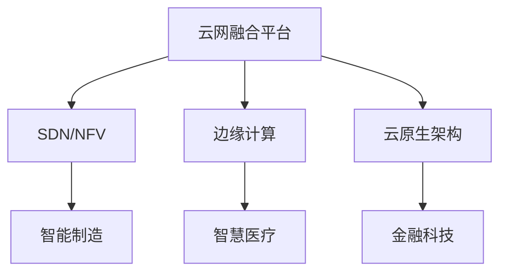
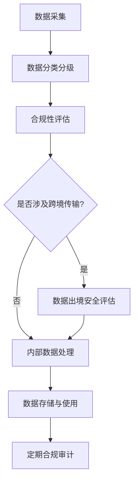

# 云网业务未来三年发展趋势和方向深度研究报告

## 引言
随着全球数字化转型的加速推进，云计算与网络技术的深度融合已成为新一代信息基础设施发展的核心趋势。云网融合作为支撑数字经济的关键能力，不仅推动了企业IT架构的深刻变革，也催生了全新的商业模式与服务形态。本报告旨在全面分析云网业务的范畴、市场现状、技术演进、竞争格局、应用场景及政策环境，并对未来三年的发展趋势进行科学预测，为企业战略决策提供有力支撑。

## 一、云网业务范畴与市场现状

### 1.1 云网融合业务定义与核心服务

**云网融合**（Cloud-Network Convergence）是指将**云计算与网络技术深度融合**，构建新型信息基础设施，实现计算与网络资源的统一管理与优化配置。其核心目标在于实现“**云随网动、网随云动**”，构建一个高度协同、智能化、可定制的信息服务架构。

云网融合并非简单的技术叠加，而是通过**网络能力的云化**与**云计算的网络化**，实现服务的敏捷交付与按需调度。其典型特征包括：

* **智能化**：通过AI驱动实现网络与云资源的智能调度和优化。
* **自服务化**：用户可根据需求自助开通、配置和管理云网资源。
* **高速与低延迟**：依托5G、边缘计算等技术，实现高效数据传输。
* **灵活扩展**：支持弹性资源调度，满足不同业务场景的需求。

云网融合的核心服务主要包括以下几类：

* **云接入（Cloud Access）**：提供企业用户高效、安全地接入云资源的服务。
* **云专线（Cloud Direct Connect）**：构建企业本地数据中心与云平台之间的高速、稳定连接。
* **云互联（Cloud Interconnect）**：实现多个云平台之间的互联互通，支持多云协同。
* **云安全服务（Cloud Security）**：集成防火墙、DDoS防护、数据加密等安全能力，保障云网环境下的数据安全。
* **边缘云服务（Edge Cloud）**：结合边缘计算，实现低延迟、本地化的云计算能力。

中国电信等运营商在云网融合实践中提出“**网是基础、云为核心、网随云动、云网一体**”的战略方针，进一步明确了云网融合的技术演进路径和业务发展方向。

此外，云网融合的关键技术如**软件定义网络**（SDN）、**网络功能虚拟化**（NFV）、**边缘计算**等，正在成为支撑其业务能力的重要基石。SDN实现了网络控制平面与数据平面的分离，使得网络配置更加灵活；NFV通过虚拟化网络功能，提升了资源利用率与部署效率；而边缘计算则将计算能力下沉至网络边缘，显著降低延迟，满足高实时性场景的需求。

#### 关键技术部署难点与成本结构分析

尽管SDN、NFV和边缘计算在理论层面具备显著优势，但在实际部署过程中仍面临一系列挑战：

* **运维复杂度高**：SDN与NFV的引入打破了传统网络架构的稳定性，对运维团队的技术能力提出了更高要求。特别是在多厂商设备混用场景下，兼容性问题频发，增加了维护成本。
* **初期投资大**：边缘计算节点的建设需要大量硬件投入，包括服务器、存储设备及配套网络设施。同时，NFV平台的部署也涉及软件许可、系统集成等费用，导致企业短期内资本支出压力较大。
* **标准化程度不足**：当前行业缺乏统一的云网融合标准，不同厂商的产品在接口、协议等方面存在差异，影响了跨平台协同能力。

为应对上述挑战，部分领先企业已开始探索基于**容器化**和**自动化运维工具链**的解决方案。例如，华为推出的FusionSphere云操作系统，通过集成Kubernetes容器编排平台，实现了对异构资源的统一调度，有效降低了运维复杂度。

---

### 1.2 全球及中国云网业务市场规模与增长趋势

云网融合作为支撑数字经济发展的关键基础设施，近年来在全球范围内呈现高速增长态势。随着企业数字化转型的加速，云计算与网络服务的需求持续扩大，推动了市场规模的快速增长。

#### 全球市场规模

根据中研普华产业研究院发布的《2024-2029年中国云网融合行业运行现状分析及未来发展趋势预测报告》，**2024年第一季度，全球云服务市场同比增长21%**，市场规模达到**765亿美元**。预计未来几年，全球云计算市场仍将维持**约20%的年均增长率**，显示出强劲的发展动力。

#### 中国市场规模

中国云网融合市场增长尤为显著。数据显示，自2015年的**103.2亿元**起步，至2022年市场规模已激增至**近550.7亿元**，**年均复合增长率高达27.03%**。进入2024年，这一增长势头持续加强。仅2024年第一季度，中国大陆的云基础服务支出同比增长**20%**，达到**92亿美元**，创下历史新高。

未来，随着5G、人工智能、边缘计算等技术的持续演进，以及国家“新基建”政策的深入推动，中国云网融合市场将继续保持高速增长。据多家权威机构预测，**到2030年，中国云网融合市场规模有望突破数千亿元**，复合年增长率预计维持在**20%以上**。

#### 市场增长驱动因素

* **政策支持**：国家层面推动“数字中国”“新基建”战略，为云网融合提供政策红利。
* **技术演进**：5G、AI、边缘计算等技术的成熟为云网融合提供了技术支撑。
* **企业需求**：企业数字化转型加速，对高效、灵活、安全的云网服务需求持续上升。
* **云网协同**：运营商和云服务商积极布局云网一体化解决方案，推动产业链协同发展。

#### 主要厂商战略布局与差异化竞争

在云网融合市场中，国内外主要厂商纷纷加大投入，形成差异化竞争格局。

| 厂商名称 | 核心战略 | 主要优势 |
|----------|----------|----------|
| 阿里云 | “云为核心，网随云动” | 全栈云服务，覆盖IaaS、PaaS、SaaS |
| 华为云 | “云网边端”一体化 | 强大的网络设备能力与端到端解决方案 |
| 腾讯云 | “连接+智能” | 游戏、社交等垂直领域生态优势 |
| 中国电信 | “云网融合24字方针” | 网络资源丰富，运营商背景 |
| AWS | “全球基础设施+多云互联” | 全球领先的技术生态与安全体系 |
| 微软Azure | “混合云+企业服务” | 与企业客户高度契合的云网协同方案 |

这些厂商在技术路线、市场定位和客户资源方面各有侧重，共同推动了云网融合市场的多元化发展。

#### 战略实施效果与市场份额变化趋势

以阿里云为例，其在2023年推出的“云网融合2.0”战略，聚焦于构建更高效的混合云架构与边缘计算能力，成功吸引了金融、制造等多个行业的头部客户。据IDC数据显示，阿里云在中国公有云市场的份额从2022年的40.2%提升至2023年的42.1%，进一步巩固了其市场领先地位。

相比之下，AWS虽然在全球范围内占据主导地位，但在中国市场的渗透率相对较低，主要受限于本土化服务能力与监管合规要求。为此，AWS于2024年初宣布与国内多家电信运营商建立合作关系，试图通过联合运营模式弥补短板。

---

### 1.3 主要应用场景分布与需求分析

云网融合凭借其灵活、高效、智能的特性，广泛应用于多个行业与业务场景中，尤其在数字化转型需求旺盛的领域表现突出。

#### 主要应用场景

| 场景类别       | 应用描述                                                                 | 典型行业             |
|----------------|--------------------------------------------------------------------------|----------------------|
| **智能制造**   | 通过边缘计算与云协同，实现设备互联、数据采集与智能分析，提升生产效率。     | 制造业、汽车、电子等 |
| **智慧医疗**   | 支持远程诊疗、医疗影像处理、健康数据实时分析等，保障低延迟与高安全性。     | 医疗、公共卫生       |
| **金融科技**   | 实现高频交易、风控建模、智能客服等场景下的高效数据处理与安全保障。         | 银行、保险、证券     |
| **智慧城市**   | 支撑城市交通管理、安防监控、公共设施智能化等，实现城市运行数据的统一调度。 | 政府、公共事业       |
| **在线教育/娱乐** | 提供高清视频传输、低延迟互动、个性化内容推荐等，提升用户体验。           | 教育、媒体、游戏     |

#### 用户需求分析

1. **敏捷交付能力**：企业希望在短时间内完成IT资源部署，云网融合支持按需配置和快速上线。
2. **弹性扩展能力**：面对业务波动，用户需要可动态调整的资源调度能力，以控制成本。
3. **安全与合规性**：特别是在金融、医疗等敏感行业，用户对数据隐私与安全有极高要求。
4. **多云协同**：随着企业采用多云战略，跨云平台的互联互通与统一管理成为关键需求。
5. **边缘计算支持**：为满足低延迟、本地化处理的需求，边缘节点与云端的协同成为重要趋势。

#### 行业需求驱动下的技术演进

* **网络自动化与智能化**：通过SDN（软件定义网络）、NFV（网络功能虚拟化）等技术，实现网络的灵活配置与自动运维。
* **云原生架构**：推动微服务、容器化等技术应用，提升应用部署与管理效率。
* **安全防护体系**：构建端到端的安全防护机制，包括访问控制、加密传输、威胁检测等。

#### 技术协同支撑行业落地

以下图示展示了云网融合关键技术如何协同支撑典型行业应用：

综上所述，云网融合作为支撑数字基础设施的核心能力，正在从技术概念走向规模化落地。其在多个行业中的广泛应用，不仅推动了企业数字化转型，也为整个信息通信产业带来了新的增长机遇。未来，随着技术不断演进和应用场景持续拓展，云网融合将为数字经济的高质量发展注入更强劲动力。

## 二、技术演进与创新趋势

### 2.1 SD-WAN与SASE架构演进

SD-WAN（软件定义广域网）自其概念在2014年正式提出以来，经历了从单纯网络优化工具到支撑企业“云—边—端”一体化部署核心平台的深刻转型。通过软件定义的方式，SD-WAN实现了网络资源的灵活配置、智能路径选择与集中化管理，显著提升了网络性能、降低了运营成本，并增强了对多云、混合云及边缘计算环境的支持。

然而，随着企业网络架构的不断扩展，传统的SD-WAN模型在面对日益复杂的网络边界和多样化的安全威胁时，逐渐暴露出其局限性。这促使SD-WAN向更高级的架构演进，即**SASE**（安全访问服务边缘）。Gartner于2019年首次提出SASE框架，将其定义为一种融合网络与安全功能的云原生架构，旨在满足企业在远程办公、多云部署和边缘计算场景下的动态安全访问需求。

#### SASE架构的核心优势与发展趋势

SASE架构的核心优势包括：

* **统一策略管理**：通过云端统一部署和管理网络与安全策略，无论用户、设备或应用位于何处，均可实现一致的安全策略执行。
* **零信任安全模型**：将传统的边界安全模型转变为基于身份和上下文的零信任模型，减少因网络边界模糊带来的安全漏洞。
* **降低运维复杂度**：通过整合SD-WAN、防火墙即服务（FWaaS）、安全Web网关（SWG）等组件，实现一体化管理，提升运维效率。

据Analysys Mason预测，到2027年，全球SD-WAN、SSE（安全服务边缘）和FWaaS市场的总收入将超过1100亿美元，其中SASE将占据约15%的份额。这一增长趋势表明，SASE正逐步成为企业网络架构演进的主流方向。

#### SASE部署中的挑战与应对策略

尽管SASE架构在理论上具备诸多优势，但在实际部署过程中仍面临诸多挑战。其中，**策略一致性管理**与**身份集成复杂性**是两个亟待解决的关键问题。

* **策略一致性管理**：在跨地域、跨平台的网络环境中，如何确保安全策略在不同边缘节点、云平台和本地数据中心之间保持一致，是SASE部署中的核心挑战。企业往往需要引入统一的策略引擎，通过云原生的控制平面实现策略的集中定义与分布式执行。
* **身份集成复杂性**：SASE架构依赖于统一的身份认证与访问控制机制，但企业在实际部署中往往面临多套身份系统并存的问题。为应对这一挑战，业界普遍采用**身份即服务**（IDaaS）解决方案，通过标准化的身份协议（如SAML、OAuth 2.0）实现跨平台的身份集成与统一管理。

此外，许多SD-WAN厂商（如VMware、Cisco等）已开始在其产品中集成安全功能，而传统安全厂商（如Palo Alto Networks、Zscaler等）也纷纷推出融合SD-WAN能力的安全解决方案。这种双向融合趋势，将进一步推动SASE架构的标准化与成熟化。

未来，随着云原生、零信任和AI驱动的安全自动化技术的进一步发展，SASE架构将更加成熟，成为支撑企业数字化转型的关键基础设施。

#### 行业应用实例：金融行业的SASE实践

在金融行业，SASE架构的应用尤为显著。某大型商业银行在推进数字化转型过程中，面临分支机构网络接入复杂、安全策略难以统一、远程办公风险高等挑战。通过部署SASE解决方案，该银行实现了以下关键成果：

* **统一安全策略**：通过云端统一管理所有分支和远程用户的网络访问策略，确保无论用户身处何地，均能获得一致的安全防护。
* **零信任访问控制**：基于用户身份和设备状态进行动态访问控制，有效防范未授权访问和数据泄露风险。
* **运维效率提升**：通过自动化策略部署和故障诊断，运维效率提升了40%，显著降低了人力成本。

这一案例充分展示了SASE在金融行业中的实际应用价值，为其他行业提供了可借鉴的经验。

### 2.2 边缘计算网络与5G协同

随着物联网（IoT）、自动驾驶、工业互联网等新兴应用场景的快速发展，**边缘计算**作为云计算的延伸，正逐渐成为企业网络架构的重要组成部分。边缘计算通过将计算、存储和网络资源下沉至网络边缘，有效降低延迟、提升带宽利用率，并增强数据隐私保护能力。

在此背景下，**SD-WAN**作为连接数据中心、云和边缘节点的关键技术，正在与边缘计算深度融合，推动网络架构的进一步演进。

#### SD-WAN在边缘计算中的关键作用

SD-WAN在边缘计算中的应用主要体现在以下几个方面：

* **优化边缘节点连接**：通过多路径路由、负载均衡和动态路径选择等技术，SD-WAN能够提升边缘节点的网络传输效率，确保关键应用的低延迟和高可靠性。
* **支持混合链路接入**：SD-WAN支持MPLS、Internet、LTE/5G等多种接入方式，能够根据业务需求动态调整链路，简化边缘设备的部署和管理。
* **提升边缘服务灵活性**：借助虚拟化技术，SD-WAN可将安全、分析等网络服务部署在边缘节点，实现服务的本地化处理，降低对中心数据中心的依赖。

#### 5G与边缘计算的协同效应

与此同时，**5G技术**的商用部署为边缘计算和SD-WAN的协同发展提供了强大支撑。5G网络具备高带宽、低延迟和大规模连接能力，能够有效满足边缘计算场景对实时性和连接密度的要求。

例如，在智能制造领域，5G网络可将传感器数据实时传输至边缘节点进行处理，再通过SD-WAN将处理结果快速回传至控制中心，实现生产过程的实时监控与优化。中国移动研究院专家指出，SD-WAN未来将向SRv6技术承载演进，并与边缘计算深度融合，推动“端-边-云”协同架构的形成。

#### 边缘计算中的资源编排与能耗优化

然而，边缘计算场景下的资源受限环境也带来了新的挑战，尤其是在**服务编排**与**能耗优化**方面。

* **服务编排复杂性**：边缘节点通常资源有限，如何在多个边缘节点之间动态分配计算任务，确保服务的连续性与性能一致性，是边缘计算部署中的关键问题。业界普遍采用**容器化技术**（如Kubernetes）与**服务网格**（如Istio）相结合的方式，实现边缘服务的自动化部署与动态调度。
* **能耗优化需求**：边缘节点往往部署在能耗受限的环境中（如移动设备、工业现场等），如何在保证服务质量的前提下，优化边缘节点的能耗，成为部署中的重要考量。通过引入**智能调度算法**与**能效感知机制**，可实现边缘资源的动态休眠与负载迁移，从而降低整体能耗。

#### 行业应用实例：制造业中的边缘计算与5G融合

在制造业中，边缘计算与5G的融合应用尤为突出。某汽车制造企业在其智能工厂中部署了基于5G的边缘计算平台，实现了以下关键应用：

* **实时质量检测**：通过5G网络将高清摄像头采集的图像数据实时传输至边缘节点，利用AI算法进行缺陷检测，检测准确率高达99.5%，显著提升了产品质量。
* **设备预测性维护**：通过5G网络将设备传感器数据实时上传至边缘节点，利用机器学习算法进行故障预测，提前预警设备故障，减少了30%的停机时间。
* **柔性生产线调度**：通过边缘计算平台实时分析生产数据，动态调整生产线调度，提升了生产效率15%。

这一案例充分展示了边缘计算与5G在制造业中的协同应用价值，为其他行业提供了可借鉴的实践经验。

### 2.3 网络自动化与智能化驱动因素

随着企业网络规模的扩大和复杂性的增加，传统的手工运维模式已难以满足高效、稳定和安全的网络管理需求。因此，**网络自动化与智能化**成为SD-WAN技术发展的另一重要趋势。通过引入AI和机器学习技术，实现网络的自动化配置、智能优化和故障预测，已成为行业发展的必然方向。

#### 网络自动化的关键驱动因素

网络自动化的关键驱动因素包括：

* **降低运维成本**：通过自动化工具减少对人工干预的依赖，降低网络运维的人力成本和出错率。
* **提升网络效率**：AI驱动的智能路由和流量调度能够根据实时网络状况动态调整策略，优化带宽利用率和应用性能。
* **增强故障响应能力**：自动化系统可实时监控网络状态，快速识别并修复故障，缩短业务中断时间。

例如，VMware SD-WAN通过集成AI算法，能够自动分析网络流量模式，预测潜在的性能瓶颈，并提前进行路径优化。这种主动式管理方式不仅提升了网络的稳定性，还显著改善了用户体验。

#### AI模型训练机制与实时决策逻辑

在网络智能化方面，AI模型的训练机制与实时决策逻辑是实现智能运维的关键。当前主流的AI模型训练机制包括：

* **监督学习**：通过对历史网络数据进行标注，训练模型识别正常与异常流量模式，从而实现故障预测与安全威胁检测。
* **无监督学习**：在缺乏标注数据的情况下，通过聚类与异常检测算法，自动识别网络中的异常行为，适用于未知威胁的发现。
* **强化学习**：通过模拟网络环境中的交互过程，训练模型在动态调整网络策略时实现最优决策，适用于路径优化与负载均衡等场景。

在实时决策方面，AI模型通常通过以下逻辑实现自动化响应：

1. **数据采集与预处理**：通过SD-WAN控制器实时采集网络状态数据（如延迟、丢包率、带宽利用率等），并进行数据清洗与特征提取。
2. **模型推理与决策**：将预处理后的数据输入训练好的AI模型，生成网络优化策略（如路径切换、带宽调整等）。
3. **策略执行与反馈**：将优化策略下发至边缘节点或SD-WAN网关执行，并通过实时监控获取策略执行效果，形成闭环反馈机制。

#### 智能化安全运营中心（SOC）的构建

此外，网络智能化还体现在对安全威胁的实时检测与响应能力上。传统的安全策略往往依赖于静态规则，难以应对日益复杂的网络攻击。而通过引入机器学习模型，SD-WAN平台可以动态识别异常流量行为，自动调整安全策略，有效防范潜在威胁。

未来，随着AI技术的不断进步，网络自动化将向更高层次发展。例如，基于强化学习的网络优化算法能够根据历史数据和实时反馈，持续优化网络策略，实现真正的“自适应网络”。同时，AI还将与SASE架构深度融合，构建智能化的安全运营中心（SOC），实现从威胁检测到响应处置的全流程自动化。

#### 行业应用实例：金融行业的AI驱动网络优化

在金融行业中，AI驱动的网络优化应用尤为显著。某大型银行通过引入AI算法，实现了以下关键成果：

* **智能路径选择**：通过AI模型实时分析网络流量模式，动态选择最优路径，提升了网络传输效率20%。
* **故障预测与自愈**：通过机器学习算法预测网络故障，提前进行路径切换，减少了50%的业务中断时间。
* **安全威胁检测**：通过无监督学习算法识别异常流量行为，自动调整安全策略，有效防范了多起潜在攻击。

这一案例充分展示了AI在网络自动化与智能化中的实际应用价值，为其他行业提供了可借鉴的经验。

综上所述，网络自动化与智能化不仅是SD-WAN技术演进的重要方向，也是企业实现网络高效运营和业务持续创新的关键支撑。随着相关技术的不断成熟，未来的网络将更加智能、灵活和安全，为数字化转型提供强有力的基础设施保障。

## 三、主要参与者与竞争格局

随着中国数字经济的蓬勃发展，云计算作为关键基础设施，已成为推动千行百业数字化转型的核心引擎。在这一过程中，阿里云、腾讯云、华为云等头部厂商凭借各自的技术积累、生态资源和战略定位，构建了差异化竞争优势，形成了当前中国云计算市场的竞争格局。与此同时，电信运营商凭借其在基础设施和政企客户方面的深厚积淀，正通过“云网融合”战略加速抢占市场。新兴科技企业则以创新为驱动，在细分领域实现突破。本章将从云服务提供商的市场布局、电信运营商的战略优势以及新兴科技企业的创新定位三个维度，深入剖析当前中国云计算市场的竞争格局。

### 3.1 云服务提供商市场布局与份额

中国云计算市场呈现出高度集中的竞争格局，**阿里云、华为云、腾讯云**三大厂商稳居市场前列，合计占据市场总份额的近60%。根据Canalys、雪球等多家权威机构的数据，截至2024年，**阿里云**以约**21.3%**的市场份额持续领跑，其领先地位得益于其在电商、金融、大数据等领域的深厚积累。**华为云**市场份额约为**19%**，凭借其在通信、政企及工业互联网领域的优势，持续扩大影响力。**腾讯云**则以约**16%**的份额位列第三，依托腾讯在社交、游戏等领域的生态资源，形成了在特定行业的领先优势。

| 云服务提供商 | 2024年市场份额 | 主要优势领域 |
|--------------|----------------|----------------|
| 阿里云       | 21.3%          | 电商、金融、大数据、AI |
| 华为云       | 19%            | 政企、工业互联网、安全 |
| 腾讯云       | 16%            | 游戏、社交、音视频 |
| 百度智能云   | 约8%           | AI、搜索、自动驾驶 |
| 天翼云       | 约5%           | 运营商背景、政企客户 |
| UCloud       | 约3%           | 中小企业、出海业务 |

**阿里云**作为阿里巴巴集团旗下的云计算品牌，自2009年成立以来，已发展成为全球领先的云计算平台。其核心优势在于**技术全面性与场景适配能力**，特别是在大数据处理、AI模型训练、弹性计算等方面表现突出。例如，阿里云的飞天系统为其提供了强大的底层架构支持，使其在高并发场景如“双11”购物节中表现出色。

**腾讯云**则依托腾讯强大的社交和游戏生态，聚焦于**场景化解决方案**。其在音视频处理、游戏加速、企业协作等领域的技术能力尤为突出。例如，腾讯会议、企业微信等产品的成功，进一步强化了腾讯云在政企市场的渗透力。

**华为云**则以**安全可信、政企服务能力**为核心卖点。依托华为在通信领域的技术积累，其在5G、物联网、边缘计算等新兴技术领域具有先发优势。擎天架构的推出，也进一步提升了其在混合云、多云协同场景中的竞争力。

此外，百度智能云凭借其在人工智能领域的深厚积累，也在AI+云计算场景中占据一席之地。天翼云、移动云等运营商云则依托其网络基础设施和政企客户资源，市场份额持续增长。

#### 关键成功因素对比分析

为了更深入地理解各厂商的市场竞争力，我们从研发投入、人才结构、生态合作模式等关键成功因素出发，对三大厂商进行对比分析：

| 指标 | 阿里云 | 腾讯云 | 华为云 |
|------|--------|--------|--------|
| 研发投入占比 | 约15%（集团整体） | 约12%（集团整体） | 约18%（集团整体） |
| 技术专利数量（2023年） | 超过10,000件 | 约8,000件 | 约12,000件 |
| 人才结构（技术占比） | 60%以上 | 55%以上 | 70%以上 |
| 生态合作伙伴数量 | 超过10,000家 | 约8,000家 | 约12,000家 |
| 客户获取成本（COC） | 中等 | 较低 | 较高 |
| 产品差异化策略 | 全栈服务+AI赋能 | 场景化解决方案 | 安全+政企专有云 |

从上表可以看出，**华为云在研发投入和专利数量上具有明显优势**，其技术导向和对安全性的重视，使其在政企客户中更具竞争力。**阿里云则凭借全面的技术栈和AI能力，在通用场景中表现突出**。**腾讯云则通过场景化服务和生态协同，实现了较低的客户获取成本**。

#### 技术创新路径对比

在AI、安全、多云协同等关键技术领域，三大厂商也展现出不同的竞争路径：

* **AI能力**：阿里云依托达摩院，在自然语言处理、计算机视觉等领域持续领先；腾讯云凭借腾讯AI Lab，在语音识别、图像处理方面表现突出；华为云则通过盘古大模型系列，快速追赶。
* **安全能力**：华为云凭借其在通信安全领域的积累，在政企安全解决方案中占据优势；阿里云通过多层次安全防护体系，保障大规模并发场景下的数据安全；腾讯云则在应用层安全和内容安全方面表现突出。
* **多云协同**：华为云通过擎天架构，实现了混合云和多云的无缝协同；阿里云通过云原生技术栈，提升了跨云管理能力；腾讯云则通过TencentHub等工具，强化了边缘计算与多云协同能力。

#### 产业链协同与标准化趋势

随着云计算向多云、混合云演进，**标准化与生态协同**成为厂商竞争的新焦点。阿里云积极参与Kubernetes、CNCF等开源社区，推动容器技术的标准化；腾讯云通过TencentOS等系统，强化边缘计算能力；华为云则依托其在通信领域的积累，积极参与ETSI、ITU等国际标准组织，推动云网融合标准的制定。这些举措不仅提升了厂商的技术影响力，也增强了其在产业链中的话语权。

#### 政策监管对市场格局的影响

随着国家对数据安全、隐私保护的监管趋严，**合规性**成为厂商竞争的重要维度。《数据安全法》《个人信息保护法》等法规的出台，使得云服务商在数据存储、跨境传输等方面面临更高要求。华为云凭借其“安全可信”的品牌定位，在政企客户中赢得更多信任；阿里云和腾讯云也纷纷加强数据加密、访问控制等安全技术的研发，以满足监管要求。未来，谁能更好地平衡技术创新与合规性，谁就能在竞争中占据更有利的位置。

### 3.2 电信运营商云网融合战略与优势

随着“云网融合”成为新一代信息基础设施的核心趋势，**中国电信、中国移动、中国联通**等传统电信运营商正加速布局云计算市场，通过“网+云+数+智”的一体化服务，构建新的增长曲线。根据2024年市场数据，运营商云（天翼云、移动云、联通云）合计市场份额已超过**30%**，成为云计算市场不可忽视的重要力量。

电信运营商的核心优势在于其**网络资源与政企客户基础**。与互联网云厂商相比，运营商在IDC资源、骨干网带宽、边缘节点部署等方面具备天然优势，能够为客户提供低延迟、高可靠性的云网一体化服务。例如：

* **中国电信天翼云**：依托“云网融合2.0”战略，天翼云已构建起覆盖全国的“2+4+31+X”资源池布局，提供包括公有云、专属云、混合云在内的全栈服务。其在政务云、工业云等场景中表现突出。
* **中国移动移动云**：借助其全球领先的通信网络，移动云重点打造“N+31+X”资源池体系，聚焦“5G+云+AI”融合创新，已在智慧医疗、智慧城市等领域落地多个标杆项目。
* **中国联通联通云**：以“联通云+AI”为核心战略，联通云正加速构建“一主多专”的产品体系，重点服务金融、制造、能源等政企客户。

此外，运营商在数据安全、合规性方面具备天然优势，尤其在涉及国家关键信息基础设施的政务、金融、能源等领域，其云服务更容易获得客户信任。

| 运营商云 | 核心优势 | 主要应用场景 |
|----------|----------|----------------|
| 天翼云   | 网络资源丰富、政企客户基础强 | 政务云、工业云 |
| 移动云   | 边缘节点覆盖广、5G融合能力强 | 智慧城市、智慧医疗 |
| 联通云   | 安全合规、混合云能力强 | 金融、能源、制造 |

#### 云网融合战略的关键成功因素

为了进一步分析电信运营商在云网融合中的竞争优势，我们从以下几个维度进行量化分析：

* **网络资源投入**：三大运营商在网络基础设施上的投入均超过年营收的10%，其中中国电信在IDC资源上的投入占比最高，达到12%。
* **政企客户覆盖率**：中国电信在政务云市场的覆盖率超过60%，中国移动在智慧城市项目中的中标率位居第一，中国联通在金融行业的客户满意度排名前三。
* **技术创新能力**：三大运营商均设立了专门的云网融合研究院，其中中国移动在5G边缘计算领域的专利申请量位居全球前列。

#### 与互联网厂商的竞合关系

运营商云与互联网厂商之间并非简单的竞争关系，而是呈现出**竞合共生**的态势。一方面，运营商凭借其网络资源和政企客户优势，在政务、金融等市场对互联网厂商形成挑战；另一方面，互联网厂商在AI、大数据等领域的技术优势，也为运营商提供了重要的生态补充。例如，天翼云与阿里云在工业互联网领域展开合作，移动云与华为云在5G+AI场景中形成互补。这种竞合关系不仅推动了技术的协同发展，也为客户提供了更全面的解决方案。

### 3.3 新兴科技企业的创新突破与定位

在头部厂商占据主导地位的背景下，一批新兴科技企业正通过差异化定位和技术创新，逐步在云计算市场中占据一席之地。这些企业通常聚焦于**细分赛道**，如边缘计算、容器服务、多云管理、行业SaaS等，凭借敏捷的产品迭代能力和灵活的市场策略，实现快速增长。

例如：

* **UCloud**：以“中立、安全、全球化”为定位，专注于为中小企业和出海企业提供云计算服务。其全球节点布局和多云管理平台，成为其在国际市场的核心竞争力。
* **青云QingCloud**：主打“全栈云”理念，提供从IaaS到PaaS的全栈服务，并在容器、微服务、边缘计算等领域持续创新。
* **品高股份**：以云计算业务为核心主业，聚焦于政企市场，提供包括云平台、云管理、云安全在内的整体解决方案，其云业务占比远超传统互联网厂商。

此外，一些AI驱动的初创企业也在探索“AI+云”的融合模式，如**第四范式、商汤科技**等，通过将AI能力嵌入云平台，为客户提供智能化的数据分析、自动化运维等增值服务。

新兴企业虽然在整体市场份额上难以与头部厂商抗衡，但其**灵活性、创新性与行业专注度**，使其在特定垂直领域具备较强的竞争力。未来，随着云计算向边缘、行业化、智能化方向演进，这些企业有望通过“专精特新”策略，实现弯道超车。

#### 融资情况与核心技术壁垒分析

为了更全面地评估新兴科技企业的竞争力，我们对其融资情况和核心技术壁垒进行分析：

* **融资情况**：UCloud在2019年成功上市，累计融资超过10亿元；青云QingCloud已完成多轮融资，估值超过50亿元；品高股份在科创板上市，市值稳定增长。
* **核心技术壁垒**：
  * UCloud在多云管理平台和全球节点部署方面具有技术壁垒；
  * 青云QingCloud在容器技术和边缘计算平台方面具备领先优势；
  * 品高股份在政企云平台和安全解决方案方面形成了差异化竞争力。

#### 商业化路径与盈利模式

新兴科技企业的商业化路径通常围绕**行业垂直化**展开。例如，品高股份通过提供定制化政企云平台，实现高附加值服务；UCloud则通过“中立云”定位，吸引对数据安全有高要求的客户群体。其盈利模式主要依赖于：

* **订阅制服务**：通过按需付费模式，降低客户初期投入成本；
* **增值服务**：提供安全、运维、迁移等专业服务，提升客户粘性；
* **生态合作**：与ISV、SI等合作伙伴共同拓展市场，实现收益分成。

#### 与大厂的竞合关系

新兴科技企业与大厂之间既存在竞争，也存在合作。例如，UCloud与阿里云在出海市场上存在直接竞争，但同时也通过生态合作实现互补；青云QingCloud与华为云在边缘计算领域展开合作，共同推动技术标准化。这种竞合关系使得新兴企业能够在保持独立性的同时，借助大厂的资源实现快速发展。

#### 未来发展趋势

随着国家对“专精特新”企业的政策支持不断加码，新兴科技企业有望在以下方向获得更多发展机会：

* **边缘计算**：随着5G、物联网的普及，边缘计算需求快速增长；
* **行业云**：金融、医疗、制造等行业对云服务的定制化需求不断提升；
* **AI+云**：AI技术的成熟将推动云服务向智能化方向演进。

这些趋势为新兴企业提供了弯道超车的机会，也对传统厂商构成了新的挑战。

## 四、行业应用场景与需求分析

随着云计算技术的不断演进，其在各行各业的应用场景日益广泛，尤其在金融、医疗等对安全性、稳定性要求极高的垂直行业中，云服务的应用已经从基础资源支撑逐步走向深度定制化与融合创新。与此同时，元宇宙、物联网等新兴技术的兴起也对网络连接能力提出了更高的挑战。本章将围绕企业数字化转型中的网络连接需求、金融与医疗行业的定制化应用，以及新兴技术融合所带来的挑战展开深入分析。

### 4.1 企业数字化转型中的网络连接需求

在企业数字化转型过程中，网络连接能力成为支撑业务高效运行的关键基础设施。尤其是在金融行业，传统的集中式架构正逐步向分布式架构演进，推动着企业对多云互联、高速网络和灵活接入的需求激增。

#### 多云互联与分布式架构演进

随着金融业务逐步上云，越来越多的金融机构开始采用“多地多中心”的分布式架构部署模式。这种架构的演进不仅提升了业务的灵活性和容灾能力，也带来了显著的网络连接挑战。例如，跨云的东西向流量激增，使得传统的南北向网络架构难以满足多云环境下的高速互联需求。

为了应对这一挑战，金融行业正积极推动**云网融合战略**。云网融合通过将云计算与网络资源进行一体化规划、建设和运维，打破了传统云与网的界限，实现了更高效的资源调度与业务支撑。例如，北京金融科技产业联盟发布的《2024金融云网发展研究报告》指出，金融云网需具备**多云互联、弹性扩展、服务质量保障**等关键能力，以满足分布式部署下的网络连接需求。

> **云网融合三阶段演进路径**：
> 1. **云网协同**：云与网独立建设，但通过接口实现基本互通。
> 2. **云网融合**：云与网在资源调度和管理层面实现一体化。
> 3. **云网一体**：形成统一的资源池，实现业务驱动的自动调度。

#### 网络质量与用户体验优化

随着金融业务的多样化发展，人脸识别、大数据分析、人工智能等新型业务场景对网络带宽、时延和稳定性提出了更高要求。例如，泛金融业务的快速增长使得传统专线带宽难以承载多样化的业务流量，进而影响用户体验。为了解决这一问题，金融机构开始采用广覆盖、敏捷接入的网络架构，以实现随时随地的金融服务能力。

此外，网络服务质量（QoS）也成为保障用户体验的关键因素。通过引入多层冗余备用、网络切片、资源动态调度等技术，金融机构可以为不同等级的业务提供差异化的服务质量保障。例如，针对高优先级业务，可采用网络切片技术实现资源隔离与带宽保障，从而确保关键业务的稳定运行。

#### 安全与合规挑战

金融行业对数据安全和合规性的要求极高，这也对网络连接提出了更高的安全挑战。云计算环境下，数据在传输、存储和使用过程中面临更高的泄露风险，尤其是在多云互联和混合云架构下，数据的流动路径更加复杂，安全边界难以界定。

为应对这一挑战，金融机构正积极构建安全可信的网络架构。例如，通过引入IPv6+、零信任网络等技术，实现端到端的安全防护。同时，监管政策的不断完善也推动了金融云网向安全合规方向发展。《中国银行业信息科技“十三五”发展规划监管指导意见》等政策的出台，进一步明确了金融云网在数据保护、业务连续性等方面的要求。

### 4.2 金融、医疗等垂直行业的定制化应用

金融和医疗作为对安全性、合规性要求极高的行业，在云服务的应用中呈现出显著的定制化趋势。这种定制化不仅体现在技术架构的设计上，更体现在对行业特定需求的深度理解与响应。

#### 金融行业的定制化云服务

金融行业对云服务的需求主要集中在以下几个方面：

* **安全合规性**：金融云服务需满足国家及行业监管要求，例如等保三级、金融行业灾备能力等。通过构建金融专区、专属云等安全隔离环境，云服务商可以为金融机构提供符合监管要求的云服务。
* **高性能与高可用性**：金融业务对系统的响应速度和稳定性要求极高。例如，证券行业的交易系统需具备毫秒级的响应能力，而保险行业的理赔系统则需支持大规模并发处理。通过引入高性能计算、弹性扩容等技术，金融云服务可以有效支撑高并发业务场景。
* **业务敏捷性**：随着金融科技的快速发展，金融产品迭代速度不断加快。云服务通过提供微服务、容器化等技术，帮助金融机构实现业务的快速部署与灵活调整。

**案例分析：热网互联金融云服务实践**

热网互联为银行、保险、证券等金融机构提供定制化的云服务解决方案，帮助其打破“信息孤岛”，实现业务系统的快速上线与高效运维。例如：

- **银行领域**：热网互联通过构建金融级灾备能力，保障核心业务系统的高可用性；支持通过VPN和云接入互联，根据需求灵活搭建混合云架构。
- **保险领域**：其智能理赔方案通过引入AI技术，显著降低了人工审核成本；通过云计算、微服务、容器等技术实现业务的敏捷迭代。
- **证券领域**：提供高性能云产品，支持弹性扩容，满足业务波动大的特点。

#### 医疗行业的定制化云服务

医疗行业对云服务的需求同样呈现出显著的定制化特征，尤其是在数据安全、系统性能和业务连续性等方面。

* **数据安全与隐私保护**：医疗数据涉及患者隐私，对数据安全的要求极高。医疗云服务通过引入加密存储、访问控制、数据脱敏等技术，保障医疗数据的安全性。例如，《“健康中国2030”规划纲要》明确提出要加强健康医疗大数据的应用体系建设，推动医疗数据的开放共享与深度挖掘。
* **系统性能与弹性扩展**：随着医疗信息化的深入发展，医疗数据规模呈现爆发式增长。传统IT架构难以满足海量数据的存储与处理需求，而云平台的弹性存储与计算能力则可以有效应对这一挑战。例如，医保信息化系统的快速发展使得医保电子凭证用户数量突破12亿，而云平台的弹性扩容能力则保障了系统的稳定运行。
* **业务连续性与灾备能力**：医疗业务对系统的连续性要求极高，一旦系统中断将直接影响患者的生命安全。医疗云服务通过构建灾备中心、实现数据异地备份等措施，保障医疗业务的连续性。例如，中国联通发布的《联通云灾备医疗行业白皮书》强调了云计算在提升医疗数据安全与业务连续性方面的重要作用。

**案例分析：阿里云医疗云服务实践**

阿里云通过构建医疗专属云平台，为医疗机构提供包括电子病历管理、远程医疗、医疗大数据分析等在内的全面云服务。其核心优势包括：

- **弹性计算与存储**：满足医疗数据的指数级增长需求。
- **统一运维管理**：支持多个医疗机构和信息系统的集中运维。
- **安全保障体系**：通过等保三级认证，满足医疗行业安全合规要求。

### 4.3 元宇宙、物联网等新兴技术融合挑战

随着元宇宙、物联网等新兴技术的快速发展，云服务的应用场景不断拓展，对网络连接能力也提出了更高的要求。这些技术的融合不仅推动了云服务的创新，也带来了新的挑战。

#### 元宇宙对网络连接的新要求

元宇宙作为虚拟现实与互联网深度融合的产物，对网络连接的带宽、时延和稳定性提出了极高的要求。例如，元宇宙中的虚拟现实场景需要实时传输高清视频流，而交互式体验则要求毫秒级的响应速度。这对网络基础设施的承载能力提出了巨大挑战。

为满足元宇宙的需求，云服务提供商正积极引入**边缘计算、5G网络**等技术，以降低网络时延、提升用户体验。例如，通过在边缘节点部署计算资源，可以实现数据的就近处理，从而减少数据传输的延迟。同时，5G网络的高带宽、低时延特性也为元宇宙的实现提供了强有力的网络支撑。

#### 物联网与医疗云的深度融合

物联网技术在医疗行业的应用日益广泛，尤其是在远程医疗、智能监护、健康管理等领域。例如，通过部署可穿戴设备，医疗机构可以实时监测患者的生理参数，并通过云平台进行数据分析与预警。这种应用模式不仅提升了医疗服务的效率，也为患者提供了更加便捷的健康管理方式。

然而，物联网设备的广泛应用也带来了数据安全与隐私保护的挑战。例如，医疗物联网设备在采集、传输和存储患者数据的过程中，可能面临数据泄露、非法访问等风险。为应对这一挑战，医疗云服务提供商正积极引入**区块链、零信任网络**等技术，以保障医疗数据的安全性与隐私性。

#### 技术融合下的网络架构演进

元宇宙、物联网等新兴技术的融合推动了网络架构的深度演进。传统的网络架构已难以满足新兴应用对高带宽、低时延、高可靠性的需求，而**云网一体化架构**则成为解决这一问题的关键方向。

云网一体化通过将云计算与网络资源进行深度融合，实现了资源的统一调度与管理。例如，通过引入SDN（软件定义网络）、NFV（网络功能虚拟化）等技术，可以实现网络资源的灵活配置与动态调整，从而满足不同应用场景的需求。同时，AI技术的引入也为网络架构的智能化演进提供了新的可能。例如，通过引入AI算法，可以实现网络流量的智能调度与故障预测，从而提升网络的稳定性与可靠性。

**部署挑战与应对策略**

在实际部署中，云网融合面临如下挑战：

| 挑战类别 | 具体问题 | 应对策略 |
|----------|----------|----------|
| **兼容性** | 不同厂商设备、协议不统一 | 推动标准化协议，如IPv6+、OpenAPI等 |
| **运营维护** | 跨域资源管理复杂 | 引入统一运维平台与自动化工具 |
| **安全边界模糊** | 多云与边缘环境下的安全管控难 | 构建零信任安全体系，实现端到端防护 |

综上所述，随着元宇宙、物联网等新兴技术的快速发展，云服务的应用场景不断拓展，对网络连接能力也提出了更高的要求。未来，云服务提供商需积极引入新技术，推动网络架构的深度演进，以满足新兴应用场景的需求。

## 五、政策环境与标准规范

随着全球数字化进程的加速，数据已成为国家经济和社会发展的重要战略资源。中国在“十四五”规划中明确提出要加快新型基础设施建设（新基建），并推动数字经济发展。在此背景下，“东数西算”工程作为国家级重大战略部署，不仅体现了国家对数据中心布局优化的高度重视，也标志着我国在构建全国一体化大数据中心协同创新体系方面迈出了关键一步。

“东数西算”工程的核心在于通过跨区域资源调配，将东部地区的高密度数据处理需求有序引导至西部地区，利用西部丰富的能源和土地资源，实现数据中心绿色化、智能化发展。该工程不仅是推动数字经济均衡发展的关键举措，也是落实“双碳”目标、促进可持续发展的有效路径。

### 5.1 国家新基建与东数西算政策导向

自2022年正式启动以来，“东数西算”工程已进入全面实施阶段。根据国家发改委等相关部门的规划，该工程以**2022年至2025年为建设周期**，分为示范项目申报、中期考核、落地实施等多个阶段推进。截至2022年2月，全国八大枢纽节点的建设方案申报工作已完成，标志着工程正式进入实质性建设阶段。

从投资模式来看，“东数西算”工程采用“**政府引导、企业为主、市场运作**”的方式，其中社会资金占据主导地位，政府资金发挥引导作用。承载主体主要包括运营商、IDC龙头企业、互联网企业及电力能源企业等，工程建设顺序依次为土建“基建”、硬件设备、IT设备等环节。这种模式既保障了项目的市场化运作效率，又兼顾了国家战略目标的实现。

政策层面，国家出台了一系列支持性文件和指导意见，如《新型数据中心发展三年行动计划（2021-2023年）》《关于严格能效约束推动重点领域节能降碳的若干意见》等，明确了数据中心PUE（电能使用效率）控制标准——新建大型及以上数据中心PUE应低于1.3，严寒和寒冷地区力争降至1.25以下。这些政策为“东数西算”工程提供了明确的技术规范和发展方向。

此外，国家还通过设立东部与西部对接机制、提供网络、电力、土地等方面的优惠政策，降低西部地区的运营成本，吸引东部数据处理需求向西部转移。预计未来几年内，东部地区的投资节奏将快于西部，数据中心的投资也将领先于云网设施建设。

“东数西算”工程的实施不仅有助于缓解东西部数字经济发展不均衡的问题，还将显著提升西部地区对有效投资和数字经济人才的吸引力，激发当地数字经济活力，促进区域经济协调发展。据测算，该工程作为一项重资产投资项目，整体投资体量可能达到**数千亿元人民币**，对土建、5G网络、IDC数据中心、绿色能源等相关产业具有巨大的拉动效应。

在具体落地机制方面，工程采用了“存量+增量”的资源配置方式。数据中心的增量以目标量和存量的差值计算，我国部分地区数据中心存量小，则增量相对较大，如广东韶关、甘肃庆阳等节点。这种差异化配置策略有助于优化全国范围内的算力资源分布，提升整体运行效率。

#### 5.1.1 典型项目案例分析

在典型项目案例方面，目前已有多个示范项目进入商务对接阶段，预计将在2025年正式落地。例如，中国电信在内蒙古乌兰察布市建设的“东数西算”数据中心集群，已形成超过10万标准机架的规模，成为支撑京津冀及华北地区算力需求的重要节点。此外，华为云在贵州贵安新区建设的“贵安云数据中心”，依托当地丰富的水电资源，实现了绿色低碳运行，PUE值控制在1.2以下，成为“东数西算”工程绿色化发展的典范。

以下为典型“东数西算”项目的技术与经济效益对比分析：

| 项目名称 | 地理位置 | 数据中心规模（标准机架） | 年均PUE值 | 绿色能源占比 | 经济效益（年营收估算） |
|----------|-----------|--------------------------|------------|----------------|--------------------------|
| 中国电信乌兰察布数据中心 | 内蒙古乌兰察布 | 100,000+ | 1.25 | 60% | 15亿元 |
| 华为贵安云数据中心 | 贵州贵安新区 | 80,000+ | 1.20 | 70% | 12亿元 |
| 阿里巴巴张北数据中心 | 河北张家口 | 60,000+ | 1.28 | 55% | 10亿元 |
| 腾讯中卫数据中心 | 宁夏中卫 | 50,000+ | 1.30 | 50% | 8亿元 |

这些项目的成功实施，不仅验证了“东数西算”工程在技术可行性与经济效益上的双重优势，也为后续全国范围内的推广提供了宝贵经验。

### 5.2 国内外云网融合技术标准与互操作性

随着“东数西算”工程的深入推进，云网融合作为支撑其高效运行的关键技术，正逐步成为行业关注的焦点。云网融合是指云计算与网络基础设施深度融合，实现计算、存储、网络资源的统一调度与管理，从而提升整体算力服务的灵活性、可靠性和响应速度。

在国内，云网融合技术的发展得到了国家政策的大力支持。例如，《“十四五”信息通信行业发展规划》明确提出要推进云网协同发展，打造全国一体化算力网络体系。与此同时，国内三大电信运营商——中国移动、中国电信、中国联通均加快了云网融合战略布局，推出了各自的云网一体化解决方案，旨在构建低时延、高带宽、广覆盖的算力网络。

国际上，云网融合同样成为全球科技巨头竞相布局的重点领域。美国亚马逊AWS、微软Azure、谷歌Cloud等云服务商纷纷加大在边缘计算、5G网络、AI加速器等方面的研发投入，推动全球范围内算力资源的互联互通。欧洲也在积极推进“数字主权”战略，致力于构建自主可控的云网基础设施，减少对外部技术依赖。

然而，尽管国内外在云网融合技术方面取得了显著进展，但在标准化和互操作性方面仍面临挑战。目前，全球尚未形成统一的云网融合技术标准，不同厂商之间的产品和服务存在兼容性问题，这在一定程度上制约了跨区域、跨平台算力资源的高效协同。

#### 5.2.1 技术标准落地与互操作性挑战

当前，不同厂商的设备在兼容性方面存在显著问题，尤其是在边缘计算与数据中心互联等关键领域。例如，华为的IEC平台与阿里云的Link Edge平台在接口协议、数据格式等方面存在差异，导致在跨平台部署时需进行额外的适配工作，增加了实施成本与复杂度。

为应对这一问题，行业正在积极探索解决方案。一方面，国际电信联盟（ITU）、开放计算项目（OCP）、全球边缘计算联盟（MEC）等组织正在积极推动相关标准的制定和完善。另一方面，国内企业也在通过技术协作与平台开放，提升互操作性。例如，中国移动联合华为、中兴等厂商推出了“OneEdge开放平台”，支持多厂商设备接入，显著提升了边缘计算节点的兼容性。

以下为当前云网融合技术标准发展情况的对比分析：

| 组织/机构 | 主要关注领域 | 典型标准/成果 | 互操作性支持 |
|-----------|----------------|------------------|----------------|
| ITU       | 网络架构与服务质量 | Y.3172（边缘计算框架） | 高 |
| OCP       | 硬件开放与数据中心互联 | OpenRack、OpenNetworkLinux | 中 |
| MEC       | 边缘计算平台标准 | ETSI MEC 003、MEC 011 | 高 |
| CCSA      | 网络切片、算力调度 | YD/T 3867（网络切片管理） | 中高 |

未来，随着“东数西算”工程的持续推进，国内将进一步加强与国际标准组织的合作，积极参与全球云网融合技术标准的制定，推动形成开放、协同、共赢的产业生态。同时，国内企业也将加快技术创新步伐，提升云网融合产品的自主可控能力，为全球用户提供更加高效、安全、便捷的算力服务。

#### 5.2.2 技术标准内容解析

以网络切片技术为例，其通过将物理网络划分为多个逻辑独立的虚拟网络，实现不同业务场景下的差异化服务保障。例如，高优先级的AI推理任务可分配至低时延切片，而大数据存储任务则可运行于高带宽切片中。这种灵活的资源调度机制，正是“东数西算”工程实现全国一体化算力网络的关键支撑。

此外，边缘计算作为云网融合的重要组成部分，也正在加速标准化进程。根据ETSI MEC 003标准，边缘计算节点需具备本地数据处理、缓存、路由等功能，以降低中心云的负载压力并提升响应效率。目前，国内已有多个边缘计算平台通过了MEC标准认证，如中国移动的OneEdge平台、华为的IEC平台等，为“东数西算”工程的边缘节点部署提供了标准化解决方案。

### 5.3 数据安全法规与跨境传输合规要求

在“东数西算”工程推进过程中，数据安全与合规问题是不可忽视的重要议题。随着数据价值的不断提升，如何确保数据在传输、存储、处理过程中的安全性，已成为各国政府和企业高度关注的问题。特别是在当前国际形势复杂多变的背景下，数据跨境流动的安全风险日益凸显，亟需建立健全的数据安全法规体系，确保数据在合法合规的前提下高效流通。

中国在数据安全立法方面走在世界前列。2021年9月1日正式施行的《中华人民共和国数据安全法》，确立了数据分类分级保护制度，明确了数据处理者的法律责任，强化了对个人信息和重要数据的保护。同年11月1日，《个人信息保护法》正式生效，进一步细化了个人信息处理规则，规范了跨境数据传输行为，为个人隐私权益提供了强有力的法律保障。

针对“东数西算”工程涉及的跨区域数据流动问题，国家也出台了相应的监管政策。例如，国家网信办发布的《数据出境安全评估办法》规定，关键信息基础设施运营者和处理个人信息达到国家网信部门规定数量的个人信息处理者，向境外提供个人信息或重要数据的，应当通过国家网信部门组织的数据出境安全评估。这一规定有效防范了数据跨境传输过程中可能存在的安全风险，确保了国家数据主权和国家安全。

#### 5.3.1 企业数据合规操作实务

对于参与“东数西算”工程的企业而言，必须严格遵守国家和地方的相关法律法规，建立健全内部数据安全管理体系，确保数据在采集、传输、存储、使用等各个环节的安全可控。同时，企业还需加强与监管部门的沟通协作，及时了解最新的政策动态，积极应对可能出现的合规风险。

在企业数据合规操作实务方面，以下为典型合规流程示意图：

#### 5.3.2 数据跨境传输中的技术障碍与应对策略

企业在数据跨境传输过程中，常面临技术障碍，如加密协议不兼容、数据格式不统一等问题。为应对这些挑战，企业可采取以下策略：

* **采用国际通用加密协议**：如TLS 1.3，确保数据在传输过程中的安全性。
* **建立数据中转节点**：通过在中立地区设立数据中转节点，规避直接跨境传输带来的合规风险。
* **实施数据脱敏与匿名化处理**：在传输前对敏感数据进行脱敏处理，降低数据泄露风险。

未来，随着“东数西算”工程的不断深化，数据安全法规将进一步完善，跨境数据传输的合规要求也将更加严格。企业需要不断提升自身的技术能力和管理水平，确保在享受政策红利的同时，切实履行好数据安全保护责任，为构建安全、可信、高效的数字生态环境贡献力量。

## 六、未来三年发展预测与战略建议

### 6.1 市场渗透趋势与收入贡献预测

未来三年（2024-2027），中国云网融合市场将维持高速扩张态势，预计市场规模将从2023年的**约1500亿元**增长至**2027年的超3000亿元**，年均复合增长率（CAGR）有望达到**18%以上**。这一增长动力主要源自以下几大核心因素：

*   **5G基础设施全面部署**：截至2023年底，中国已建成全球最大的5G网络，基站数超过300万个。5G核心网基于云架构，推动网络功能虚拟化（NFV）和边缘计算加速落地，成为云网融合的底层驱动力。
*   **企业数字化转型持续深化**：随着“上云用数赋智”政策的持续推进，企业对云服务的需求从基础资源扩展至智能化、一体化解决方案。据行业报告，**超过80%的企业已上云或处于上云进程中**，其中**混合云部署占比超过90%**，成为主流选择。
*   **政策与产业协同推动**：“新基建”、“东数西算”等国家级战略为云网融合提供了坚实的政策支撑和基础设施保障。同时，运营商、互联网厂商与传统IT企业的深度合作，加速了云网融合技术的商业化进程。

在细分市场中，**混合云、多云互联、边缘计算与云原生平台**成为增长最快的领域。运营商凭借其网络资源与服务保障能力，在混合云市场中占据主导地位。例如，**中国电信天翼云2023年营收已突破500亿元**，稳居国内运营商首位；**中国移动云**则通过成立云能力中心，实现营收**年增长超120%**。

未来三年，随着**IPv6+、SRv6、自智网络**等新一代网络技术的广泛应用，云网融合将实现从资源协同向深度融合演进，推动政务、金融、制造、医疗等垂直行业实现智能化升级。预计到2027年，**云网融合将成为数字经济基础设施的核心组成部分**，为超过**50%的行业应用场景提供支撑**。

### 6.2 关键技术发展路线图（2024-2027）

云网融合的深化发展依赖于多项前沿技术的协同演进。未来三年，以下六大技术将成为推动云网融合迈向智能化、自动化与安全化的核心驱动力。

#### 1. **边缘计算与云边协同**
边缘计算通过将计算能力下沉至网络边缘，满足低时延、高带宽、本地化处理等需求。未来三年，边缘节点将逐步实现与中心云平台的无缝对接，构建**全域边缘计算生态**，广泛应用于工业互联网、自动驾驶、远程医疗等场景。

#### 2. **网络功能虚拟化（NFV）与软件定义网络（SDN）**
NFV与SDN技术将推动传统网络向可编程、可定制方向演进。运营商将基于NFV/SDN构建**电信云平台**，实现网络资源的灵活编排与按需配置，支持**端到端网络切片**，满足不同业务场景的差异化需求。

#### 3. **人工智能驱动的智能运维（AIOps）**
随着云网融合架构的复杂度提升，AIOps将成为保障系统稳定运行的关键。通过引入机器学习算法，实现**故障预测、性能优化、安全防护**等功能的自动化，显著提升运维效率与服务质量。

#### 4. **IPv6+与自智网络**
IPv6+通过引入SRv6、网络切片、随流检测等新特性，构建高度智能化、可感知、可编程的网络环境。未来三年，基于IPv6+的智能云网解决方案将在多个垂直行业中实现规模化商用。

#### 5. **云原生技术与微服务架构**
云原生技术以其轻量化、高弹性、易扩展的特点，成为新一代应用开发与部署的主流范式。微服务架构则通过将复杂应用拆分为多个独立的服务单元，提升系统的灵活性与可维护性。

#### 6. **安全防护与可信计算**
面对日益严峻的网络安全威胁，云网融合架构必须具备强大的安全防护能力。未来三年，**零信任网络架构、区块链加密、硬件级可信计算**等技术将被广泛应用于身份认证、数据保护、访问控制等领域。

为更直观地展示上述关键技术在未来三年的发展节奏与演进路径，下表总结了主要技术的发展阶段与关键里程碑：

| 技术类别             | 2024年重点方向                          | 2025年关键进展                         | 2026-2027年成熟期目标                   |
|----------------------|-----------------------------------------|----------------------------------------|------------------------------------------|
| 边缘计算             | 边缘节点初步部署，试点行业应用          | 实现边缘-云协同调度，扩大商用范围      | 构建全域边缘计算生态，支持大规模商用     |
| NFV/SDN              | 核心网虚拟化试点，初步构建电信云        | 实现端到端网络切片，提升网络灵活性     | 打造全场景NFV/SDN平台，支持多厂商互通    |
| AIOps                | 故障预测与性能监控初步应用              | 实现多维度智能分析，提升运维效率       | 实现全生命周期自动化运维                 |
| IPv6+                | SRv6、网络切片技术试点部署              | 实现跨域互通与差异化服务               | 构建端到端IPv6+智能网络体系              |
| 云原生与微服务       | 容器化部署普及，微服务架构初步应用      | 实现DevOps流程自动化，提升交付效率     | 构建完整云原生生态，支持大规模企业级应用 |
| 安全防护与可信计算   | 零信任架构初步部署，加强访问控制        | 实现端到端加密与可信执行环境           | 构建全链路安全防护体系                   |

### 6.3 风险识别与应对策略

尽管云网融合市场前景广阔，但在未来三年的发展过程中仍面临诸多潜在风险与挑战。为确保行业的健康可持续发展，有必要对这些风险进行系统识别，并制定相应的应对策略。

#### 1. **技术标准不统一与兼容性问题**
当前，云网融合涉及的技术领域广泛，包括云计算、网络通信、边缘计算、安全防护等多个方面，但由于缺乏统一的行业标准，不同厂商之间的产品与解决方案往往存在兼容性差的问题。这不仅增加了企业部署与运维的复杂度，也限制了跨平台协同能力的提升。

**应对策略**：
*   **推动标准化建设**：行业协会与龙头企业应联合制定统一的云网融合技术标准，明确接口规范与互操作要求，促进产业链上下游协同发展。
*   **加强开源生态合作**：鼓励企业参与开源项目，共同推动关键技术的标准化与开放化，降低技术壁垒。

#### 2. **网络安全与数据隐私风险**
随着云网融合架构的广泛应用，网络攻击面不断扩大，数据泄露、恶意入侵等安全事件频发。特别是在金融、医疗、政务等敏感行业，一旦发生安全问题，将对企业声誉与用户信任造成严重影响。

**应对策略**：
*   **构建多层次安全防护体系**：采用零信任架构、区块链加密、硬件级可信计算等技术，实现端到端的安全防护。
*   **强化数据合规管理**：遵循《网络安全法》《数据安全法》等相关法律法规，建立健全数据分类分级管理制度，确保数据使用的合法性与安全性。

#### 3. **市场竞争加剧与盈利模式不清晰**
随着越来越多的互联网巨头、传统IT厂商及电信运营商涌入云网融合市场，行业竞争日趋激烈。然而，由于商业模式尚处于探索阶段，部分企业面临盈利困难的问题，尤其是在前期投入巨大的情况下，如何平衡短期成本与长期收益成为一大挑战。

**应对策略**：
*   **差异化竞争策略**：企业应结合自身资源优势，聚焦特定行业或应用场景，打造具有竞争力的定制化解决方案。
*   **创新商业模式**：探索“云+网+服务”一体化的订阅制模式，提升客户粘性与复购率；同时，通过生态合作拓展增值服务，实现多元化盈利。

#### 4. **人才短缺与技术迭代压力**
云网融合作为新兴交叉领域，对复合型技术人才的需求极为迫切。然而，当前市场上既懂云计算又熟悉网络通信的专业人才相对稀缺，且技术更新迭代速度快，企业需持续投入大量资源进行人才培养与技术升级。

**应对策略**：
*   **加强校企合作与培训机制**：与高校、科研机构建立联合实验室，定向培养云网融合相关专业人才；同时，开展内部技术培训，提升员工技能水平。
*   **引进高端技术专家**：通过股权激励、项目奖金等方式吸引国内外顶尖技术人才加盟，提升企业核心竞争力。

#### 5. **政策监管不确定性**
虽然国家层面大力支持云网融合发展，但具体实施细则与监管政策仍处于不断完善阶段。若相关政策调整过于频繁或力度过大，可能对企业经营产生不利影响。

**应对策略**：
*   **密切关注政策动态**：设立专门的政策研究团队，及时跟踪并解读最新政策动向，提前做好合规布局。
*   **积极参与行业标准制定**：通过行业协会或联盟组织，主动参与行业标准与政策建议的制定，争取更多话语权。

#### 6. **企业差异化发展路径与资源配置建议**

为提升战略建议的实用性，需针对不同类型企业在云网融合中的角色与优势，提出差异化发展路径与资源配置建议：

##### **电信运营商**
*   **发展路径**：以“云网一体”为核心，打造“网络+云+安全+应用”的全栈服务能力。重点布局**边缘计算、5G专网、混合云**等场景，构建差异化竞争优势。
*   **资源配置**：加大在**网络基础设施、NFV/SDN平台、云原生技术**等方面的投入，推动网络与云资源的深度融合。
*   **绩效评估机制**：建立以**客户满意度、云网融合业务收入增长率、网络资源利用率**为核心的KPI体系。

##### **云服务商**
*   **发展路径**：以**云为核心**，强化与运营商的合作，拓展**多云互联、混合云管理、云原生平台**等服务，构建开放生态。
*   **资源配置**：聚焦**云平台技术研发、生态合作伙伴拓展、行业解决方案定制**，提升服务广度与深度。
*   **绩效评估机制**：以**市场份额增长率、客户留存率、生态合作伙伴数量**为关键指标。

##### **传统IT厂商**
*   **发展路径**：向**云网融合解决方案提供商**转型，结合自身在硬件与系统集成方面的优势，提供端到端的融合服务。
*   **资源配置**：加强在**边缘计算硬件、云管理平台、安全解决方案**等领域的投入，打造一体化服务能力。
*   **绩效评估机制**：以**项目交付效率、客户满意度、解决方案创新数量**为评估标准。

综上所述，未来三年云网融合行业既充满机遇也面临挑战。企业需在技术创新、市场拓展、风险防控等方面协同发力，才能在激烈的市场竞争中脱颖而出，实现可持续发展。

## 结论
本报告全面分析了云网业务的范畴、市场现状、技术演进、竞争格局、应用场景及政策环境，并对未来三年的发展趋势进行了科学预测。研究表明，云网融合作为支撑数字经济发展的核心基础设施，将在未来三年内持续保持高速增长，市场规模有望突破3000亿元。技术层面，边缘计算、NFV/SDN、AIOps、IPv6+、云原生及安全防护等六大技术将成为推动行业发展的核心驱动力。同时，行业也面临技术标准不统一、安全风险、市场竞争加剧等多重挑战。为应对这些挑战，企业需制定差异化发展战略，加强技术创新与人才培养，积极参与行业标准制定，并构建完善的合规管理体系。只有这样，才能在云网融合的浪潮中把握先机，实现可持续发展。

## 参考文献
1. [医疗云服务行业市场规模 医疗云服务行业未来前景-市场-智慧医疗网](http://cn-witmed.com/list/5/9096.html)
2. [云服务商的市场竞争策略-全面剖析.docx](http://m.docin.com/touch_new/preview_new.do?id=4839082776)
3. [SASE成SD-WAN演进重要趋势-深圳市田鑫科技有限公司](http://txinnet.vip/news/n2/436.html)
4. [市场云计算金融行业服务需求不断增加 - 产业科技 - 行业新闻 - 思瀚产业研究院](http://www.chinasihan.com/news/cykj/2154.html)
5. [阿里云 华为云和腾讯云位居第三季度中国云服务市场前三_中文科技资讯](http://www.citnews.com.cn/news/202312/171875.html)
6. [金融行业解决方案_爱上云](http://www.cloudduoduo.com/p/case1.html)
7. [云计算-智慧医疗网](http://www.cn-witmed.com/list/37.html)
8. [金融行业云都有什么需求--JITStack-思询科技企业官网](http://www.jitstack.com/Index/newsinfo/id/194)
9. [云网融合成为发展趋势 相关企业市场空间广阔_新思界-行业研究及投资分析报告综合提供商](http://www.newsijie.com/chanye/hulianwang/jujiao/2020/0704/11256020.html)
10. [中国云专业服务市场排名-专业填报-鲁芽网](http://www.syjlp.com/zhuanye/118508.html)
11. [2025年中国云专业服务市场排名-专业填报-鲁芽网](http://www.syjlp.com/zhuanye/490031.html)
12. [六、东数西算的影响?-南兴股份互动平台-特特股](http://www.tetegu.com/hudong/002757/ss_42955.html)
13. [网络安全需求推动SD-WAN和SASE的采用-微云网络](http://www.vecloud.com.cn/article/512.html)
14. [2024-2030年东数西算行业调研及企业顺势崛起战略研究报告 - 豆丁报告](https://baogao.docin.com/r-417767.html)
15. [5G“邂逅”云计算,运营商云网融合大势所趋_产业互联网资讯的博客-CSDN博客](https://blog.csdn.net/ABCCloud/article/details/104866466/)
16. [阿里云、腾讯云、华为云哪个好?迄今最全面的云服务评测报告出炉_华为云阿里云腾讯云哪个好-CSDN博客](https://blog.csdn.net/NicolasLearner/article/details/107950649)
17. [阿里云_腾讯云_华为云哪个好?迄今最全面的云服务评测报告出炉(转)_知乎 vps 阿里 腾讯 华为-CSDN博客](https://blog.csdn.net/NicolasLearner/article/details/113866280)
18. [SD-WAN的未来方向发展_sd-wan论文-CSDN博客](https://blog.csdn.net/SDWAN_Cheap/article/details/118995065)
19. [SD-WAN,边缘网络和安全性大热_sdwan算安全网络-CSDN博客](https://blog.csdn.net/llawliet0001/article/details/105753741)
20. [[​AI学习笔记]神经网络架构演进：从MLP到DeepSeek的混合专家系统](https://cloud.tencent.com.cn/developer/article/2504212)
21. [盘点:国内外SD-WAN&SASE提供商(2023版)-腾讯云开发者社区-腾讯云](https://cloud.tencent.com/developer/article/2226219)
22. [[​AI学习笔记]神经网络架构演进：从MLP到DeepSeek的混合专家系统](https://cloud.tencent.com/developer/article/2504212)
23. [网络边缘:扩展SD-WAN的边界 - 腾讯云开发者社区-腾讯云](https://cloud.tencent.com/developer/news/417526)
24. [SD-WAN技术加速行业数字化升级_中华网](https://digi.china.com/digi/20211220/20211220959250.html)
25. [高可用金融云服务实践-李立.pdf](https://doc.mbalib.com/view/2cd462c139e060c8fbfa8df9523641ce.html)
26. [【2019中国卫生信息技术大会】5G智慧医疗场景与运营商云网融合.pdf](https://doc.mbalib.com/view/302b348e32752d38f4c21580bb7bbb78.html)
27. [SD-WAN,边缘网络和安全性大热网络安全物联网wansd通信_网易订阅](https://dy.163.com/article/FB3BGMN90511HASF.html)
28. [云网融合趋势下专线行业需求浅析(云专线优势)-速石科技](https://fastonetech.com/newszblog/post/2627.html)
29. [金融行业上云(金融行业上云需求)-速石科技](https://fastonetech.com/newszblog/post/26916.html)
30. [金融行业用云(金融行业云服务需求)-速石科技](https://fastonetech.com/newszblog/post/27194.html)
31. [中国通信学会欧阳武:SASE是SD-WAN安全领域进一步升级变革_新浪科技_新浪网](https://finance.sina.com.cn/tech/roll/2024-11-19/doc-incwqvpn6071511.shtml)
32. [2025年云计算趋势：未来技术展望](https://fromgeek.com/telecom/673448.html)
33. [SD-WAN技术未来发展趋势分析](https://m.blog.csdn.net/Cloudvalley/article/details/131011483)
34. [【云计算服务平台调研】阿里云、腾讯云、华为云对比](https://m.blog.csdn.net/qq_43800119/article/details/124665230)
35. [人工智能进化2025年AI技术发展趋势.docx](https://m.book118.com/html/2025/0121/7162043056010026.shtm)
36. [2024年云网融合行业发展现状、竞争格局及未来发展趋势与前景分析--手机中研网](https://m.chinairn.com/hyzx/20240826/143811858.shtml)
37. [三大运营商积极布局云计算业务 云网融合是运营商未来发展必然趋势](https://m.chinairn.com/news/20211015/182705787.shtml)
38. [2024中国云网融合行业发展现状、竞争格局及面临的挑战与机遇分析--手机中研网](https://m.chinairn.com/scfx/20240929/161931432.shtml)
39. [中国移动边缘计算的云边端协同需求推动SD-WAN在云+网整合边缘资源](https://m.elecfans.com/article/1322314.html)
40. [未来三年AI发展趋势预测（ChatGPT）](https://m.meipian.cn/58dbab1d)
41. [中国云计算技术市场的竞争态势和发展机遇分析](https://m.renrendoc.com/paper/302531605.html)
42. [云计算典型应用案例](https://m.renrendoc.com/paper/305663204.html)
43. [云服务医疗行业分析](https://m.renrendoc.com/paper/309743893.html)
44. [云计算服务市场的竞争格局与战略分析](https://m.renrendoc.com/paper/321101821.html)
45. [2024至2030年中国云网融合行业市场现状调研及发展趋势预测研究报告](https://m.renrendoc.com/paper/348961559.html)
46. [2022年软件定义广域网SD-WAN行业市场发展趋势分析及投资战略专项研究预测](https://m.sohu.com/a/524604317_120624718/?pvid=000115_3w_a)
47. [2025年中国云计算市场纵深解析：竞争格局与企业实力全曝光](https://m.sohu.com/a/873263622_122004014/?pvid=000115_3w_a)
48. [阿里云、腾讯云、华为云的对比](https://m.toutiao.com/article/7324000858570686986/?wid=1710522571042)
49. [AI 25发展趋势研究报告.docx-原创力文档](https://max.book118.com/html/2020/0909/8136037117002141.shtm)
50. [云网融合2030技术白皮书-20210626103747.pdf-原创力文档](https://max.book118.com/html/2021/0626/8064020010003114.shtm)
51. [SD-WAN向SASE的演化介绍.pdf-原创力文档](https://max.book118.com/html/2022/0130/8006124017004056.shtm)
52. [2023年2023年金融信息服务行业发展趋势:金融信息服务逐渐往定制化发展报告模板.pptx-原创力文档](https://max.book118.com/html/2023/1016/8022130037005142.shtm)
53. [医疗健康行业发展趋势与布局计划PPT.pptx-原创力文档](https://max.book118.com/html/2024/0103/7056126015006025.shtm)
54. [2024至2030年中国云网融合行业市场现状调研及发展趋势预测研究报告.docx-原创力文档](https://max.book118.com/html/2024/0918/6243025023010223.shtm)
55. [2024-2030年云网融合行业市场发展分析及发展趋势与投资前景研究报告.docx-原创力文档](https://max.book118.com/html/2024/1030/5334310212011341.shtm)
56. [2024医院云服务行业深度分析报告.pptx-原创力文档](https://max.book118.com/html/2024/1129/8067073054007003.shtm)
57. [中国云计算市场竞争策略及行业投资潜力预测报告.docx-原创力文档](https://max.book118.com/html/2024/1230/6001005234011015.shtm)
58. [2024-2026年中国云计算市场竞争策略及行业投资潜力预测报告.docx-原创力文档](https://max.book118.com/html/2024/1230/8006076131007013.shtm)
59. [2025年金融信息化行业深度分析及投资规划研究建议报告.docx-原创力文档](https://max.book118.com/html/2025/0102/6151220200011020.shtm)
60. [2025年医疗云服务行业分析报告及未来五到十年行业发展趋势报告.docx-原创力文档](https://max.book118.com/html/2025/0120/8140127014007024.shtm)
61. [兼论对科技行业的影响:“东数西算”政策背景、意义及展望__新浪财经_新浪网](https://stock.finance.sina.com.cn/stock/go.php/vReport_Show/kind/search/rptid/699375097495/index.phtml)
62. [金融解决方案_金融行业-华为云](https://support.huaweicloud.com/topic/133341-1-J)
63. [云数据和物联网在医疗上取得了怎样的成绩 - 21ic电子网](https://www.21ic.com/article/726534.html)
64. [阿里云、华为云、腾讯云哪个好-技术帮助文档-重庆典名科技](https://www.321.net/Help/165538.html)
65. [云网融合行业市场深度分析与投资前景预测报告(2025-2030版)_51行业报告网](https://www.51baogao.cn/baogao/20201111/188760.shtml)
66. [中国金融云行业市场发展分析及前景趋势研究报告(2025-2030版)_51行业报告网](https://www.51baogao.cn/baogao/20220818/288780.shtml)
67. [中国云网融合行业市场发展分析及前景趋势与投资机会研究报告(2024-2029版)_51行业报告网](https://www.51baogao.cn/baogao/20240117/488198.shtml)
68. [阿里云腾讯云与华为云比较分析-特网云计算服务商](https://www.56dr.cn/news/1158.html)
69. [阿里云腾讯云华为云较量-特网云计算服务商](https://www.56dr.cn/news/2247.html)
70. [2024年中国云计算产业链图谱研究分析(附产业链全景图)-中商情报网](https://www.askci.com/news/chanye/20240403/101954271211079458572784_6.shtml)
71. [云网融合发展现状分析 云网融合市场前景如何_中研普华_中研网](https://www.chinairn.com/hyzx/20220817/145932285.shtml)
72. [医疗云服务行业市场规模 医疗云服务行业未来前景_中研普华_中研网](https://www.chinairn.com/hyzx/20230221/175303186.shtml)
73. [金融行业市场调研 金融云行业需求及应用政策研究分析2023_中研普华_中研网](https://www.chinairn.com/hyzx/20230510/174856488.shtml)
74. [2024年金融云行业发展趋势及市场规模调查研究分析_中研普华_中研网](https://www.chinairn.com/news/20231107/154217647.shtml)
75. [医疗云服务行业市场规模预测及竞争格局分析_中研普华_中研网](https://www.chinairn.com/scfx/20220415/231236297.shtml)
76. [云网融合行业现状及未来发展前景分析2024_中研普华_中研网](https://www.chinairn.com/scfx/20240507/103952696.shtml)
77. [2024中国云网融合行业发展现状、竞争格局及面临的挑战与机遇分析_中研普华_中研网](https://www.chinairn.com/scfx/20240929/161931432.shtml)
78. [2024年“东数西算”工程的发展趋势 - 中国“东数西算”工程行业研究与趋势分析(2024-2030年) - 产业调研网](https://www.cir.cn/5/72/-DongShuXiSuan-GongChengDeFaZhanQuShi.html)
79. [2025年“东数西算”工程的前景趋势 - 2025-2031年中国“东数西算”工程行业研究与市场前景分析报告 - 产业调研网](https://www.cir.cn/6/55/-DongShuXiSuan-GongChengDeQianJingQuShi.html)
80. [SD-WAN,边缘网络和安全性大热 - jizhiqing - 博客园](https://www.cnblogs.com/probemark/articles/12775119.html)
81. [新一代云网融合数据中心关键技术研究--《信息通信技术与政策》2023年05期](https://www.cnki.com.cn/Article/CJFDTOTAL-DXWJ202305006.htm)
82. [云网络:云网融合的新型网络发展趋势--《中兴通讯技术》2022年01期](https://www.cnki.com.cn/Article/CJFDTOTAL-ZXTX202201004.htm)
83. [SD-WAN的未来展望:新兴技术趋势与潜在影响-天翼云开发者社区 - 天翼云](https://www.ctyun.cn/developer/article/618198646677573)
84. [云网一体化场景下的智能医疗平台 - 道客巴巴](https://www.doc88.com/p-44659966953581.html)
85. [电信运营商云网融合发展方向探讨 - 道客巴巴](https://www.doc88.com/p-74087193668414.html)
86. [SD-WAN与边缘计算融合 - 道客巴巴](https://www.doc88.com/p-78147977674603.html)
87. [医疗行业超融合解决方案 - 豆丁网](https://www.docin.com/p-1857562240.html)
88. [云网融合切入运营商云服务新市场 - 豆丁网](https://www.docin.com/p-2471337335.html)
89. [王秀梅 云计算在医疗行业的应用&医疗云可信选型评估标准发布 - 豆丁网](https://www.docin.com/p-2482894225.html)
90. [中国云计算产业竞争格局(上篇) - 豆丁网](https://www.docin.com/p-2678587163.html)
91. [云技术在医疗健康领域的应用案例 - 豆丁网](https://www.docin.com/p-4382378977.html)
92. [云网融合技术发展态势分析课件 - 豆丁网](https://www.docin.com/p-4500631844.html)
93. [云网融合部署的性能优化 - 豆丁网](https://www.docin.com/p-4653017975.html)
94. [SD-WAN在边缘计算中的应用-洞察分析 - 豆丁网](https://www.docin.com/p-4794919971.html)
95. [未来网络魏亮:SD-WAN未来发展的三大趋势- DoNews](https://www.donews.com/news/detail/1/3401511.html)
96. [Canalys:Q2中国云服务市场达66亿美元 阿里云市占率第一 - 电商派](https://www.dsb.cn/159846.html)
97. [HPE Aruba Networking 2025年五大网络趋势洞察 - 与非网](https://www.eefocus.com/article/1792172.html)
98. [2025年云计算趋势：未来技术展望](https://www.fromgeek.com/telecom/673448.html)
99. [云服务中国供应商市场竞争格局?](https://www.hanghangcha.com/hhcQuestion/detail/1294171.html)
100. [金融行业 - 热网互联](https://www.hotiis.com/solution/finance.html)
101. [2021年“东数西算”大背景下我国IDC产业发展现状与前景展望分析「图」_华经情报网_华经产业研究院](https://www.huaon.com/channel/trend/786762.html)
102. [2020 Q1中国云市场份额:阿里云 44.5%、华为云 14.1、腾讯云 13.9、百度云 8.6%。-24小时-虎嗅网](https://www.huxiu.com/moment/103950.html)
103. [报告丨2022中国“东数西算”行业简析  信息化观察网 - 引领行业变革](https://www.infoobs.com/article/20220704/54442.html)
104. [报告丨2022中国“东数西算”行业简析  信息化观察网 - 引领行业变革](https://www.infoobs.com/teletext/20220704/54442.html)
105. [以下()医疗场景适合运营商云网融合解决方案?-知到钦差大臣答案-简明问答题库](https://www.jianming8.cn/baike/show/67f4d1c697bf86825.html)
106. [对于()领域,云计算个性化定制解决方案为设立多重安全隔离,灵活利用混合云模式。 - 链晓得问答](https://www.lianxiaode.com/5FEDD8DA.html)
107. [云网需求主要的场景包括() - 希赛医卫题库问答](https://www.manonggu.cn/017218C0.html)
108. [中国云计算技术市场的竞争态势和发展机遇分析.pptx - 人人文库](https://www.renrendoc.com/paper/302531605.html)
109. [云服务市场竞争力分析-洞察分析.docx - 人人文库](https://www.renrendoc.com/paper/372341037.html)
110. [云边协同性能评估模型-洞察分析.docx - 人人文库](https://www.renrendoc.com/paper/384300267.html)
111. [2025年云计算服务模式在金融领域的应用与发展趋势报告.docx - 人人文库](https://www.renrendoc.com/paper/419344403.html)
112. [2025AI大模型发展趋势、重点应用场景及产业链机遇前瞻报告(31页).pdf_三个皮匠报告](https://www.sgpjbg.com/baogao/183116.html)
113. [金融行业](https://www.shdmt.net/solution2/solve2.html)
114. [云网融合是电信运营商未来发展的必然趋势_网络](https://www.sohu.com/a/359922576_427368)
115. [中国东数西算产业建设潜力与需求动向调研报告2024年_工程_发展](https://www.sohu.com/a/749165499_121759727)
116. [2024-2029年中国“东数西算”工程深度调研与投资战略咨询报告_发展_分析_政策](https://www.sohu.com/a/777986699_121446206)
117. [2024金融云网发展研究报告_业务_网络_服务](https://www.sohu.com/a/796797500_121666195)
118. [金融云网发展研究报告_网络_应用_协同](https://www.sohu.com/a/797194177_121840847)
119. [2025:AI产业的新机遇与挑战_技术_应用_的发展](https://www.sohu.com/a/844762068_121798711)
120. [2025年AI大模型的发展方向在哪里?探索未来智能的璀璨星空_推理_企业_系统](https://www.sohu.com/a/846134864_121798711)
121. [2025年中国云计算市场纵深解析:竞争格局与企业实力全曝光_行业_阿里云_IaaS](https://www.sohu.com/a/873263622_122004014)
122. [医疗软件定制开发的市场需求与技术趋势分析_锐智_数据_智能化](https://www.sohu.com/a/877662083_120849698)
123. [医疗行业定制软件:赋能智慧医疗新时代 - 今日头条](https://www.toutiao.com/article/7363466693408047653/)
124. [阿里云:2025年“人工智能+”医疗健康行业应用白皮书.pdf - 外唐智库](https://www.waitang.com/report/87581652.html)
125. [2022年华为云与AWS的营收距离 差6.5个阿里云 - 喜马拉雅](https://www.ximalaya.com/read/113595086841069568)
126. [2023Q4 中国大陆云服务市场报告:阿里云占 39%、华为云 19%、腾讯云 16%-指股网](https://www.zhiguf.com/focusnews_detail/1169867)
127. [以下()医疗场景适合运营商云网融合解决方案?() - 上学吧学历考试](https://xueli.shangxueba.com/B53777CC.html)
128. [2024年,中国云计算市场仍由阿里云、华为云、 腾讯 云三大头部互联网云厂商主导,合计占比近60%。其中,阿里云以21.... - 雪球](https://xueqiu.com/1096519231/324809273)
129. [截至2021年初,中国云市场的主要玩家及其市场占有率如下:阿里云:市场占有率超过40% 腾讯 云:市场占有率约20%华为... - 雪球](https://xueqiu.com/6624016336/249588335)