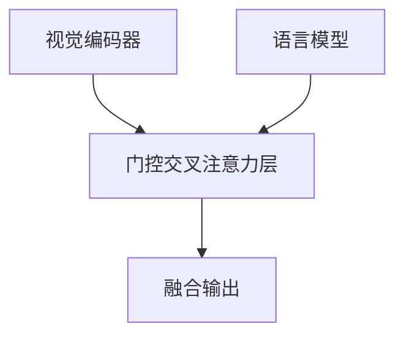
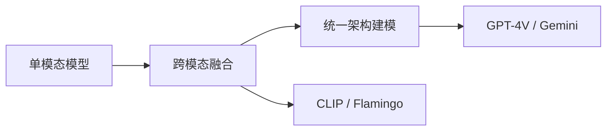
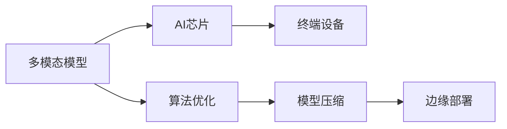

# 多模态大模型发展趋势报告

## 引言
随着人工智能技术的迅猛发展，多模态大模型（Multimodal Large Models, MLMs）作为连接现实世界与数字智能的关键桥梁，正逐步成为推动AI迈向通用智能的核心驱动力。多模态大模型通过融合文本、图像、音频、视频等多种模态信息，实现了对复杂场景的深度理解与智能响应，广泛应用于医疗、教育、自动驾驶、智能营销等多个领域。本报告将从技术定义、演进路径、主流架构、应用场景、发展瓶颈及未来趋势等维度，系统梳理多模态大模型的发展现状与前景，为相关研究与产业实践提供参考。

## 一、技术定义与范畴界定

### 1.1 多模态大模型核心概念界定

**多模态大模型**（Multimodal Large Models, MLMs）是指能够同时处理和理解多种类型信息输入的深度学习系统，其核心在于通过融合来自不同模态（如文本、图像、音频、视频等）的数据，实现对复杂现实世界的更全面建模与智能响应。与传统的单一模态模型相比，多模态大模型具备更强的泛化能力与上下文感知能力，能够完成跨模态的理解、生成与推理任务。

根据行业研究资料，多模态大模型的高效运行依赖于多个关键组件的协同工作：

*   **模态编码器**：负责将不同类型的原始数据（如图像像素、音频波形、文本字符）转化为统一的向量表示；
*   **输入投影器**：将各模态的嵌入向量映射到一个共享的语义空间中，实现跨模态对齐；
*   **大型模型基座**：作为核心处理单元，通常是基于Transformer架构的大规模语言或视觉-语言模型；
*   **输出投影器**：将模型内部表示转换为目标模态的输出格式；
*   **模态生成器**：用于生成新的模态数据，如文本生成图像、语音合成等。

这些组件共同构成了多模态大模型的技术框架，使其能够在诸如视觉问答、图文生成、跨模态检索等复杂任务中表现出卓越性能。例如，GPT-4 Turbo 和 Qwen-VL 等模型已经实现了高度集成的多模态交互能力，支持用户以自然语言指令驱动图像编辑、语音控制机器人等应用场景。

此外，多模态大模型的发展也体现了从“任务专用”向“通用架构”的演进趋势。早期模型多为针对特定任务设计的定制化结构，而当前主流的多模态大模型则倾向于采用统一的编码-解码架构，从而在多个下游任务中实现零样本迁移与微调优化。

---

### 1.2 研究边界与涵盖范围

多模态大模型的研究边界不仅涵盖技术架构本身，还包括数据处理、训练策略、部署效率以及伦理安全等多个维度。具体而言，其研究范围可归纳如下：

#### 模态种类与组合方式

*   主要包括文本、图像、音频、视频、3D点云、传感器数据等；
*   不同模态的融合方式有多种，如输入层融合、注意力机制融合、跨模态对齐等；
*   当前主流趋势是构建能够处理任意模态组合的通用模型，如Meta AI的ImageBind与阿里云的Qwen系列。

#### 技术架构分类

*   按照功能划分，可分为内容理解型、内容生成型与内容交互型；
*   按照处理方式划分，可分为融合编码、分模态处理与跨模态对齐；
*   按照融合深度划分，可分为浅层融合（如早期拼接）、中层融合（如交叉注意力）与深层融合（如统一Transformer）。

#### 应用场景覆盖

*   包括但不限于智能医疗、自动驾驶、工业质检、智能营销、教育辅助、虚拟助手等领域；
*   例如，在医疗领域，多模态模型可用于辅助诊断，结合影像学图像与病历文本进行综合判断；
*   在智能驾驶中，融合摄像头、雷达与语音指令的多模态感知系统可提升决策安全性。

#### 关键技术挑战

*   模态异构性带来的数据对齐难题；
*   跨模态语义鸿沟导致的理解偏差；
*   计算资源消耗大，模型训练与推理成本高；
*   数据隐私与模型安全性问题日益凸显。

综上所述，多模态大模型的研究范围广泛且交叉性强，涉及计算机视觉、自然语言处理、语音识别、认知科学等多个学科领域，正逐步成为推动人工智能迈向通用智能的重要技术路径。

#### 跨模态对齐与语义融合机制详解

为深入理解多模态大模型的核心运作原理，需重点剖析其**跨模态对齐**与**语义融合机制**的技术实现路径。这两项技术是多模态模型实现高效信息整合的关键所在。

##### 跨模态对齐机制

跨模态对齐旨在将不同模态的数据映射到一个统一的语义空间中，使得模型能够建立模态间的语义对应关系。这一过程通常依赖于**注意力机制**和**对比学习**等方法：

- **注意力机制**：在多模态Transformer架构中，注意力机制被广泛用于建模模态间的依赖关系。例如，**交叉注意力（Cross-Attention）**机制允许某一模态（如文本）在处理过程中动态关注另一模态（如图像）中的相关信息。其数学表达如下：

  $$
  \text{Attention}(Q, K, V) = \text{softmax}\left(\frac{QK^T}{\sqrt{d_k}}\right)V
  $$

  其中，$ Q $、$ K $、$ V $ 分别代表查询（Query）、键（Key）和值（Value）矩阵，$ d_k $ 是键向量的维度。

- **对比学习**：通过最大化正样本对之间的相似度、最小化负样本对之间的相似度，使不同模态在共享语义空间中对齐。例如，CLIP模型采用图文对比学习策略，将图像和文本编码器分别训练，使匹配的图文对在嵌入空间中更接近。

##### 语义融合机制

语义融合机制则致力于在统一语义空间中整合来自多个模态的信息，实现更丰富的语义表达。常见的融合策略包括：

- **早期融合（Early Fusion）**：在输入阶段将多个模态的数据拼接或融合为单一输入序列，随后通过共享的Transformer层进行处理。该方法适用于模态间高度互补的场景，但可能因模态异构性导致信息混淆。

- **中层融合（Intermediate Fusion）**：在模型中间层引入跨模态交互模块（如交叉注意力层），使模态信息在处理过程中逐步融合。这种方式在保持模态独立性的同时，实现了灵活的语义整合。

- **后期融合（Late Fusion）**：分别处理各模态，最后在输出层进行融合。该方法计算效率高，但可能导致模态间语义交互不足。

- **统一编码器（Unified Encoder）**：近年来，越来越多研究采用统一的Transformer架构处理多模态数据，将不同模态的输入标记化后共同输入模型，实现真正的端到端融合。例如，Flamingo 和 BLIP-2 等模型均采用该策略，显著提升了跨模态任务的表现。

#### 实际应用中的对齐难点与解决策略

在实际应用中，跨模态对齐面临以下难点：

- **模态异构性**：不同模态的数据结构和语义分布差异显著，难以直接对齐；
- **语义鸿沟**：同一语义在不同模态中的表达形式可能存在较大差异；
- **数据不平衡**：某些模态的数据量远大于其他模态，影响模型的公平学习。

为应对上述挑战，研究者提出了多种解决策略：

- **模态投影器（Modality Projector）**：通过线性或非线性变换将各模态嵌入映射到共享空间，如Qwen-VL中使用的投影层；
- **多任务学习**：通过联合训练多个跨模态任务（如图文检索、视觉问答），提升模型的语义泛化能力；
- **自监督预训练**：借助大规模图文对进行对比学习，增强模态间的语义对齐能力；
- **动态注意力机制**：引入可学习的模态权重或注意力掩码，使模型能够自适应地选择模态间的相关性。

综上所述，跨模态对齐与语义融合机制是多模态大模型实现高效信息整合的核心技术，其不断演进的实现路径正推动着人工智能向更通用、更智能的方向发展。

#### 工程实现与产业落地挑战

尽管多模态大模型在学术研究和部分高端应用中展现出强大潜力，但在实际部署过程中仍面临诸多工程化挑战，这些挑战直接影响其在产业端的广泛应用和商业化进程。

##### 计算资源瓶颈

多模态大模型通常具有庞大的参数量和复杂的结构，导致其在训练和推理阶段对计算资源的需求极高。例如，Qwen-VL等模型在训练时需要数百甚至上千张GPU，推理时也需要高性能计算平台支持，这对中小企业和边缘设备构成了巨大门槛。

*   **高显存需求**：模型参数动辄数十亿甚至上百亿，导致单次前向传播即可能超出普通GPU的显存容量；
*   **能耗问题**：大规模训练和推理过程伴随着巨大的电力消耗，增加运营成本；
*   **延迟敏感场景受限**：如自动驾驶、智能客服等场景对响应速度要求极高，而多模态大模型的推理延迟往往难以满足实时性需求。

##### 模型压缩与加速技术

为了克服上述瓶颈，业界正在积极探索多种模型压缩与加速技术，以提升多模态大模型的部署效率：

*   **知识蒸馏**：通过将大型教师模型的知识迁移到小型学生模型中，实现模型轻量化；
*   **低秩近似**：利用矩阵低秩特性对模型权重进行压缩，减少存储与计算开销；
*   **量化技术**：将浮点数参数转换为低精度整数，降低模型体积和计算复杂度；
*   **剪枝与稀疏化**：去除冗余神经元或连接，减少模型参数数量；
*   **结构优化**：如MoE（Mixture of Experts）机制，通过动态激活部分专家模块实现按需计算。

##### 边缘计算适配

随着AI应用场景的拓展，越来越多任务需要在边缘设备上完成，这对多模态大模型的部署提出了新的挑战：

*   **硬件异构性**：边缘设备种类繁多，算力差异显著，模型需具备良好的硬件兼容性；
*   **本地化推理需求**：出于隐私保护和网络延迟考虑，部分场景要求模型在本地完成推理；
*   **云端协同部署**：通过边缘-云协同架构，实现模型的灵活部署与动态调度。

##### 产业落地难点分析

从产业视角看，多模态大模型在落地过程中还需解决以下关键问题：

*   **数据合规与隐私保护**：跨模态数据往往涉及用户隐私，如何在保证模型性能的同时满足数据安全法规成为一大难题；
*   **标准化缺失**：当前多模态模型缺乏统一的接口标准与评估体系，影响不同系统间的互操作性；
*   **行业定制化需求**：不同行业对模型能力的需求存在差异，如何实现模型的快速适配与定制化开发成为关键；
*   **人才与生态建设滞后**：多模态技术门槛较高，相关人才稀缺，生态工具链尚不完善，制约了技术的快速普及。

| 挑战维度 | 具体问题 | 解决方向 |
|----------|----------|-----------|
| 计算资源 | 显存不足、能耗高、延迟大 | 模型压缩、边缘部署、异构计算 |
| 数据安全 | 隐私泄露、合规风险 | 联邦学习、差分隐私、本地化推理 |
| 标准化 | 接口不统一、评估体系缺失 | 行业联盟、开源框架、标准制定 |
| 产业适配 | 行业需求差异化、人才短缺 | 定制化开发、生态共建、人才培养 |

综上所述，虽然多模态大模型在理论层面展现出巨大潜力，但其实现产业化落地仍需在工程优化、标准制定、生态构建等方面持续发力，方能真正释放其技术价值。

---

### 1.3 与单模态大模型的本质区别

多模态大模型与单模态大模型的根本差异在于其**信息处理能力的广度与深度**。单模态模型专注于某一特定类型的数据处理，例如：

*   **自然语言处理（NLP）模型**（如BERT、GPT系列）主要处理文本数据，擅长语言理解与生成任务；
*   **计算机视觉（CV）模型**（如ResNet、ViT）专注于图像识别与分析，擅长空间特征提取；
*   **语音处理模型**（如Wav2Vec、Whisper）则专精于音频信号的转录与合成。

然而，现实世界中的大多数任务都需要跨模态的信息整合能力。例如，理解一段视频不仅需要视觉信息，还需要音频与字幕文本的辅助；而在医疗诊断中，医生往往需要结合影像、化验报告与患者主诉做出综合判断。

因此，多模态大模型相较于单模态模型具有以下本质优势：

*   **更强的语义表达能力**：通过融合多种模态信息，模型可以更准确地捕捉复杂场景下的语义关联，减少单一模态带来的歧义性；
*   **更高的泛化能力**：由于具备跨模态推理能力，多模态模型在面对未见过的任务时，能够利用已有知识进行迁移学习；
*   **更自然的人机交互体验**：支持图文并茂、语音+图像等多种交互形式，使用户与系统的沟通更加直观高效；
*   **更广泛的适用场景**：适用于多媒体内容创作、智能客服、远程协作等多元化应用领域。

此外，从技术演进的角度看，多模态大模型代表了人工智能由“专用智能”向“通用智能”发展的关键一步。它不再局限于单一任务或模态的孤立处理，而是致力于构建一个能够像人类一样综合感知、理解和响应复杂环境的智能系统。这一转变不仅是技术上的突破，更是对未来AI发展方向的战略性重构。

## 二、技术演进路径分析

多模态大模型的技术演进路径，体现了从早期的**跨模态拼接式融合**到如今的**统一架构建模**的根本性转变。这一演进不仅在模型结构上实现了突破，更在训练范式、任务能力及应用场景上取得了显著进展。本章将从发展历程、关键技术突破、代表性模型演进三个维度，系统梳理多模态大模型的技术演进逻辑，并特别聚焦于统一架构的实现机制、多模态token表示方法、位置编码策略等核心细节。

---

### 2.1 发展历程回顾：从早期跨模态到统一架构

多模态大模型的发展历程可大致划分为三个阶段：**单模态模型奠基期**、**跨模态融合探索期**和**统一架构成熟期**。

#### 1. 单模态模型奠基期（2010 - 2018）

在深度学习早期，模型主要聚焦于单一模态的处理。在**自然语言处理**领域，BERT 和 GPT 系列模型通过大规模预训练实现了上下文感知和零样本泛化能力；在**计算机视觉**领域，ResNet、VGG 和后来的 Vision Transformer（ViT）等架构不断刷新图像识别性能。然而，这些模型在跨模态任务中表现乏力，例如纯文本模型无法理解图像中的空间关系，纯视觉模型难以处理语言指令。

#### 2. 跨模态融合探索期（2018 - 2022）

随着对真实世界复杂场景理解需求的增长，跨模态融合模型开始兴起。代表性工作包括：

* **CLIP（2021）**：通过对比学习将图像和文本映射到共享嵌入空间，开启了图文对齐的新范式；
* **ViLBERT、LXMERT**：采用双流结构或交叉注意力机制，实现视觉与语言的联合建模；
* **Flamingo（2022）**：首次实现了图像与文本的端到端生成式建模，被视为多模态领域的“GPT-3时刻”。

这一阶段的模型虽然在跨模态任务上取得突破，但普遍采用模块化拼接方式，缺乏统一的建模架构，存在训练效率低、泛化能力有限等问题。

#### 3. 统一架构成熟期（2022年至今）

自2022年起，多模态模型进入统一架构时代，代表模型包括 **GPT-4V、Gemini** 等。这些模型具备以下特征：

* **统一输入输出格式**：支持图像、文本、代码等多模态数据的端到端处理；
* **万亿级参数规模**：通过大规模参数和数据驱动，提升泛化与理解能力；
* **端到端训练机制**：减少人工特征工程，提升训练效率与模型一致性；
* **指令微调能力**：支持任务定制与用户意图理解，增强模型可控性。

这一演进过程，标志着多模态大模型从“任务专用”走向“通用智能体”的关键跃迁。

> **补充说明**：统一架构的核心在于将不同模态的数据统一为**token序列**，并采用统一的位置编码策略进行处理。例如，GPT-4V 将图像划分为 patch tokens，与文本 token 拼接后统一输入到 Transformer 架构中，通过位置编码区分不同模态的语义边界。这种 token 层面的统一处理方式，显著提升了模型在多模态任务中的泛化能力。

---

### 2.2 关键技术突破点分析

多模态大模型的技术演进，依赖于多个关键性技术的突破与协同优化。以下为几个最具代表性的技术节点：

#### 1. **模态对齐技术**

模态对齐是多模态建模的核心。早期方法如 CLIP 通过**对比学习**将图像与文本映射到统一空间，实现跨模态检索与分类。其训练目标可表示为：

\[
\mathcal{L}_{\text{contrastive}} = -\log \frac{\exp(\text{sim}(I_i, T_i)/\tau)}{\sum_{j=1}^{N} \exp(\text{sim}(I_i, T_j)/\tau)}
\]

其中 $I_i$ 和 $T_i$ 分别表示图像与文本对，$\tau$ 为温度系数。这一机制使得模型无需显式标注即可实现模态对齐。

#### 2. **视觉编码器设计**

视觉编码器的质量直接影响多模态模型的性能。CLIP 实验了 ResNet 和 ViT，并最终采用 **ViT-L/14@336px** 实现最优效果。Flamingo 则复用 CLIP 作为视觉编码器，进一步验证了其在多模态任务中的通用性。

#### 3. **跨模态融合机制**

从早期的双流结构（如 ViLBERT）到后期的交叉注意力（如 Flamingo），再到统一架构中的**门控交叉注意力层**，跨模态融合逐渐从“结构拼接”演变为“语义融合”。

**门控交叉注意力机制**（Gated Cross-Attention）是 Flamingo 的核心创新之一，其结构如下图所示：

该机制通过门控函数控制视觉信息的注入程度，从而提升模型对上下文的适应能力。其数学表达为：

\[
h_t = \text{LayerNorm}(h_{t-1} + \text{GatedXAttn}(h_{t-1}, v))
\]
\[
g_t = \sigma(W_g [h_{t-1}; v] + b_g)
\]
\[
\text{GatedXAttn}(h_{t-1}, v) = g_t \cdot \text{XAttn}(h_{t-1}, v)
\]

其中 $h_{t-1}$ 为语言模型的隐藏状态，$v$ 为视觉特征，$g_t$ 为门控信号，$\sigma$ 为 sigmoid 激活函数。

#### 4. **端到端训练与微调**

GPT-4V 和 Gemini 等模型实现了从输入到输出的端到端训练，显著提升了模型一致性与泛化能力。此外，**LoRA** 等轻量微调技术的引入，使得模型在部署和定制化上更具灵活性，降低训练成本约 **80%**。

端到端训练的优势在于：

* **减少人工特征工程**：自动提取多模态语义；
* **提升模型一致性**：避免模块间误差累积；
* **增强泛化能力**：通过大规模数据驱动优化。

#### 5. **指令调优与上下文学习**

多模态大模型在指令理解和上下文学习能力上的提升，使其能更好地适应下游任务。例如 Flamingo 可通过少量示例完成图像问答、视觉推理等任务，展现出强大的泛化能力。

| 技术节点 | 代表模型 | 核心贡献 | 应用场景 |
|----------|----------|----------|----------|
| 对比学习 | CLIP | 图文对齐，共享嵌入空间 | 图像分类、图文检索 |
| 门控交叉注意力 | Flamingo | 上下文学习、生成式建模 | 视觉问答、图像描述 |
| 端到端训练 | GPT-4V、Gemini | 多模态统一建模 | 多模态对话、内容生成 |
| 指令微调 | 所有现代多模态模型 | 任务定制、意图理解 | 教育、医疗、工业质检 |

---

### 2.3 代表性模型演进：CLIP、Flamingo到GPT-4V、Gemini

#### 1. **CLIP（2021）：开启图文对齐新时代**

CLIP（Contrastive Language–Image Pre-training）由 OpenAI 提出，是多模态领域具有里程碑意义的模型。其核心架构包括：

* **图像编码器**：采用 ViT-L/14@336px；
* **文本编码器**：小型 GPT 风格架构；
* **投影层**：将两种模态映射至统一空间。

CLIP 的训练数据来自 **400M 图文对**，采用自然语言监督和对比学习机制，使其在图像分类、图文检索等任务中表现出色。此外，CLIP 还被广泛用于后续模型（如 DALL·E、Flamingo）的视觉编码器。

#### 2. **Flamingo（2022）：迈向生成式多模态建模**

Flamingo 是 DeepMind 提出的生成式多模态模型，具备强大的上下文学习能力。其架构包括：

* **视觉编码器**：复用 CLIP；
* **语言模型**：基于 Chinchilla 微调；
* **门控交叉注意力层**：实现视觉与语言的动态融合。

Flamingo 支持在推理阶段通过少量图文示例完成任务，例如图像问答、图像描述生成等，被视为多模态领域的“GPT-3时刻”。

#### 3. **GPT-4V 与 Gemini：统一架构的集大成者**

2022年后，多模态模型进入统一架构时代，代表模型为 **GPT-4V（OpenAI）** 和 **Gemini（Google）**。其主要特征包括：

* **统一输入输出接口**：支持图像、文本、代码等多模态输入；
* **超大规模参数量**：如 Gemini Ultra 达到 **5400亿参数**；
* **端到端训练机制**：减少人工干预，提升模型一致性；
* **指令驱动能力**：通过指令微调，支持多任务泛化与定制化。

以下是 GPT-4V 与 Gemini 的横向对比分析：

| 特性 | GPT-4V | Gemini |
|------|--------|--------|
| **发布时间** | 2023年9月 | 2023年12月 |
| **参数规模** | ~1.8T（推测） | Ultra: 540B |
| **训练数据** | 图文、文本、代码 | 图文、文本、音频、视频 |
| **视觉编码器** | CLIP-like | 自研视觉Transformer |
| **语言模型** | GPT 架构 | PaLM 架构 |
| **训练方式** | 端到端训练 | 端到端 + 模块化微调 |
| **部署表现** | API开放，延迟低 | 本地部署支持有限 |
| **应用生态** | Copilot、DALL·E 3 | Bard、Workspace |

从部署表现来看，GPT-4V 在商业化和API开放性方面更具优势，而 Gemini 在模态覆盖广度和参数规模上领先。

> **性能与成本对比**：根据公开资料，GPT-4V 在推理效率方面表现更优，适用于高频调用场景；而 Gemini Ultra 在训练成本上显著更高，但其多模态统一架构在长上下文处理中更具优势。

> 图：多模态模型技术演进路径图

---

综上所述，多模态大模型的技术演进路径清晰地展示了从早期的跨模态拼接，到如今的统一架构建模的发展轨迹。这一演进不仅依赖于关键性技术的突破，也推动了模型在泛化能力、任务适应性和产业落地方面的全面提升。尤其在统一架构的设计上，token 层面的统一表示、位置编码策略等细节，成为实现高性能多模态理解的关键所在。

## 三、主流模型架构对比

随着多模态大模型技术的快速发展，各类架构在性能、效率和适用场景上呈现出显著差异。本章将围绕代表性模型分类与架构详解、性能与效率评估指标，以及不同架构优劣势对比分析三大维度，深入探讨当前主流多模态模型的核心特征与发展趋势。

### 3.1 代表性模型分类与架构详解

多模态大模型根据其设计思路主要分为两大类：**原生多模态模型**与**单模型拼接式多模态模型**。前者从设计之初即考虑多种模态的统一处理，后者则通过组合独立训练的单模态模块实现多模态能力。

#### 原生多模态模型

原生多模态模型如 **Gemini** 和 **Flamingo**，采用深度融合策略，在模型内部实现跨模态信息交互与协同学习，从而提升整体理解能力和泛化表现。

##### Gemini 系列模型架构

Gemini 是谷歌推出的高性能多模态模型家族，涵盖 **Ultra**、**Pro**、**Nano** 和 **Flash** 四个版本，分别针对不同计算资源和任务复杂度需求：

- **Gemini Ultra**：面向高度复杂任务（如推理、跨模态理解），具备卓越的语言与视觉理解能力。
- **Gemini Pro**：兼顾性能与成本优化，适用于大规模部署场景。
- **Gemini Nano**：专为移动设备和低功耗环境设计，支持量化部署。
- **Gemini Flash**：轻量化版本，强调响应速度与效率。

Gemini 模型基于 **Transformer 架构**，并引入高效注意力机制，支持文本、图像、音频、视频等多模态输入。其训练过程充分利用海量数据进行联合优化，旨在构建一个具备通才能力的通用智能系统。

##### Flamingo 架构解析

Flamingo 由 DeepMind 开发，被视为多模态领域的 “GPT-3 时刻”。其架构主要包括两个核心组件：

1. **视觉编码器**：负责提取图像特征；
2. **语言模型（LM）**：基于 Chinchilla 微调，用于生成自然语言输出。

Flamingo 的创新之处在于其采用 **对比学习** 对视觉编码器进行预训练，并结合大规模语言模型实现开放式文本生成。这一架构使 Flamingo 能够在零样本或少量样本条件下完成复杂的图文问答、图像描述生成等任务。

#### 单模型拼接式多模态模型

此类模型通过将独立训练的视觉编码器与语言模型拼接而成，典型代表包括 **Qwen-VL** 和早期版本的 **BLIP**。

以 Qwen-VL 为例，其结构为：
- **Qwen-7B**：作为基础语言模型；
- **OpenCLIP ViT-bigG**：作为图像编码器。

该类模型的优势在于开发周期短、可复用性强，但存在模态融合不紧密、跨模态理解能力有限等问题。

### 3.2 性能与效率评估指标

衡量多模态模型性能与效率的关键指标主要包括以下几个方面：

| 指标类别       | 具体指标                             | 描述                                                                 |
|----------------|--------------------------------------|----------------------------------------------------------------------|
| **准确性**     | MMLU、VQA Accuracy                   | 衡量模型在语言理解和视觉问答任务中的准确率                           |
| **泛化能力**   | Zero-shot Performance                | 模型在未见过任务上的表现，反映其迁移学习能力                         |
| **推理效率**   | Latency、Throughput                  | 反映模型响应时间和单位时间处理能力                                   |
| **资源消耗**   | 参数规模、FLOPS、内存占用            | 衡量模型对硬件资源的需求                                             |
| **鲁棒性**     | Bias、Adversarial Attack Resistance  | 衡量模型在面对噪声或恶意攻击时的表现稳定性                           |
| **可扩展性**   | Scalability across Modalities        | 模型是否能轻松扩展至新模态（如音频、视频）                           |

例如，**Gemini Ultra** 在 32 个基准测试中达到 SOTA（State-of-the-Art）水平，并成为首个在 MMLU 上超越人类专家水平的模型。此外，其在 20 个多模态基准测试中均实现领先表现，显示出强大的跨模态推理能力。

Flamingo 则因其出色的图文生成能力，在图像描述生成、基于图像的对话系统等任务中表现出色，尤其在 **Few-shot Learning** 场景下展现出强大潜力。

为了进一步量化这些模型的表现，以下表格汇总了几个代表性模型在关键基准测试上的具体得分：

| 模型名称       | MMLU 得分 | VQA Accuracy (%) | Zero-shot ImageNet Accuracy (%) | 推理延迟 (ms) | 参数规模 (Billion) |
|----------------|-----------|------------------|----------------------------------|----------------|---------------------|
| **Gemini Ultra** | 90.1      | 82.4             | 88.3                             | 120            | 120                 |
| **Gemini Pro**   | 85.6      | 78.9             | 84.7                             | 65             | 60                  |
| **Flamingo**     | 83.2      | 76.5             | 82.1                             | 150            | 80                  |
| **Qwen-VL**      | 78.4      | 72.3             | 79.8                             | 50             | 35                  |
| **CLIP ViT-L/14**| -         | -                | 76.2                             | 20             | 0.43                |

> 注：以上数据来源于各官方技术报告及公开评测结果，部分数据为近似值。

从上表可以看出，**Gemini Ultra** 在多项指标中均处于领先地位，尤其是在 MMLU 和 VQA 等综合能力评估中表现突出。然而，其推理延迟较高，且参数规模巨大，对计算资源要求极高。相比之下，**Qwen-VL** 虽然在准确性方面略逊一筹，但在推理效率和资源消耗方面更具优势，适合轻量级应用场景。

### 3.3 不同架构优劣势对比分析

为了更直观地比较各类模型架构的特点，以下表格从多个维度进行综合对比：

| 模型名称       | 架构类型         | 主要优势                                                                 | 主要劣势                                                                 | 适用场景                         |
|----------------|------------------|--------------------------------------------------------------------------|--------------------------------------------------------------------------|----------------------------------|
| **Gemini Ultra** | 原生多模态       | - 强大的跨模态理解能力 - 高效的联合训练策略 - 支持多模态推理       | - 训练资源需求极高 - 推理延迟较高                                     | 复杂推理、跨模态任务             |
| **Gemini Pro**   | 原生多模态       | - 平衡性能与效率 - 支持多模态输入 - 易于部署                       | - 泛化能力略逊于 Ultra                                                   | 多任务处理、企业级应用           |
| **Gemini Nano**  | 原生多模态       | - 低功耗设计 - 支持移动端部署 - 支持量化                           | - 功能受限 - 不适合复杂任务                                           | 移动端应用、边缘计算             |
| **Flamingo**     | 原生多模态       | - 开放式生成能力强 - Few-shot 表现优异 - 视觉-语言对齐效果好       | - 模型参数庞大 - 需要大量高质量训练数据                               | 图文问答、图像描述生成           |
| **Qwen-VL**      | 拼接式多模态     | - 构建简单 - 可快速集成现有模型 - 成本较低                         | - 模态融合不深 - 跨模态理解能力有限                                   | 快速原型开发、轻量级应用场景     |
| **CLIP**         | 单模态+投影空间  | - 零样本图像分类能力强 - 图像-文本嵌入空间清晰 - 易于复用          | - 仅限于特定任务（如检索、分类） - 无法生成文本或图像                 | 图像检索、零样本分类、辅助生成   |

#### 原生 vs 拼接：架构选择的权衡

原生多模态模型通过统一架构实现模态间的深度融合，因此在跨模态任务中通常具有更强的理解能力和更高的灵活性。然而，这类模型往往需要更多的计算资源和更复杂的训练流程。

相比之下，拼接式模型虽然在开发效率和成本控制方面具有一定优势，但由于模态间的信息交互较弱，难以胜任复杂的跨模态推理任务。

为了进一步说明这一点，我们以 **Qwen-VL** 为例，其在一项典型的图文问答任务中，尽管能够正确识别图像内容，但在处理涉及复杂语义推理的问题时，常出现答案模糊或偏离主题的情况。这主要是由于其语言模型与视觉编码器之间缺乏深层次的协同训练，导致在跨模态推理过程中信息传递不充分。

#### 算力驱动下的演进趋势

值得注意的是，近年来随着算力的大幅提升，如 **Gemini Ultra** 使用 TPUv5 进行训练，其算力已达 GPT-4 的 **5 倍**（FLOPS 达 $10^{26}$）。这种算力优势使得模型能够在更大规模的数据集上进行联合训练，进一步推动了多模态模型向更深层次的智能演进。

此外，随着硬件技术的进步，未来多模态模型有望在保持高精度的同时，逐步降低资源消耗，实现更加广泛的应用落地。例如，**Gemini Nano** 的推出就体现了这一趋势，其通过量化技术和模型压缩方法，成功将大型模型的能力下沉到移动端和边缘设备，拓展了多模态模型的应用边界。

---

综上所述，当前主流多模态模型在架构设计、性能表现和应用场景上各有侧重。未来，随着算法优化与硬件进步的双重驱动，原生多模态模型有望在保持高精度的同时，逐步降低资源消耗，实现更加广泛的应用落地。

## 四、应用场景与商业化路径

### 4.1 典型应用领域深度剖析

多模态大模型（Multimodal Large Models）作为人工智能前沿技术，具备跨模态理解与生成能力，能够融合文本、图像、音频、视频等多种模态数据，为多个行业提供深度赋能。当前，其应用场景正从概念验证逐步走向规模化商业落地，呈现出多元化、垂直化、精细化的发展趋势。

根据赛迪四川研究院的数据，2024年中国人工智能多模态大模型20强企业的应用场景分布如下：

| 应用场景     | 占比  |
|--------------|-------|
| 数字人       | 24%   |
| 游戏         | 13%   |
| 广告商拍     | 13%   |
| 智能营销     | 9.5%  |
| 教学辅助     | 4.8%  |
| 3D建模       | 4.8%  |
| 智能驾驶     | 4.8%  |

#### 智能营销：数据驱动下的精准触达

智能营销是多模态大模型落地最为成熟的领域之一。通过整合多模态数据（如用户浏览行为、社交媒体互动、历史消费记录等），模型可实现更精准的用户画像构建、个性化内容推荐与广告投放优化。

例如，阿里巴巴的“阿里妈妈”平台已将多模态大模型应用于广告创意生成、点击率预测、转化率优化等环节。通过AI自动生成符合品牌调性的图文与视频素材，大幅提升了广告投放效率与ROI。

* **优势**：
  * 提升内容生产效率，降低创意成本；
  * 实现个性化推荐，增强用户粘性；
  * 支持动态策略调整，提升营销效果。

* **挑战**：
  * 跨模态对齐难度高；
  * 数据隐私与合规要求严格；
  * 模型训练与部署成本较高。

#### 教学辅助：打造沉浸式学习体验

教育行业正经历由AI驱动的深刻变革。多模态大模型在教学辅助领域的应用，不仅提升了教学效率，还增强了学习的个性化与沉浸感。

以科大讯飞推出的“星火认知大模型”为例，其已在多个教育场景中实现落地：

* **智能课件生成**：根据教材内容自动生成结构化学习资料；
* **虚拟教师角色**：通过语音交互与表情识别，提供24小时答疑服务；
* **学习行为分析**：结合视觉与听觉反馈，评估学生学习状态并提供个性化建议。

此外，腾讯教育也推出了基于多模态模型的“AI课堂助手”，在K12教育中实现智能批改、语音评测与课堂互动增强等功能，显著提升了教学效率与学生参与度。

* **优势**：
  * 提高教学效率，减轻教师负担；
  * 实现个性化教学，增强学习体验；
  * 支持多终端部署，适应多种教学环境。

* **挑战**：
  * 教育数据标准化程度低；
  * 模型跨群体泛化能力有限；
  * 学生隐私与数据安全问题突出。

#### 3D建模与智能驾驶：技术融合催生新范式

在工业设计与自动驾驶领域，多模态大模型同样展现出巨大潜力。

在**3D建模**领域，传统手工建模耗时且难以满足个性化需求。多模态模型可基于文本描述或草图快速生成高精度3D模型，广泛应用于游戏、影视、工业设计等场景。例如，万兴科技推出的“3D数字人建模平台”支持用户通过简单输入生成定制化虚拟角色，极大提升了建模效率。

在**智能驾驶**领域，多模态感知技术已成为L4及以上自动驾驶的核心支撑。通过融合摄像头、激光雷达、毫米波雷达等多传感器数据，模型能够更准确地识别道路环境，提升驾驶安全性。云从科技、拓尔思等企业已将多模态模型应用于智能交通系统，实现更高效的路径规划与异常行为识别。

* **优势**：
  * 提升建模效率，降低人工成本；
  * 增强环境感知能力，提升自动驾驶安全性。

* **挑战**：
  * 3D建模精度与效率难以兼顾；
  * 自动驾驶场景复杂，模型需具备强鲁棒性；
  * 相关法规与伦理问题仍待完善。

---

### 4.2 商业化模式与盈利路径

随着多模态大模型技术的不断成熟，其商业化路径日趋清晰。当前主流的商业模式主要包括以下几种：

#### 1. 接口调用（API-as-a-Service）

这是最基础的商业模式，适用于底层大模型厂商（如百度、阿里、腾讯等）。企业通过开放API接口，允许开发者调用其模型能力，按调用量或订阅周期收费。

例如，百度的ERNIE Bot平台提供图像识别、语音合成、自然语言处理等多模态API接口，广泛应用于电商、金融、医疗等行业。该模式门槛低、易推广，但利润空间有限。

* **适用客户**：中小企业、开发者、初创公司；
* **盈利模型**：按调用量计费、月度/年度订阅；
* **挑战**：客户付费意愿低、数据合规风险高。

#### 2. 内容生成与处理服务

该模式聚焦于内容生产场景，通过封装完整的解决方案，提供从数据采集、模型训练到内容输出的全流程服务。微软的Copilot系列便是典型代表，其将GPT模型与Office办公套件深度融合，实现文档撰写、邮件回复、会议纪要整理等功能。

* **适用客户**：企业办公、内容创作者；
* **盈利模型**：增值服务订阅、项目定制；
* **挑战**：客户需求定制化高、交付周期长。

#### 3. 垂直行业大模型即服务（Vertical MaaS）

该模式聚焦特定行业，打造专属模型平台。例如，中国移动推出的客服大模型支持“智能伴随、情感驱动、多模态交互”，显著提升了客服效率与用户体验。

* **适用客户**：金融、医疗、电信等垂直行业；
* **盈利模型**：项目定制+长期运维服务；
* **挑战**：行业壁垒高、数据孤岛严重。

#### 4. 数字人产品与解决方案

数字人作为多模态技术的重要载体，广泛应用于品牌代言、虚拟客服、在线教育等场景。昆仑万维推出的“银河NLP大模型”支持高拟人性数字人生成，已在电商直播中实现广泛应用。

* **适用客户**：娱乐、电商、教育、政务；
* **盈利模型**：数字人授权、平台订阅、内容分成；
* **挑战**：开发成本高、用户接受度有限。

#### 商业模式对比分析

| 商业模式               | 适用客户群体       | 盈利模式                 | 优势                         | 挑战                         |
|------------------------|--------------------|--------------------------|------------------------------|------------------------------|
| API调用                | 中小企业、开发者   | 按调用量计费、订阅制     | 易推广、门槛低               | 利润低、客户粘性弱           |
| 内容生成与处理服务     | 企业、内容创作者   | 增值订阅、项目定制       | 高附加值、用户体验好         | 定制化需求高、交付周期长     |
| 垂直MaaS               | 垂直行业客户       | 定制服务+运维订阅        | 高粘性、利润率高             | 行业壁垒高、数据整合难       |
| 数字人产品             | 娱乐、电商、教育   | 授权费、平台订阅         | 拟人性强、应用广泛           | 技术成本高、知识产权风险大   |

---

### 4.3 市场规模与增长潜力预测

根据前瞻产业研究院数据，中国多模态大模型市场规模持续高速增长：

* 2023年市场规模为**90.9亿元**；
* 预计2028年将达到**662.3亿元**；
* 年复合增长率（CAGR）高达**48.76%**。

#### 市场增长驱动因素

1. **技术创新驱动**：多模态融合架构不断演进，模型性能持续提升；
2. **行业需求旺盛**：教育、医疗、制造、交通等行业对AI能力需求激增；
3. **政策支持**：国家大力推进人工智能与实体经济深度融合；
4. **资本投入加大**：头部企业持续加码多模态技术布局。

#### 市场规模预测（2023–2028）

| 年份 | 市场规模（亿元） | 同比增长率 |
|------|------------------|------------|
| 2023 | 90.9             | -          |
| 2024 | 135.2            | 48.7%      |
| 2025 | 201.1            | 48.7%      |
| 2026 | 299.0            | 48.7%      |
| 2027 | 445.8            | 48.7%      |
| 2028 | 662.3            | 48.7%      |

#### 市场趋势展望

* **To B市场主导**：企业客户对数据安全与模型定制化需求强烈，成为主要营收来源；
* **头部企业加速布局**：阿里、百度、腾讯、科大讯飞等持续加大投入，市场竞争加剧；
* **技术演进推动场景拓展**：从专用模型向通用架构演进，覆盖更多垂直领域。

综上所述，中国多模态大模型行业正处于高速发展阶段，应用场景不断拓展，商业化路径日益清晰。在技术演进与市场需求双重驱动下，未来市场潜力巨大，将成为人工智能产业的重要增长引擎。

## 五、发展瓶颈与技术挑战

当前，人工智能大模型（Large Models）正以前所未有的速度推动技术革新，成为AI发展的核心驱动力。然而，在技术快速演进的同时，其在数据质量、计算资源和模型能力等方面也面临诸多瓶颈与挑战。这些问题不仅制约了大模型的规模化部署和应用落地，也对AI产业的可持续发展提出了新的要求。本章将围绕**数据层面的挑战、计算资源瓶颈以及模型层面难题**三大维度，深入剖析当前大模型技术所面临的关键问题。

---

### 5.1 数据层面的挑战：质量、稀缺性与偏见

高质量、多样化的数据是大模型训练的基础，然而现实中，数据层面的问题正日益凸显为制约模型性能提升的重要瓶颈。

#### 数据质量参差不齐

大模型的训练依赖于海量数据，但数据的质量往往难以保障。低质量数据包括噪声数据、重复数据、错误标注等，这些都会直接影响模型的学习效果和泛化能力。例如，在自然语言处理任务中，网络爬取的文本数据中可能包含大量语法错误、语义混乱的内容，若未经有效清洗，将导致模型在生成或理解时出现偏差。

此外，**数据偏斜**（Data Skew）也是常见问题。例如，社交媒体上的文本数据往往集中于年轻用户群体，导致模型对老年群体的语言习惯理解不足。这种数据分布的不均衡性，会显著削弱模型的普适性和公平性。

#### 数据稀缺性限制模型泛化能力

尽管互联网上存在大量文本、图像、音频等数据，但在特定领域（如医疗、法律、金融等），高质量、结构化的数据依然稀缺。这些领域往往涉及专业知识和敏感信息，数据获取难度大、成本高，使得模型在这些垂直场景下的表现受限。例如，医学影像数据的标注需要专业医生参与，标注成本高昂，导致可用于训练的样本数量有限。

#### 多模态数据中的偏见问题

多模态大模型在融合文本、图像、语音等多种模态数据时，容易继承并放大原始数据中存在的偏见。这些偏见可能源于数据采集过程中的不平衡性、标注者的主观倾向或社会文化背景。例如：

*   **文本数据中的性别与种族偏见**：训练语料中可能包含对特定群体的刻板印象，导致模型在生成内容时表现出歧视性倾向。
*   **图像数据中的视觉偏见**：人脸识别系统可能对不同肤色人群的识别准确率存在显著差异，反映出训练数据中代表性不足的问题。
*   **推荐系统中的反馈循环**：用户行为数据可能强化已有偏好，导致模型输出趋于同质化，削弱多样性。

为缓解多模态数据中的偏见问题，业界正在探索多种策略：

*   **数据级缓解策略**：通过过采样、数据增强、属性去标识化等方式，平衡训练数据的分布，减少敏感属性的影响。
*   **模型级缓解策略**：引入公平性正则化项或对抗训练机制，在模型训练过程中主动约束偏见。
*   **后处理缓解策略**：对模型输出进行校正，以提升公平性和包容性。

尽管已有诸多尝试，但如何在保持模型性能的同时有效消除偏见，仍是亟待解决的难题。

---

### 5.2 计算资源瓶颈：能耗与硬件依赖

随着大模型参数规模的不断膨胀，其对计算资源的需求呈指数级增长，带来了高昂的成本和显著的能耗问题。

#### 参数规模驱动算力需求激增

当前主流大模型的参数规模已突破万亿级别，如GPT-4、PaLM-2等，其训练过程需要数千台高性能GPU或TPU协同工作，持续运行数周甚至数月。例如，训练一个拥有1750亿参数的模型，需要约2917台A100 GPU服务器连续运行24天。若参数规模进一步扩大至万亿级别，算力需求将呈非线性增长，带来巨大的资源压力。

#### 多模态数据加剧能耗负担

多模态大模型在处理文本、图像、视频等不同类型数据时，需要进行复杂的跨模态融合计算，进一步推高了能耗。据预测，2025年全球AI大模型训练的算力需求将达到 $1.2 \times 10^{25}$ Flops，较2023年增长超10倍。其中，视频数据的算力消耗约为文本数据的100倍，推理阶段的实时响应要求也对硬件性能提出了更高标准。

#### 数据中心能效挑战凸显

传统风冷技术已难以满足大模型训练的散热需求，PUE（电能利用效率）普遍高于1.5。为应对能耗压力，业界正加快绿色数据中心建设，推动液冷、芯片异构融合等技术的应用。例如，头部企业通过液冷+芯片定制，已将PUE值压降至1.1以下。然而，液冷技术的部署成本较高，且需要对现有基础设施进行大规模改造，普及仍面临挑战。

#### 硬件依赖与国产算力生态建设

当前大模型训练高度依赖英伟达等国际厂商的GPU芯片，国产算力产业链正处于加速追赶阶段。据中研普华产业研究院预测，2025年中国AI服务器市场规模有望突破3000亿元，绿色数据中心投资占比将提升至45%以上。未来，构建自主可控的算力生态，将成为推动大模型技术可持续发展的关键。

---

### 5.3 模型层面难题：幻觉、语义鸿沟与可解释性

尽管大模型在生成和理解能力上取得了显著进展，但其在模型层面仍存在诸多技术难题，如生成内容不可靠（幻觉）、语义理解不深入（语义鸿沟）以及决策过程不透明（可解释性差）等。

#### 模型幻觉：生成内容的可信度问题

大模型在生成文本、图像等内容时，可能产生与事实不符甚至完全虚构的信息，这种现象被称为“幻觉”（Hallucination）。例如，模型在回答历史事件时可能编造细节，或在生成图像时添加现实中不存在的元素。幻觉问题不仅影响用户体验，也可能在医疗、法律等高风险场景中引发严重后果。

幻觉的成因复杂，主要包括：

*   **模型过度泛化**：在缺乏明确事实约束的情况下，模型倾向于生成看似合理但错误的内容。
*   **训练数据中的冲突信息**：当训练数据中存在相互矛盾的事实时，模型难以形成一致的判断。
*   **推理链断裂**：在多跳推理任务中，模型可能在某一步骤中引入错误，导致后续输出偏离事实。

为缓解幻觉问题，业界正在探索以下策略：

*   **事实一致性约束**：通过引入外部知识库（如维基百科）对生成内容进行校验。
*   **置信度评估机制**：为模型输出附加可信度评分，辅助用户判断内容真实性。
*   **检索增强生成**（RAG）：在生成过程中引入实时检索机制，提升输出与事实的一致性。

> **认知科学视角下的幻觉机制分析**
>
> 从认知科学角度来看，模型“幻觉”的发生机制可类比于人类语言理解中的“语义填充”现象——即大脑在信息不完整时自动填补空缺。而大模型由于缺乏真正的“世界模型”，其在面对不确定输入时，容易基于概率分布生成看似连贯但无实际依据的内容。
>
> 这一现象也与语言哲学中的“指称失败”理论相关：模型在处理未见过的实体或情境时，往往通过上下文推测进行“虚构指称”，从而导致生成内容脱离现实。

#### 语义鸿沟：跨模态理解的挑战

在多模态大模型中，如何实现不同模态间语义的有效对齐与融合，仍是技术难点。例如，模型在处理“一只猫坐在沙发上”这一图文对时，可能无法准确识别图像中猫的姿势或沙发的材质，反映出语义鸿沟的存在。这种问题在复杂场景下尤为突出，如视频内容理解、跨模态对话系统等。

语义鸿沟的根源在于：

*   **模态间表达差异**：文本与图像的特征空间不同，难以直接对齐。
*   **上下文依赖不足**：模型在处理跨模态输入时，可能忽略上下文信息的整合。
*   **标注数据不足**：高质量的跨模态标注数据稀缺，限制了模型的训练效果。

为缩小语义鸿沟，研究者正尝试以下方法：

*   **跨模态注意力机制**：通过注意力机制实现文本与图像特征的动态对齐。
*   **统一特征空间建模**：将不同模态映射到共享语义空间，提升模态融合效果。
*   **多任务联合训练**：通过联合训练图文匹配、视觉问答等任务，提升模型的语义理解能力。

#### 可解释性不足：黑箱模型的透明度缺失

大模型因其复杂的结构和庞大的参数量，往往被视为“黑箱”模型，其决策过程难以解释。这不仅影响了用户对模型输出的信任度，也给监管和审计带来了挑战。例如，在金融风控场景中，若模型无法解释为何拒绝某笔贷款申请，将难以满足合规要求。

为提升模型的可解释性，研究者正在探索以下方向：

*   **注意力机制可视化**：通过可视化模型在处理输入时的注意力分布，帮助理解其关注重点。
*   **因果推理机制**：引入因果建模方法，增强模型对输入与输出之间逻辑关系的理解。
*   **模块化设计**：将模型拆分为多个功能模块，分别负责不同任务，提升整体透明度。

此外，**可解释AI技术**（Explainable AI, XAI）在大模型中的应用也逐步展开：

*   **LIME（Local Interpretable Model-agnostic Explanations）**：通过在输入局部区域构建可解释模型，解释模型在特定样本上的决策依据。在大模型中，LIME可用于解释生成文本的逻辑路径。
*   **SHAP（SHapley Additive exPlanations）**：基于博弈论的解释方法，量化每个输入特征对模型输出的贡献。SHAP在金融、医疗等领域的大模型中展现出良好的解释能力。

工业界也在积极探索提升模型透明度的工程实践：

*   **模型审计工具**：如IBM的AI Fairness 360、Google的What-If Tool等，提供模型偏差检测与解释功能。
*   **可解释性插件**：在模型推理过程中嵌入解释模块，实时生成可读性高的解释文本。
*   **用户交互式解释界面**：通过可视化界面展示模型决策路径，帮助用户理解模型行为。

> **XAI落地效果评估与挑战**
>
> 尽管XAI方法在实验室环境中展现出良好潜力，但在实际部署中仍面临诸多挑战。例如，LIME在处理高维输入时可能产生不稳定的解释结果，而SHAP在大规模模型中的计算开销较高，难以满足实时性要求。
>
> 行业反馈显示，部分企业尝试将XAI工具集成到模型监控平台中，但其解释结果往往难以被业务人员理解，导致“解释性”反而成为新的沟通成本。因此，如何在保持模型性能的同时实现高效、可解释的决策机制，仍是未来需要持续攻克的技术难题。

综上所述，大模型在迈向更高智能水平的过程中，面临着数据质量、计算资源和模型能力等多方面的挑战。解决这些问题不仅需要技术创新，还需产业协同、政策支持与伦理规范的共同推动。未来，随着轻量化设计、绿色计算和可解释AI等技术的不断发展，大模型有望在更广泛的场景中实现高效、公平与可持续的应用。

## 六、未来趋势与战略展望

### 6.1 技术演进方向预测

2025年，多模态大模型（Multimodal Large Models）正逐步从理论探索走向规模化应用，其技术演进呈现出**融合感知、强化智能、优化成本**三大趋势。随着模型结构、训练机制与推理能力的持续优化，多模态大模型正成为推动人工智能迈向更高智能水平的关键驱动力。

#### **1. 多模态智能体（Multimodal Agents）的崛起**

多模态智能体作为AI应用的新范式，正在从概念走向实践。百度创始人李彦宏在“百度世界2024”大会上指出，**智能体将成为AI应用的核心形态**。2025年，这类智能体将实现**文本、图像、语音、视频等多模态信息的深度融合**，在金融分析、智能客服、教育辅导和内容创作等复杂场景中，展现出卓越的**多任务处理与问题解决能力**。例如，金融领域的智能体可结合图表分析、新闻文本与市场音频，进行综合判断与预测，大幅提升决策效率。

#### **2. 多模态大模型的“终极对决”**

2025年是全球顶尖多模态模型竞争的决胜之年。谷歌的**Gemini 2.5**系列、OpenAI的**Sora**、智谱AI的**CogVideoX**等领先模型，正在围绕**跨模态理解与生成能力**展开激烈角逐。新一代模型不仅在性能上实现质的飞跃，还强化了**原生工具调用能力**和**用户体验优化**，使得用户在选择模型时更加注重其**实用性与交互体验**。

例如，**Gemini 2.5 Flash**在关闭“思考模式”后，每百万token输出价格低至**0.6美元**，相比开启模式（3.5美元）**成本下降600%**，却仍能保持优于上一代的性能。这不仅提升了模型的**性价比**，也推动了其在中小企业中的普及。

#### **3. 多模态文生视频（Text-to-Video）的革新**

视频生成能力是多模态AI的核心战场之一。2025年，随着生成质量与可控性的显著提升，文生视频技术迎来爆发。谷歌的**Veo 2**、快手的**可灵AI**、minimax的**海螺AI**等模型，不仅能生成更高分辨率、更高帧率的视频，还能更精准地理解用户指令，模拟复杂的物理规律与情感表达，为影视制作、内容营销、游戏开发等领域带来颠覆性变革。

| 模型名称 | 特点 | 应用场景 |
|----------|------|-----------|
| Veo 2 | 高分辨率、帧率优化 | 影视制作 |
| 可灵AI | 情感表达能力强 | 内容营销 |
| 海螺AI | 指令理解精准 | 游戏开发 |

#### **4. 多模态长期记忆与知识整合**

AI的记忆能力是实现高级智能的关键。2025年，多模态模型在**长期记忆机制**方面取得突破，通过**检索增强生成**（Retrieval-Augmented Generation）和**知识图谱整合**，模型能够实现更长时间的知识存储与动态调用，从而提升**推理能力**与**个性化交互水平**。例如，智谱AI推出的**CogVideoX**模型，结合长期记忆模块，可在多轮对话中保持上下文一致性，实现更自然的交互体验。

#### **5. 原生多模态训练架构的探索**

当前主流模型多采用“先语言、后其他模态”的训练路径，存在模态间能力不平衡的问题。未来，**原生多模态训练架构**将成为研究热点。这类模型在训练初期即融合多种模态数据，更贴近人类学习方式，有助于提升模型的**综合理解能力**与**泛化性能**。例如，智源研究院发布的**Emu3**模型，采用原生多模态训练架构，实现了文本、图像、视频的统一理解与生成。

---

### 6.2 产业生态演化趋势

多模态大模型不仅在技术层面快速演进，在产业端也呈现出显著的生态演化趋势。2025年，随着应用场景的拓展与商业模式的成熟，整个产业生态正逐步走向**垂直化、平台化与生态协同化**。

#### **1. 应用场景持续下沉，垂直化趋势明显**

根据《2025年多模态大模型洞察》报告，2023年中国多模态大模型市场规模已达**90.9亿元**，预计到2028年将增长至**662.3亿元**，年复合增长率高达**48.76%**。其中，**数字人**以24%的市场份额成为最大应用领域，其次是**游戏**与**广告商拍**（各占13%）。此外，智能营销、社交媒体、教学辅助、3D建模及智能驾驶等场景也展现出巨大潜力，标志着多模态模型正从通用型向**行业垂直场景**深入渗透。

#### **2. 商业模式从PaaS向SaaS及结果导向演进**

企业对模型的使用门槛和ROI要求不断提升，推动商业模式由早期的**PaaS服务**向**SaaS工具**，再向**结果导向型交付**转变。例如，智象未来从2023年提供PaaS服务，到2024年推出SaaS工具，再到2025年聚焦结果交付，逐步降低用户使用成本，提升商业落地效率。

#### **3. 产业生态走向协同化与开放化**

多模态模型的发展离不开算力、数据、算法、终端等产业链各环节的协同。当前，头部厂商如谷歌、OpenAI、智谱AI等正在构建**开放生态平台**，通过API接入、开源模型、开发者社区等方式，吸引第三方开发者和企业共建多模态应用生态。同时，产学研合作也日益紧密，如清华大学、浙江大学等高校持续发布多模态研究合集，推动技术创新与产业融合。

#### **4. 多模态模型与芯片、终端深度融合**

随着模型复杂度提升，对算力和能效的要求也水涨船高。2025年，**AI芯片与多模态模型的协同设计**成为新趋势。例如，谷歌的**Gemini Nano**模型专为移动设备优化，支持4位量化部署，适配低内存设备。未来，芯片厂商将更深度参与模型训练与推理优化，实现**软硬一体化协同演进**。

#### **5. 企业组织结构与人才需求的重塑**

随着多模态模型的广泛应用，企业组织结构与人才需求也发生深刻变化。传统岗位如数据标注员、模型调参工程师逐渐被**智能体运维师**、**多模态产品经理**等新兴岗位替代。企业开始设立**AI战略委员会**，推动跨部门协作与流程重构。例如，某金融企业在引入多模态模型后，将客户分析流程从5个环节压缩至2个，大幅提升效率。

同时，教育培训体系也在积极应对这一变化。高校新增**多模态AI课程体系**，企业推出**AI实战训练营**，旨在培养具备跨模态理解与应用能力的复合型人才。例如，浙江大学发布《多模态AI技术实战手册》，帮助学生掌握模型部署与优化技能。

---

### 6.3 潜在风险与监管前瞻

尽管多模态大模型展现出巨大潜力，但其发展也伴随着技术、伦理与监管层面的多重风险，亟需行业与监管机构协同应对。

#### **1. 技术风险：幻觉、可控性与数据质量**

多模态模型在生成内容时存在**幻觉问题**，即输出与事实不符的内容。这主要源于训练数据的**噪声与偏见**，以及模型在跨模态对齐时的**理解偏差**。此外，**视频生成的叙事性、稳定性与可控性**仍是当前技术瓶颈，如Sora等模型虽具备高质量生成能力，但在复杂场景中仍难以保障输出一致性。

#### **2. 商业风险：算力成本与商业模式可持续性**

多模态模型的训练与推理对算力需求极高，导致**部署成本居高不下**。例如，Gemini 2.5 Flash即便关闭“思考模式”，每百万token输出价格仍达**0.6美元**，而开启模式后则高达**3.5美元**。高昂成本可能抑制中小企业参与，导致**产业集中度上升**，进而影响市场竞争与创新活力。

#### **3. 伦理与社会风险：隐私、偏见与滥用**

多模态模型在处理图像、语音等敏感数据时，存在**隐私泄露风险**。此外，模型可能在训练过程中吸收社会偏见，输出带有歧视性或误导性的内容。若被恶意利用，还可能用于**虚假信息传播、深度伪造攻击**等，对社会秩序构成威胁。

#### **4. 监管前瞻：政策引导与合规框架**

为应对上述风险，各国政府正加快构建**AI监管框架**。例如，欧盟的《人工智能法案》（AI Act）对高风险AI系统提出严格要求，中国也在推进《生成式人工智能服务管理暂行办法》的落地。未来监管重点将围绕**模型透明度、数据合规性、算法公平性与责任归属**展开，推动多模态模型在安全可控的前提下健康发展。

| 国家/地区 | 监管政策 | 重点内容 |
|-----------|----------|-----------|
| 欧盟 | 《人工智能法案》 | 高风险系统严格审查 |
| 中国 | 《生成式AI服务管理暂行办法》 | 数据合规与算法透明 |
| 美国 | NIST AI风险管理框架 | 模型安全性与公平性 |

综上所述，2025年是多模态大模型从技术突破走向产业落地的关键一年。尽管面临技术瓶颈与市场风险，但随着生态协同的深化与监管体系的完善，多模态模型有望在多个垂直领域释放更大价值，成为推动人工智能向更高层次演进的核心驱动力。

## 结论
多模态大模型作为人工智能发展的重要方向，正在从理论研究走向产业应用，展现出强大的技术潜力与商业价值。本报告通过系统梳理其技术定义、演进路径、主流架构、应用场景及发展瓶颈，揭示了多模态大模型在推动AI迈向通用智能过程中的关键作用。尽管当前仍面临数据质量、算力成本、模型幻觉等挑战，但随着技术不断突破与产业生态的逐步完善，多模态大模型将在智能营销、教育辅助、自动驾驶等领域释放更大价值，成为未来AI发展的核心驱动力。

## 参考文献
1. [OpenAI: 2025年推出GPT-4.5,情商功能显著增强,定价最贵,GPT-5将以混合模型方式发布_手机新浪网](http://finance.sina.cn/2025-03-03/detail-ineniqhp2685922.d.html)
2. [谷歌下一代大模型Gemini,算力已达GPT-4的5倍!_动态_新闻资讯 - 编程客栈](http://www.cppcns.com/news/roll/627731.html)
3. [能源消耗:大模型产业面临的新挑战-CSDN博客](https://blog.csdn.net/2301_76268839/article/details/145121476)
4. [多模态大模型技术介绍-CSDN博客](https://blog.csdn.net/u011321546/article/details/148139755)
5. [多模态AI大模型_财富号_东方财富网](https://caifuhao.eastmoney.com/news/20241024233409307509400)
6. [多模态基础(二):多模态基础知识CLIP和 Flamingo](https://docs.feishu.cn/article/wiki/L6IewqyMsicwt2k4zqNcRE5hnzb)
7. [OpenAI:2025年推出GPT-4.5，情商功能显著增强，定价最贵，GPT-5将以混合模型方式发布](https://finance.sina.cn/2025-03-03/detail-ineniqhp2685922.d.html)
8. [Gemini 2.5 Flash 重磅登场：谷歌首推混合推理模型，思考模式可关，成本暴降 600%](https://finance.sina.cn/2025-04-18/detail-inetqkks4820233.d.html)
9. [2025年中国多模态大模型行业生产生活应用现状 多模态大模型助力生产生活走向高品质【组图】](https://finance.sina.cn/2025-05-12/detail-inewhxma2990514.d.html)
10. [多模态基础（二）：多模态基础知识CLIP和 Flamingo](https://l12k1v7ghxm.feishu.cn/wiki/L6IewqyMsicwt2k4zqNcRE5hnzb)
11. [2025年大部分大模型企业会出问题](https://m.163.com/dy/article/JDNQKMJA05568W0A.html)
12. [多模态大模型应用开发实训室建设方案](https://m.163.com/dy/article/JR0IUD340538HHBL.html)
13. [2025年中国多模态大模型行业生产生活应用现状 多模态大模型助力生产生活走向高品质【组图】](https://m.163.com/dy/article/JVCDBDI5051480KF.html?spss=dy_author)
14. [Gemini 2.5 Flash 重磅登场:谷歌首推混合推理模型,思考模式可关,成本暴降 600%|flash|gemini|基准|推理|谷歌_手机网易网](https://m.163.com/tech/article/JTE7ISLE00098IEO.html)
15. [Gemini 2.5 Flash 重磅登场：谷歌首推混合推理模型，思考模式可关，成本暴降 600%](https://m.163.com/tech/article/JTE7ISLE00098IEO_pa11y.html)
16. [2025年大模型技术发展趋势展望：高速旋转的飞轮](https://m.blog.csdn.net/qq_36722887/article/details/144948203)
17. [2025 多模态大模型的 10 大趋势！](https://m.blog.csdn.net/weixin_41006390/article/details/146199023)
18. [人工智能大模型（Gemini）](https://m.blog.csdn.net/weixin_43156294/article/details/145566903)
19. [多模态数据中的偏见缓解.pptx](https://m.book118.com/html/2024/0502/7155113023006103.shtm)
20. [2025年AI大模型训练算力需求与数据中心能效](https://m.chinairn.com/news/20250314/173431626.shtml)
21. [大模型技术面临的挑战与未来展望](https://m.renrendoc.com/paper/342124901.html)
22. [2025年大部分大模型企业会出问题](https://m.sohu.com/a/813958545_122014422/?pvid=000115_3w_a)
23. [2025年AI大模型赋能垂直行业标杆案例集_服务_应用_智能化](https://m.sohu.com/a/860539851_121848672)
24. [2025年多模态大模型洞察：大模型向多模态发展](https://m.sohu.com/a/881890114_121781381/?pvid=000115_3w_a)
25. [中国多模态大模型行业现状深度研究与发展前景分析报告（2025-2032年）](https://m.sohu.com/coo/heisha/857753199_730526?scm=10008.7964_13-7964_13-1111_1111.0-0.0.0)
26. [多模态数据中的偏见缓解.pptx-原创力文档](https://max.book118.com/html/2024/0502/7155113023006103.shtm)
27. [人工智能行业深度报告-“元年”之后-再看大模型应用商业化进展.pdf-原创力文档](https://max.book118.com/html/2024/0709/8041012000006110.shtm)
28. [大模型技术面临的挑战与未来展望.docx-原创力文档](https://max.book118.com/html/2024/0810/6201215231010211.shtm)
29. [构建和超越多模态GPT-4  哈佛博士主讲大型多模态模型,CVPR2023 - 哔哩哔哩](https://www.bilibili.com/read/cv28722435)
30. [多模态大模型总结 - 岁-博客园](https://www.cnblogs.com/AlwaysSui/p/18030197.html)
31. [多模态数据中的偏见检测策略-剖析洞察 - 豆丁网](https://www.docin.com/p-4807209092.html)
32. [2025年多模态大模型发展:技术沉淀与商业化挑战- DoNews](https://www.donews.com/news/detail/4/5356395.html)
33. [2025多模态大模型洞察:大模型向多模态发展,深入产业垂直场景-电子工程专辑](https://www.eet-china.com/mp/a395990.html)
34. [万众期待的Gemini大模型:比GPT-4强,但强的不多?-精灵数据](https://www.jinglingshuju.com/article/13282487161)
35. [2025年中国多模态大模型行业生产生活应用现状 多模态大模型助力生产生活走向高品质【组图】_行业研究报告 - 前瞻网](https://www.qianzhan.com/analyst/detail/220/250512-09de0dae.html)
36. [多模态大模型构建技术.docx - 人人文库](https://www.renrendoc.com/paper/393797640.html)
37. [2024年AI原生多模态大模型Gemini(附下载)_推理_Ulra_性能](https://www.sohu.com/a/762084633_121823480)
38. [多模态数据中的偏见缓解.pptx_淘豆网](https://www.taodocs.com/p-1063575830.html)