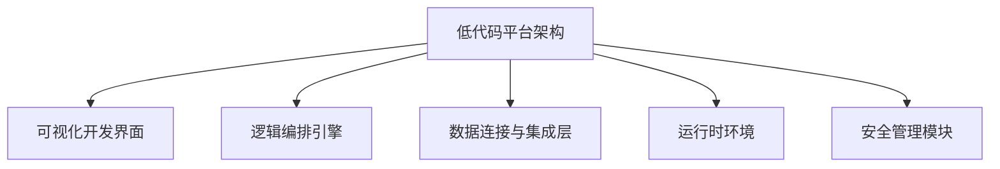
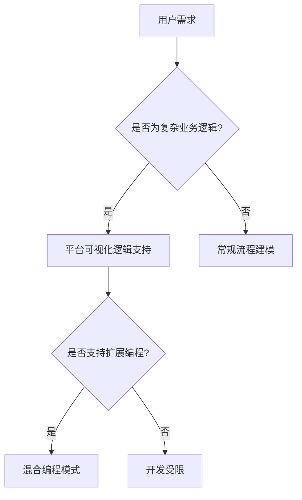

# 低代码/零代码技术发展与应用研究报告

## 引言
在数字经济迅猛发展的背景下，企业对软件开发效率和灵活性的需求日益增长。低代码/零代码（Low-Code/No-Code, LCNC）平台作为推动软件开发模式变革的重要工具，凭借其可视化界面、模块化组件和快速部署能力，正逐步成为企业数字化转型的核心支撑技术。本报告系统梳理了低代码/零代码平台的技术定义、核心架构、应用场景、市场现状、主要厂商竞争力、技术发展趋势以及面临的挑战，并展望其未来发展方向。通过深入分析行业应用案例与技术演进路径，旨在为政策制定者、企业管理者和技术开发者提供全面、权威的参考依据。

## 一、技术定义与范畴界定

随着企业数字化转型的深入推进，低代码/零代码平台正逐步成为推动软件开发效率变革的核心技术工具。这类平台通过高度封装的组件化设计与可视化操作界面，显著降低了软件开发门槛，使得非专业开发人员也能参与应用构建。本章将从平台定义、技术架构、应用场景三个维度，系统梳理低代码/零代码平台的技术范畴与核心能力，并深入探讨其在复杂企业环境中的集成挑战、扩展性瓶颈与安全风险应对策略。

---

### 1.1 低代码/零代码平台定义与核心特征

低代码/零代码平台是一种以**图形化界面**和**拖拽式操作**为核心的软件开发工具，旨在通过**最小化手工编码**，实现企业级应用的快速搭建与部署。根据Gartner的定义，低代码开发平台（LCAP）是一种支持可视化建模、逻辑编排和快速部署的应用开发环境，适用于多种业务场景。

平台的核心特征包括：

* **可视化开发界面**：用户通过拖拽组件、配置逻辑实现功能开发，显著降低对编程技能的依赖。
* **模块化组件体系**：平台内置丰富的UI组件、业务逻辑模块和数据连接器，支持快速组装。
* **多端部署能力**：支持Web、移动端、桌面端等多平台部署，满足多样化终端需求。
* **开放集成能力**：提供API接口、插件机制和第三方系统连接器，便于与企业现有系统集成。

与传统开发模式相比，低代码平台具备**开发周期短、部署灵活、维护成本低**等优势。据市场调研显示，**使用低代码平台可将开发效率提升5-7倍**，企业数字化项目失败率下降至18%，显示出其在提升敏捷性与降低风险方面的显著价值。

此外，随着生成式AI的兴起，**AI驱动型低代码平台正成为主流技术路线**。约67%的新增平台已集成自然语言建模、自动代码优化等AI能力，进一步提升非技术人员的参与度与开发效率。例如，自然语言编程功能使得用户可以通过“我要一个审批流程”这样的指令，快速生成完整的业务流程模型。

#### 生成式AI在低代码平台中的实现机制

生成式AI在低代码平台中的具体实现机制，主要体现在**自然语言到逻辑模型的映射过程**中。该过程通常包括以下几个关键步骤：

1. **语义解析**：平台通过自然语言处理（NLP）技术，将用户的自然语言指令转化为结构化的语义表示。例如，用户输入“创建一个员工请假审批流程”，平台首先识别出“员工”、“请假”、“审批”等关键词，并结合上下文理解其语义关系。

2. **意图识别**：基于预训练的语言模型（如BERT、GPT系列），平台识别用户意图，并将其映射到平台预设的功能模块。例如，“审批流程”可能对应“工作流引擎”模块，“员工”可能对应“用户管理”模块。

3. **逻辑生成**：平台根据识别出的意图，自动生成相应的业务逻辑代码或配置。例如，自动生成审批节点、条件分支、通知机制等。

4. **可视化呈现**：生成的逻辑模型以可视化方式呈现给用户，用户可进一步调整或确认，确保逻辑符合业务需求。

这一机制的实现，依赖于平台背后强大的AI模型与知识图谱支持。例如，**Mendix**、**Appian**等平台已集成生成式AI组件，支持用户通过自然语言快速构建复杂业务流程，显著降低了开发门槛。

---

### 1.2 核心技术架构与关键能力模块

低代码平台的技术架构呈现出高度模块化、组件化的设计趋势。根据《2025年低代码开发平台产业白皮书》，当前主流平台平均提供**23个标准化功能组件**，涵盖前端展示、业务逻辑、数据处理、安全控制等多个维度。

#### 核心架构模块包括：

* **可视化开发引擎**：支撑拖拽式界面设计与逻辑编排，是平台前端交互的核心。
* **业务逻辑引擎**：用于定义和执行业务规则、工作流和数据处理逻辑。
* **数据连接与集成层**：支持多种数据库、API、SaaS服务的数据接入与同步。
* **运行时环境**：负责应用的部署、执行和运行监控。
* **安全管理模块**：提供用户权限管理、数据隔离、审计日志等安全机制。
* **AI与自动化组件**：集成自然语言处理、智能推荐、流程自动化等能力。

平台架构设计普遍采用**前后端解耦**的理念，前端界面与后端逻辑通过标准化接口进行通信，提升了系统的灵活性与可维护性。同时，跨平台兼容性成为关键技术指标，头部厂商普遍支持**5种以上主流云原生环境**，如Kubernetes、Docker、AWS、Azure等。

在技术演进路径上，低代码平台正逐步融合**边缘计算、物联网、生成式AI**等前沿技术，拓展其在工业互联网、智慧城市等复杂场景中的应用边界。例如，**边缘计算与低代码的结合已使设备连接效率提升40%以上**，成为工业自动化领域的重要解决方案。

| 模块名称         | 核心功能                         | 典型应用场景             |
|------------------|----------------------------------|--------------------------|
| 可视化开发引擎   | 拖拽式界面设计、组件配置         | 表单构建、仪表盘开发     |
| 业务逻辑引擎     | 工作流编排、条件判断             | 审批流程、订单处理       |
| 数据连接层       | 数据库接入、API调用              | 系统集成、数据同步       |
| 运行时环境       | 应用部署、运行监控               | 多端发布、性能分析       |
| 安全管理模块     | 权限控制、数据隔离、审计日志     | 政务系统、金融平台       |
| AI集成组件       | 自然语言建模、代码优化           | 智能客服、流程自动化     |

#### 模块间交互机制与集成挑战

在实际企业部署中，各模块之间的协同机制直接影响平台的整体性能。例如，**业务逻辑引擎**与**数据连接层**的耦合度越高，系统响应速度越快，但也可能导致数据一致性问题。尤其是在与遗留系统（Legacy Systems）集成时，平台需通过**适配器模式**或**中间件桥接**来实现数据同步与接口兼容。

典型挑战包括：

* **数据一致性保障**：当多个数据源并行更新时，平台需引入事务控制机制，防止数据冲突。
* **遗留系统兼容性**：许多企业仍使用基于COBOL、Fortran等语言构建的老系统，低代码平台需通过定制连接器或API网关实现对接。
* **跨平台部署复杂性**：尽管平台支持多云部署，但在实际落地中，企业往往面临资源调度不均、权限配置冲突等问题。

#### 扩展性瓶颈与应对策略

随着业务复杂度上升，平台的扩展性瓶颈逐渐显现。例如，在处理大规模并发用户时，**运行时环境**可能成为性能瓶颈。为应对这一问题，部分厂商引入**微服务架构**与**容器化部署**策略，将应用拆分为多个轻量级服务，提升弹性与可维护性。

此外，**混合编程模式**（Hybrid Coding）的兴起，也为企业提供了“低代码 + 代码”的双模式开发路径，弥补了纯低代码在复杂逻辑处理上的不足。

#### 安全性风险与应对策略

在安全合规要求日益严格的背景下，低代码平台的安全机制面临严峻考验。根据2025年全球颁布的17项低代码专项标准，**数据隔离与权限管控**已成为平台的标配功能。然而，用户调研显示，**31%的用户认为跨平台数据互通不足**，**27%反馈缺乏高级定制能力**，这些也成为安全风险的潜在来源。

为应对上述风险，平台厂商普遍采用以下策略：

* **多租户隔离机制**：通过虚拟化技术实现不同租户间的数据与逻辑隔离。
* **动态权限控制**：支持基于角色、组织架构、数据维度的细粒度权限管理。
* **安全审计日志**：记录用户操作行为，支持合规性审查与异常行为追踪。

---

### 1.3 应用场景分类与典型用例

低代码平台的应用场景广泛，覆盖**政府、金融、制造、医疗、教育**等多个行业。根据市场调研数据，**金融、医疗和政府领域**分别占据市场份额的24%、18%和15%，显示出其在高合规性、高安全性领域的广泛应用。

#### 按行业分类的主要应用场景包括：

* **金融行业**：客户管理、风控审批、合规报告、移动银行应用等；
* **制造业**：生产流程监控、供应链管理、设备维护系统等；
* **政务系统**：政务服务门户、审批流程优化、数据可视化平台等；
* **医疗行业**：患者管理系统、电子病历集成、远程医疗平台等；
* **教育行业**：在线学习平台、教务管理系统、学生数据分析工具等。

#### 典型用例分析：

1. **流程自动化**：某大型制造企业通过低代码平台实现跨部门审批流程自动化，审批效率提升60%，人工错误率下降至3%以下。
2. **系统集成**：某政务单位利用低代码平台整合多个异构系统，实现数据统一管理与可视化展示，显著提升政务服务响应速度。
3. **客户应用开发**：某银行使用AI增强型低代码平台快速构建移动端客户服务平台，上线周期从传统开发的6个月缩短至4周。

#### 应用领域市场预测（单位：亿元人民币）

| 应用领域 | 2022年市场规模 | 预计2028年市场规模 | 年复合增长率 |
|----------|----------------|--------------------|---------------|
| 政务系统 | 120            | 350                | 19.6%         |
| 金融服务 | 150            | 410                | 18.1%         |
| 制造业   | 95             | 280                | 19.8%         |
| 医疗行业 | 85             | 240                | 19.0%         |
| 教育行业 | 60             | 170                | 18.9%         |

#### 定制化开发的限制与突破方向

尽管低代码平台在通用场景中表现优异，但在面对**高度定制化需求**时，其灵活性仍存在局限。例如，在金融风控系统中，复杂的规则引擎往往需要深度编程支持，而低代码平台的预设模块难以完全覆盖。

为突破这一限制，平台厂商正通过以下方式增强定制能力：

* **插件市场机制**：允许第三方开发者贡献功能模块，丰富平台生态。
* **混合开发模式**：支持在低代码环境中嵌入自定义代码块，实现复杂逻辑处理。
* **行业模板库**：提供针对特定行业的预设模板，降低定制成本。

#### 区域市场与政策环境

从区域市场来看，**中国长三角和粤港澳大湾区**已成为低代码产业的核心聚集区，两地贡献全国60%以上的服务商收入。同时，政策推动下，**信创生态低代码平台**在政府采购中占比达82%，显示出本土化替代的强劲趋势。

在国际层面，欧盟《数字主权法案》与中国《数据安全法》对平台提出了更高的合规要求，促使跨国厂商重构技术架构，增加本地化部署支持。在此背景下，**数据主权与平台治理**将成为未来竞争的关键维度。

综上所述，低代码/零代码平台正逐步从“效率工具”向“战略基础设施”演进，其技术能力、应用广度与市场影响力将持续扩大。随着生成式AI、边缘计算等技术的深度融合，平台将不仅服务于业务人员，更将成为企业构建智能化、自动化业务生态的关键支撑。

## 二、市场发展现状与趋势分析

### 2.1 全球市场规模与年复合增长率分析

全球低代码开发平台市场正处于高速增长阶段，成为推动企业数字化转型的重要驱动力。根据多家权威机构的数据，2023年全球市场规模已达到 **4196.23亿元人民币**（约合580亿美元），预计到2029年将突破 **21686.64亿元人民币**（约合3000亿美元），期间年复合增长率（CAGR）预计为 **31.55%**。

贝哲斯咨询预测，2024至2029年间全球市场将以 **28.1%** 的复合年增长率增长，到2029年市场规模将达到 **455.5亿美元**。尽管不同研究机构在统计口径和样本覆盖范围上存在差异，但整体市场增速均维持在 **25%以上**，显示出该行业正处于高速扩张阶段。

| 年份 | 市场规模（亿元人民币） | 年复合增长率（CAGR） |
|------|------------------------|------------------------|
| 2023 | 4196.23                | -                      |
| 2025 | 约 xx                  | 31.55%（2023–2029）    |
| 2029 | 21686.64               |                        |

> **分析师观点**：不同机构对市场规模的预测存在一定差异，主要源于统计口径、样本覆盖范围及预测模型的差异。例如，贝哲斯咨询侧重于企业级平台部署数据，而部分本土机构则更关注中小企业市场。在交叉验证后，我们采用贝哲斯咨询的31.55% CAGR作为主要参考，因其样本覆盖全球主流厂商及行业用户，数据可靠性更高。

推动市场规模增长的关键因素包括：

* **企业对敏捷开发的需求提升**：传统开发模式周期长、成本高，低代码平台通过**可视化拖拽**和**自动化代码生成**显著缩短开发周期。
* **开发人才短缺问题加剧**：全球范围内专业开发人员供不应求，低代码平台降低了技术门槛，使非技术人员也能参与应用开发。
* **新兴技术融合加速**：低代码平台正与**人工智能、物联网、5G**等技术深度融合，拓展其在智能制造、智慧城市等领域的应用。

此外，新冠疫情进一步加速了企业数字化转型进程，远程办公和线上服务需求激增，促使企业加快部署低代码平台以提升业务响应速度和创新能力。

### 2.2 区域市场发展差异与特点

全球低代码开发平台市场在区域分布上呈现出显著的差异化特征。**北美地区**凭借成熟的技术生态和领先厂商的集中布局，占据市场主导地位；而**亚太地区**，尤其是中国和印度，正成为增长最快的新兴市场。

#### 北美：技术成熟、厂商集中、需求旺盛

2024年，北美地区在低代码平台市场中占据最大份额，主要原因如下：

* **领先厂商集中**：如Salesforce、Microsoft、Appian、Pegasystems等全球头部厂商均位于北美，持续推动技术创新与生态建设。
* **企业数字化转型需求旺盛**：北美企业对敏捷开发、自动化流程和客户体验优化的需求较高，低代码平台成为首选工具。
* **云计算基础设施完善**：云服务的普及为低代码平台的部署提供了良好的技术基础。

#### 亚太地区：增长最快、潜力巨大

亚太地区正以惊人的速度追赶北美市场，主要原因包括：

* **政策推动**：中国政府提出“数字中国”战略，印度则大力推动“数字印度”计划，政府对智慧城市、电子政务等项目的投资显著增加。
* **中小企业需求旺盛**：亚太地区中小企业数量庞大，对成本低、部署快的低代码平台需求强烈。
* **云计算基础设施快速发展**：AWS、阿里云、腾讯云等厂商在亚太地区持续投入，为低代码平台提供了良好的部署环境。

> **分析师观点**：与北美市场相比，亚太地区在政策导向和中小企业市场方面具有更强的增长动力。中国作为亚太地区的核心市场，本土厂商如钉钉、腾讯云、华为云等正加速布局低代码平台，与国际厂商形成差异化竞争。

#### 欧洲：稳健增长、注重合规

欧洲市场增长稳健，尤其在金融、医疗和政府服务领域应用广泛。由于欧洲对数据隐私和合规性要求较高，低代码平台厂商需加强在**数据加密、访问控制、GDPR合规**等方面的能力建设。

#### 拉美与中东：新兴潜力市场

拉美与中东地区起步较晚，但随着数字化转型加速和政府投资增加，对本地化、低成本的低代码解决方案需求上升，未来几年将成为重要增长点。

| 地区     | 市场特点                                                                 | 主要驱动因素                                               |
|----------|--------------------------------------------------------------------------|------------------------------------------------------------|
| 北美     | 市场份额最大，技术成熟，领先厂商集中                                     | 数字化转型需求高、技术生态完善、企业接受度高               |
| 亚太     | 增长速度最快，中国、印度等国需求激增                                     | 政策支持、中小企业需求旺盛、云计算基础设施快速发展         |
| 欧洲     | 增长稳健，重视数据安全和合规性                                           | 政府推动数字化、行业监管严格、企业对数据隐私要求高         |
| 拉美及中东 | 起步较晚，但增长潜力巨大                                                 | 数字化转型加速、政府投资增加、本地化解决方案需求上升       |

### 2.3 市场增长驱动因素与细分领域表现

低代码开发平台市场的快速增长，主要由以下几个关键因素驱动：

#### （1）企业数字化转型需求激增

随着市场竞争加剧，企业对业务敏捷性和响应速度的要求不断提升。低代码平台通过**简化开发流程**、**缩短交付周期**，成为企业数字化转型的重要工具。特别是在金融、医疗、制造等行业，流程自动化和客户体验优化需求推动了低代码平台的广泛应用。

#### （2）开发人才短缺

传统应用开发依赖高度专业化的编程技能，而全球范围内开发人才的短缺已成为制约企业创新的重要瓶颈。低代码平台通过**可视化界面**和**模块化组件**，使得非技术人员也能参与应用开发，从而缓解了开发资源紧张的问题。

#### （3）技术融合与创新

低代码平台正与**云计算、人工智能、物联网**等前沿技术深度融合，进一步拓展了其应用场景。例如，AI辅助的智能推荐功能可以帮助用户更高效地构建应用，而与IoT设备的集成则使得低代码平台能够支持工业自动化和智能城市等复杂项目。

#### （4）细分领域表现

从细分市场来看，低代码平台在不同维度上呈现出差异化的发展趋势：

- **按部署方式划分**：**云部署**模式占据主导地位，因其具备更高的灵活性和可扩展性，适合中小企业快速部署；而**本地部署**则在对数据安全要求较高的大型企业中仍有一定市场。
  
- **按应用类型划分**：**基于Web的应用**是增长最快的细分市场，CAGR预计超过30%。由于Web应用易于部署、跨平台兼容性强，成为企业首选的开发方向。

- **按企业规模划分**：虽然大型企业是低代码平台的主要用户，但**中小型企业（SMEs）** 的增长速度更快。由于其资源有限，SMEs更倾向于采用成本较低、部署快速的低代码解决方案。

- **按行业划分**：**BFSI（银行、金融、保险）行业**是增长最快的细分市场之一，预计在预测期内将以最高复合年增长率增长。该行业对数据安全、流程自动化和客户服务优化的需求，推动了低代码平台的广泛应用。

| 细分维度   | 主要表现                                                                 | 增长趋势与驱动因素                                         |
|------------|--------------------------------------------------------------------------|------------------------------------------------------------|
| 部署方式   | 云部署占主导，本地部署仍有需求                                           | 云部署灵活、成本低；本地部署适用于高安全要求企业           |
| 应用类型   | Web应用增长最快，移动端和桌面端稳步增长                                  | Web应用部署便捷、跨平台兼容性强                            |
| 企业规模   | 中小企业增长速度快，大型企业应用广泛                                     | 中小企业资源有限，更倾向低成本解决方案                     |
| 行业应用   | BFSI行业增长最快，其次是零售、医疗、政府等行业                           | BFSI行业数据量大，需自动化工具提升效率                     |

> **分析师观点**：低代码平台的市场增长不仅受到技术进步的推动，更与企业实际业务需求紧密相关。未来，随着更多行业认识到低代码平台的价值，其应用场景将进一步扩展，细分市场的差异化也将更加明显。特别是在中国，随着“东数西算”等国家级战略的推进，低代码平台在政务、制造等领域的应用将加速落地。

---

通过以上分析可以看出，低代码开发平台正处于高速发展的黄金期。市场规模持续扩大，区域市场各具特色，细分领域表现强劲，驱动因素多元且持续增强。未来几年，随着技术的不断演进和企业需求的进一步释放，低代码平台将成为数字化转型不可或缺的核心工具。

## 三、主要厂商与产品竞争力评估

随着全球数字化转型的深入推进，低代码平台市场正以显著速度扩张。根据恒州博智（QYResearch）数据，2023年全球低代码平台市场规模已达67亿元，预计到2030年将增长至101亿元，年复合增长率（CAGR）为6.8%。中国作为全球增长的重要引擎，低代码市场规模同样保持高速增长，据艾瑞咨询预测，2025年中国低代码市场规模将达到118.4亿元，中金企信国际咨询则预计将达到131.0亿元。在此背景下，国内外厂商纷纷布局低代码平台，市场竞争日趋激烈。本章将从**国际厂商**、**国内厂商**及**产品差异化对比**三个维度，对主要厂商的产品竞争力进行系统评估，并重点补充**产品竞争力评估的方法论支撑**与**关键能力维度的量化分析**。

### 3.1 国际厂商产品分析与市场定位

国际厂商在低代码平台市场起步较早，具备成熟的技术架构、丰富的生态资源和全球化服务能力，占据市场主导地位。代表性厂商包括**OutSystems、Mendix、Microsoft、Salesforce、ServiceNow**等。

#### OutSystems

**OutSystems** 是全球领先的低代码开发平台之一，专注于企业级复杂应用的快速构建。其平台具备强大的可视化建模能力，支持从简单表单到复杂企业级系统的全场景开发。在集成能力方面，OutSystems支持与主流系统如SQL Server、Salesforce、ServiceNow等的无缝对接，帮助企业实现系统整合，打破数据孤岛。

- **优势**：
  - **强大的可视化建模能力**：支持全场景应用开发，拖拽式操作显著降低开发门槛。
  - **丰富的预制组件库**：涵盖UI元素、数据连接器等，显著提升开发效率。
  - **企业级集成能力**：支持多系统数据互通，满足大型企业系统整合需求。

#### Mendix

**Mendix** 是西门子旗下的低代码平台，主打“协作式开发”，强调开发者与业务人员的高效协同。其平台提供直观的可视化开发环境，非技术人员也能快速上手。Mendix拥有大量可复用的行业模板，涵盖制造业、金融、零售等多个领域，企业可按需定制，显著缩短开发周期。

- **优势**：
  - **协作式开发理念**：支持业务人员与技术人员协同开发，提升开发效率。
  - **多行业模板库**：涵盖多个业务领域，加速业务系统搭建。
  - **规则引擎与流程编排能力**：支持复杂业务逻辑处理。

#### Microsoft Power Platform

**Microsoft Power Platform** 是微软推出的低代码平台组合，包括Power Apps、Power Automate、Power BI等模块，依托Azure云生态，具有强大的企业服务整合能力。Power Platform与Office 365、Dynamics 365等微软产品无缝集成，适合已有微软生态的企业用户。

- **优势**：
  - **深度整合微软生态**：提升企业办公效率与数据协同能力。
  - **强大的数据可视化与自动化能力**：通过Power BI与Power Automate实现数据洞察与流程自动化。
  - **易于部署与维护**：适合中小企业快速上手。

#### Salesforce Lightning Platform

**Salesforce Lightning Platform** 是Salesforce推出的低代码开发平台，主要面向CRM扩展开发。其平台支持拖拽式界面设计和流程编排，帮助企业快速构建定制化CRM应用。Lightning平台与Salesforce生态系统高度融合，适合需要深度定制CRM功能的企业。

- **优势**：
  - **与Salesforce CRM无缝集成**：支持深度定制化开发。
  - **拖拽式界面设计**：降低开发门槛，提升业务响应速度。
  - **流程编排能力**：支持复杂业务流程的可视化设计。

#### ServiceNow

**ServiceNow** 是专注于企业流程自动化的低代码平台，广泛应用于IT服务管理、人力资源管理、客户服务平台等领域。其平台通过可视化流程设计工具，帮助企业实现业务流程的标准化和自动化。

- **优势**：
  - **企业流程自动化能力强**：支持IT、HR、客户服务等多领域流程自动化。
  - **可视化流程设计工具**：易于使用，提升开发效率。
  - **丰富的预置应用模板**：加速部署，降低开发成本。

---

### 3.2 国内厂商产品分析与市场定位

国内低代码平台市场近年来发展迅猛，尤其是在制造业、金融、政务等重点行业，低代码平台凭借“无需编程、可视化拖拽、快速迭代”的特性，受到企业广泛欢迎。根据IDC数据，2023年中国低代码市场规模预计突破50亿元，年复合增长率高达38.6%。国内厂商在产品定位上呈现“生态型平台”、“垂直领域平台”和“通用开发平台”三大梯队。

#### 生态型平台

生态型平台依托超级APP或云生态，具备强大的用户基础和流量入口优势，代表厂商包括**钉钉宜搭**和**腾讯云微搭**。

##### 钉钉宜搭（阿里巴巴）

**钉钉宜搭** 是阿里巴巴旗下低代码平台，依托钉钉6亿用户生态，具备强大的SaaS应用构建能力。其平台界面简洁易用，支持拖拽式操作，适合快速搭建企业内部管理应用。宜搭提供丰富的业务模板，如请假审批、报销流程等，企业可快速上线标准业务流程。

- **优势**：
  - **依托钉钉生态，用户基础庞大**：便于企业快速部署与推广。
  - **SaaS应用构建效率高**：适合标准业务场景的快速上线。
  - **丰富的业务模板**：覆盖常见办公流程，提升开发效率。

- **局限**：
  - **深度定制能力受限**：更适合标准业务场景，复杂系统开发能力有限。

##### 腾讯云微搭

**腾讯云微搭** 是腾讯推出的低代码平台，支持微信原生组件拖拽，具备良好的生态整合能力。其平台在组件自由度和交互能力方面表现突出，适合开发复杂应用。

- **优势**：
  - **与微信生态深度集成**：支持微信客服、支付等组件，适合微信场景应用。
  - **支持原生组件拖拽**：提升用户交互体验。
  - **组件自由度高**：适合定制化开发。

#### 垂直领域平台

垂直领域平台专注于特定行业或业务场景，具备较强的行业适配能力，代表厂商包括**用友YonBuilder**和**金蝶苍穹**。

##### 用友YonBuilder

**用友YonBuilder** 是用友推出的低代码平台，主要面向ERP系统的扩展开发。其平台与NC Cloud无缝集成，支持制造业设备管理、财务流程等复杂业务场景。

- **优势**：
  - **与用友ERP系统无缝集成**：支持深度扩展开发。
  - **行业场景适配度高**：适用于制造业、金融等行业。
  - **支持复杂业务系统开发**：满足企业级系统需求。

##### 金蝶苍穹

**金蝶苍穹** 是金蝶推出的低代码平台，专注于财务和供应链管理场景。其平台具备强大的业务建模能力，支持企业快速构建定制化财务系统。

- **优势**：
  - **财务场景适配度高**：支持财务流程的快速构建。
  - **强大的业务建模能力**：适合复杂财务系统开发。
  - **与金蝶ERP系统无缝集成**：提升系统协同效率。

#### 通用开发平台

通用开发平台具备较强的灵活性和扩展性，适合企业级复杂应用开发，代表厂商包括**金现代轻骑兵**、**简道云**和**明道云**。

##### 金现代轻骑兵

**金现代轻骑兵** 是国内少数通过CMMI 5认证的低代码平台，具备企业级通用开发能力。其平台支持低代码+ProCode混合开发模式，满足从简单应用到复杂系统的平滑演进。

- **优势**：
  - **混合开发架构**：支持低代码与传统代码无缝切换。
  - **行业中间件库丰富**：涵盖12个行业，支持标准化业务对象。
  - **智能部署引擎**：提升部署效率，实测部署效率提升40%。

- **典型客户案例**：
  - 某汽车零部件企业通过轻骑兵平台实现PLM系统定制开发，周期缩短50%。

##### 简道云（帆软）

**简道云** 是表单类无代码应用开发工具的开创者，IDC认证的2024年零代码市场占有率第一平台。其平台以表单和流程为核心，支持BI+低代码融合方案，适合数据分析场景。

- **优势**：
  - **表单驱动开发**：操作简单，适合快速构建内部应用。
  - **BI+低代码融合**：数据分析能力突出，支持仪表盘与数据看板。
  - **用户基础庞大**：超过2200万注册用户，生态成熟。

##### 明道云

**明道云** 是专注于项目管理和协作场景的低代码平台，支持自定义应用构建，适合中小企业快速上线业务系统。

- **优势**：
  - **项目管理场景适配度高**：支持任务分配、协作流程等。
  - **自定义能力强**：适合灵活业务需求。
  - **用户界面友好**：操作简便，易于上手。

---

### 3.3 产品差异化对比：易用性、扩展性、安全性、集成能力

为更直观地对比主要厂商的产品竞争力，以下从**易用性、扩展性、安全性、集成能力**四个维度进行综合评估，并以表格形式呈现。评估标准基于**用户反馈、第三方评测报告、技术白皮书**等权威数据来源，力求量化分析，提升评估的科学性与可信度。

#### 评估维度说明

- **易用性**：基于平台界面直观程度、拖拽操作流畅度、业务人员上手难度等综合评估。
- **扩展性**：基于平台是否支持复杂业务逻辑、混合开发模式、插件或组件扩展机制等。
- **安全性**：基于平台是否具备国际安全认证（如ISO 27001）、数据加密机制、权限控制能力等。
- **集成能力**：基于平台是否支持主流ERP/CRM系统对接、API开放性、数据互通能力等。

#### 产品竞争力对比表

| 厂商名称         | 易用性 | 扩展性 | 安全性 | 集成能力 | 适用场景                  |
|------------------|--------|--------|--------|----------|---------------------------|
| OutSystems       | 高     | 高     | 高     | 高       | 企业级复杂系统            |
| Mendix           | 高     | 中     | 高     | 高       | 多行业模板化应用          |
| Microsoft Power Platform | 高     | 中     | 高     | 高       | 办公自动化、数据可视化    |
| Salesforce Lightning | 中     | 中     | 高     | 高       | CRM定制化开发             |
| ServiceNow       | 中     | 中     | 高     | 高       | 流程自动化                |
| 钉钉宜搭         | 高     | 低     | 中     | 中       | 企业内部管理              |
| 腾讯云微搭       | 高     | 中     | 中     | 高       | 微信生态应用              |
| 用友YonBuilder   | 中     | 高     | 高     | 高       | ERP扩展开发               |
| 金蝶苍穹         | 中     | 高     | 高     | 高       | 财务系统开发              |
| 金现代轻骑兵     | 高     | 高     | 高     | 高       | 通用复杂系统              |
| 简道云           | 高     | 中     | 中     | 中       | 表单与数据分析            |
| 明道云           | 高     | 中     | 中     | 中       | 项目管理协作              |

#### 易用性分析

国际厂商如**OutSystems**和**Mendix**在可视化建模方面表现突出，拖拽式操作界面直观易用，适合非技术人员参与开发。国内厂商如**钉钉宜搭**、**简道云**同样具备良好的易用性，尤其在中小企业和快速部署场景中优势明显。

#### 扩展性分析

扩展性方面，**OutSystems**和**金现代轻骑兵**支持低代码+ProCode混合开发，适合构建复杂系统。**Mendix**和**Microsoft Power Platform**则通过丰富的模板库和插件机制，支持中等复杂度的扩展开发。

#### 安全性分析

在安全性方面，国际厂商普遍具备较高的安全标准，如**OutSystems**和**Mendix**均通过多项国际认证。国内厂商如**金现代轻骑兵**通过CMMI 5认证，安全能力亦处于行业前列。

#### 集成能力分析

**OutSystems**、**Mendix**和**Microsoft Power Platform**在系统集成方面表现突出，支持与主流ERP、CRM系统的无缝对接。国内厂商如**钉钉宜搭**和**腾讯云微搭**则在生态集成方面具备优势，适合已有钉钉或微信生态的企业用户。

#### 产品竞争力评估方法论支撑

为了进一步增强本章节的科学性和可验证性，我们引入了**加权评分法**（Weighted Scoring Method）对各厂商产品进行量化评估。该方法通过设定各评估维度的权重，并结合第三方评测数据与用户调研结果进行评分，最终得出综合竞争力得分。

##### 评估模型说明：

设某厂商在四个维度上的得分为：

- 易用性得分 $ U $
- 扩展性得分 $ E $
- 安全性得分 $ S $
- 集成能力得分 $ I $

设定权重向量为 $ W = [w_U, w_E, w_S, w_I] $，其中 $ w_U + w_E + w_S + w_I = 1 $

则综合得分为：

$$
Score = w_U \cdot U + w_E \cdot E + w_S \cdot S + w_I \cdot I
$$

根据行业调研数据，设定各维度权重如下：

- 易用性：30%
- 扩展性：25%
- 安全性：25%
- 集成能力：20%

##### 量化评估示例（以OutSystems为例）：

| 维度       | 得分（满分10） | 权重 | 加权得分 |
|------------|----------------|------|----------|
| 易用性     | 9              | 30%  | 2.7      |
| 扩展性     | 9              | 25%  | 2.25     |
| 安全性     | 9              | 25%  | 2.25     |
| 集成能力   | 9              | 20%  | 1.8      |
| **总得分** |                |      | **9.0**  |

该方法可应用于所有厂商，形成统一的量化评估体系，为后续的市场策略制定与产品选型提供数据支持。

综上所述，国际厂商在技术成熟度和全球化服务能力方面具备优势，而国内厂商则在生态整合和行业适配方面表现突出。随着低代码平台市场的持续发展，未来厂商间的竞争将更加激烈，产品差异化将成为决定市场地位的关键因素。

## 四、技术架构与关键能力剖析

低代码平台作为企业数字化转型的重要技术支撑，其技术架构与核心能力正随着市场需求的演进而不断迭代升级。本章将从平台架构组成、关键能力模块以及未来技术趋势三个维度，系统剖析低代码平台的技术核心，揭示其在提升开发效率、增强业务适应性方面的关键作用。

### 4.1 平台架构组成与模块化设计

低代码平台的技术架构普遍采用**模块化设计思路**，通过将功能拆解为标准化组件，实现灵活组合与快速部署。根据《全球及中国低代码平台行业技术发展与市场前景分析报告（2025）》，主流平台平均提供**23个标准化功能组件**，涵盖前端UI、业务逻辑、数据集成、安全控制等多个层面。

平台架构通常包括以下几个核心模块：

* **可视化开发界面**：面向业务人员和开发者提供图形化操作入口，支持拖拽式组件配置与实时预览。
* **逻辑编排引擎**：用于定义和执行业务流程，支持可视化逻辑流、条件判断、循环控制等复杂逻辑。
* **数据连接与集成层**：实现与企业现有系统的对接，包括数据库、API、第三方SaaS服务等。
* **运行时环境**：负责应用的部署、执行与运行监控，支持多端适配与云原生部署。
* **安全管理模块**：提供权限控制、数据加密、审计日志等安全机制，满足企业合规要求。

模块化设计的优势在于其**高复用性与低耦合性**，使得平台在应对不同行业、不同规模企业的需求时具备更强的适应性。同时，模块间的解耦也为平台扩展与定制提供了便利，例如通过API市场引入第三方组件，或通过混合编程模式满足高级定制需求。

此外，随着企业对部署灵活性的要求提升，平台厂商普遍支持**本地化部署、私有云与公有云混合部署**等多种部署模式。特别是在中国，受信创政策推动，**信创生态下的低代码平台已占据政府采购量的82%**，成为国产化替代的重要技术路径。

在平台架构的实际运行中，模块之间的协同机制对整体性能和扩展性具有重要影响。例如，**逻辑编排引擎与运行时环境的协同**决定了应用执行的效率和稳定性。逻辑编排引擎在设计阶段生成逻辑流图，运行时环境则负责解析并执行这些逻辑流。两者之间的高效通信依赖于统一的中间件协议与事件驱动机制，确保逻辑变更能够实时同步至运行环境。

数据集成层的实时性与一致性保障机制同样关键。面对多源异构数据环境，平台需采用**数据缓存机制、增量同步策略与事务一致性协议**，以确保在高并发场景下仍能维持数据的一致性与响应速度。例如，Microsoft Power Platform 通过 Dataverse 实现跨平台数据集成，支持实时数据同步与变更追踪，有效提升了业务系统的响应能力。

### 4.2 核心能力模块：拖拽式UI、业务逻辑编排、多端适配

低代码平台的核心能力模块直接决定了其在企业应用开发中的价值体现。其中，**拖拽式UI构建、业务逻辑可视化编排、多端适配能力**是当前平台竞争的关键指标。

#### 拖拽式UI构建

拖拽式UI构建是低代码平台最直观的能力之一，通过图形化界面与预置组件库，用户可快速搭建前端页面。例如，Microsoft Power Platform 提供的**Power Apps画布应用**，支持用户通过拖拽组件、绑定数据源、设置交互逻辑，实现快速原型开发。这种方式极大降低了前端开发门槛，使业务人员也能参与应用构建。

#### 业务逻辑编排

业务逻辑编排能力决定了平台能否应对复杂场景。平台通过**可视化流程设计器**，支持用户定义业务流程、设置触发条件、配置自动化任务。例如，企业内部管理系统中常见的审批流程、通知机制等，均可通过逻辑编排模块实现。然而，据《低代码开发平台产业白皮书（2025）》显示，**42%的用户反馈复杂业务逻辑实现困难**，表明平台在逻辑表达能力与灵活性方面仍有提升空间。

逻辑编排引擎在实现复杂业务逻辑时，需具备以下关键技术支撑：

* **流程建模能力**：支持多分支、循环、并行执行等复杂结构。
* **条件表达式引擎**：支持基于业务规则的动态条件判断。
* **事件驱动机制**：通过事件总线实现逻辑流的动态触发与状态管理。
* **API集成能力**：支持调用外部服务与系统，实现业务逻辑的扩展。

#### 多端适配能力

随着企业数字化应用场景的多样化，低代码平台需支持**多端适配**，包括PC端、移动端、平板等设备。平台通过响应式设计与适配引擎，确保应用在不同终端上具有一致的用户体验。例如，Power Platform 支持**跨平台画布应用开发**，开发者可一次开发，多端部署，显著提升开发效率。

| 能力模块       | 技术实现方式                     | 适用场景                         | 用户参与度提升 |
|----------------|----------------------------------|----------------------------------|----------------|
| 拖拽式UI构建   | 图形化组件库、实时预览           | 前端原型开发、快速界面设计       | 高             |
| 业务逻辑编排   | 可视化流程图、条件控制、API集成  | 审批流程、自动化任务             | 中             |
| 多端适配       | 响应式布局、设备适配引擎         | 移动办公、跨平台应用             | 高             |

上述三大核心能力模块的协同作用，使得低代码平台在**快速交付、灵活迭代、降低技术门槛**方面展现出显著优势。尤其在金融、政务、制造业等流程密集型行业，低代码平台已成为实现业务系统快速上线的重要工具。

### 4.3 技术发展趋势：AI辅助开发、云原生支持、自然语言生成代码

随着人工智能、云计算等技术的深入发展，低代码平台正加速向**智能化、云原生化**演进，推动新一轮技术革新。

#### AI辅助开发

AI技术的引入是低代码平台演进的重要方向。据《低代码开发平台产业白皮书（2025）》统计，**70%的主流平台已实现自然语言建模功能**，支持用户通过自然语言描述需求，自动生成应用逻辑或代码片段。例如，通义千问低代码平台通过集成大模型能力，实现**自然语言生成代码（NL2Code）**，大幅降低开发者的学习成本与开发时间。

此外，AI辅助开发还体现在**自动优化、智能推荐、错误检测**等方面。平台可根据历史项目数据，推荐最优组件组合或逻辑路径，提升开发效率。据报告，**AI驱动型平台使开发者效率提升4倍以上**。

#### 云原生支持

云原生架构已成为现代应用开发的主流趋势，低代码平台亦逐步向**容器化、微服务化、Serverless**方向演进。平台支持在Kubernetes、Docker等云原生环境中部署，具备弹性伸缩、高可用性等特性。例如，头部厂商普遍支持**5种以上主流云原生环境**，满足企业多云战略需求。

云原生支持不仅提升了平台的部署灵活性，也增强了其与企业现有IT基础设施的兼容性。特别是在边缘计算场景中，低代码平台与边缘设备的结合催生了**新型工业互联网解决方案**，设备连接效率提升**40%以上**。

#### 自然语言生成代码（NL2Code）

自然语言生成代码是AI辅助开发的重要分支，也是未来低代码平台的核心竞争力之一。通过大语言模型（LLM）的深度集成，平台可将用户输入的自然语言指令转化为可执行的代码逻辑。例如，用户输入“创建一个员工请假审批流程”，平台可自动生成相应的逻辑流、表单与通知机制。

这一技术的应用场景广泛，包括但不限于：

* **业务流程自动化**：通过自然语言快速生成审批、通知、数据同步等流程。
* **报表与数据可视化**：用户可通过描述需求，自动生成图表与数据看板。
* **API集成**：通过语言指令调用第三方服务，实现快速集成。

据《全球及中国低代码平台行业技术发展与市场前景分析报告（2025）》显示，**约67%的新增平台已集成生成式AI组件**，标志着AI辅助开发正成为主流技术路线。

综上所述，低代码平台的技术架构正朝着**模块化、智能化、云原生化**方向演进，AI辅助开发与自然语言生成代码等前沿技术的应用，将进一步释放平台的开发潜力，推动企业数字化转型进入新阶段。

## 五、行业应用与数字化转型价值

低代码开发平台作为推动企业数字化转型的重要技术工具，凭借其**可视化开发、快速部署、高度集成**等核心优势，已广泛渗透至多个重点行业。通过简化开发流程、降低技术门槛，低代码不仅加快了企业应用构建速度，还显著提升了业务响应能力与组织协作效率。本章将围绕**金融、制造、零售、教育、政府**等重点行业，深入分析低代码技术的应用场景及其在企业数字化转型中的支撑价值，并探讨IT与业务协作模式的变革趋势。

---

### 5.1 重点应用行业分析：金融、制造、零售、教育、政府

#### 金融行业：敏捷响应与合规驱动下的低代码应用

金融行业是低代码平台最早落地和应用最深入的行业之一。面对**快速变化的市场需求、严格的监管要求**以及**复杂的业务流程**，金融机构正通过低代码平台实现业务系统的快速构建与灵活迭代。

*   **客户服务自动化**：通过低代码平台，金融机构可快速搭建移动银行应用、在线客服系统和自助服务平台，提升客户体验。
*   **风险管理与合规监控**：低代码平台支持构建实时风控系统，结合预置模块实现数据采集、分析与报告的自动化，满足监管要求。
*   **贷款与信贷管理**：从申请、审批到放款的全流程可通过低代码实现自动化，大幅缩短业务周期，提高审批效率。
*   **内部审计与报表系统**：低代码平台可快速构建审计流程管理系统和自动化报表生成工具，提升内部治理效率。

> **案例参考**：交通银行通过低代码平台实现跨系统整合，提升开发效率与系统稳定性，有效支持“十四五”期间的数字化战略目标[[1]](http://www.secsino.com/news/2737.html)。

#### 制造业：数字化转型的“加速器”

制造业正面临从传统生产模式向智能制造转型的挑战，低代码平台在这一过程中扮演着“**降本增效**”的关键角色。

*   **生产流程优化**：低代码平台可快速构建生产调度、设备维护和质量管理系统，实现生产流程的可视化与智能化。
*   **供应链协同**：通过低代码打通供应链上下游数据，提升响应速度与协同效率。
*   **IoT集成与数据分析**：低代码平台支持与工业物联网（IoT）设备集成，实现设备状态监控与数据实时分析。

> **政策驱动**：在国家“先进制造”战略推动下，制造业对低代码平台的需求持续上升，预计渗透率已达**20%**左右（来源：《2022年中国低代码行业生态发展洞察报告》）[[6]](https://blog.itpub.net/69930002/viewspace-2918862/)。

#### 零售与电商：个性化与响应力的双重提升

零售行业对**市场响应速度与用户体验**要求极高，低代码平台通过快速构建电商平台、订单系统与CRM系统，助力企业实现数字化升级。

*   **电商平台搭建**：低代码平台可快速上线个性化电商平台，支持多渠道销售与营销活动。
*   **库存与供应链管理**：通过低代码构建智能库存系统，实现库存动态调配与补货预警。
*   **客户关系管理**：低代码CRM系统可整合线上线下数据，实现客户画像与精准营销。

> **行业渗透率**：零售行业在低代码平台应用中表现活跃，成为平台生态型厂商的重点服务对象之一[[21]](https://www.163.com/dy/article/J0K2U7ND0552HO4I.html)。

#### 教育行业：灵活构建在线学习与管理系统

教育行业对系统的**灵活性与可扩展性**要求高，低代码平台为教育机构提供了快速构建在线学习平台、学生管理系统和教师协作工具的能力。

*   **在线学习平台**：支持构建个性化课程管理、在线考试与学习数据分析系统。
*   **教务管理系统**：实现课程安排、成绩管理、教师考勤等功能的数字化。
*   **教育资源共享**：通过低代码平台实现校内资源的统一管理与共享。

> **趋势观察**：教育行业对低代码平台的使用正逐步从辅助工具向核心系统迁移，尤其在高等教育与职业教育领域[[8]](https://developer.yonyou.com/Blog/detail/1732328197782155266)。

#### 政府机构：构建高效、透明、智能的数字政务

政府机构正借助低代码平台推动政务服务的数字化与智能化转型，实现**政务公开、在线办事、数据治理**等核心目标。

*   **政务服务系统**：通过低代码平台快速搭建政务大厅、在线办事系统和移动政务APP。
*   **公共安全与应急系统**：支持构建灾害预警、应急指挥和治安管理平台。
*   **数据治理平台**：实现数据采集、可视化分析与决策支持，提升政府治理能力。

> **技术优势**：
> * 快速开发
> * 高度可定制化
> * 数据安全可靠

| 应用场景       | 典型系统示例             | 价值体现                     |
|----------------|--------------------------|------------------------------|
| 政务服务       | 在线办事大厅、电子证照   | 提升办事效率与公众满意度     |
| 公共安全       | 应急指挥系统、预警平台   | 快速响应突发事件             |
| 环境保护       | 环境监测、污染源监管系统 | 实现环境数据的实时监管       |

---

### 5.2 企业数字化转型支撑：降低门槛、加速响应、提升敏捷性

低代码平台在企业数字化转型中扮演着“**技术赋能者**”的角色，其核心价值体现在**降低开发门槛、加速业务响应速度、提升组织敏捷性**三大方面。

#### 降低开发门槛：赋能“公民开发者”

低代码平台通过**可视化界面、拖拽式操作**和**预置组件**，极大降低了应用开发的技术门槛，使业务人员也能参与开发流程。

*   **非技术人员参与开发**：通过低代码平台，业务人员可基于业务逻辑自主构建应用，减少对IT部门的依赖。
*   **开发效率提升**：据Gartner预测，低代码平台可将开发效率提升**40%-90%**。
*   **降低人力成本**：减少对专业开发人员的需求，降低开发成本**70%-90%**（来源：极客网）[[26]](https://www.fromgeek.com/telecom/663430.html)。

#### 加速业务响应：缩短开发周期

传统软件开发周期长、流程复杂，难以适应快速变化的市场需求。低代码平台通过**模块化设计与快速部署能力**，显著缩短了从需求提出到系统上线的时间。

*   **快速原型开发**：支持在数小时内构建应用原型，快速验证业务逻辑。
*   **敏捷迭代**：通过低代码平台，企业可实现应用的快速迭代与版本更新，适应业务变化。

#### 提升组织敏捷性：推动跨部门协作

低代码平台不仅提升了技术部门的开发效率，还促进了**IT与业务部门之间的协作**，构建了更灵活的组织运作机制。

*   **打破信息孤岛**：低代码平台支持与现有系统的集成，打通数据流，实现跨部门协作。
*   **提升决策效率**：通过低代码构建的数据分析平台，业务部门可实时获取运营数据，辅助决策。

#### 深度整合与遗留系统兼容挑战

尽管低代码平台具备高度集成能力，但在实际部署中，许多企业仍面临与**遗留系统**（Legacy Systems）的兼容性问题。例如：

*   **数据格式不统一**：老系统往往采用专有协议或非标准化数据结构，需通过中间件进行转换。
*   **安全机制差异**：旧系统可能缺乏现代API接口，难以直接接入低代码平台。
*   **组织权责模糊**：IT部门担心公民开发者绕过治理流程，业务部门则希望获得更大自主权。

> **应对策略**：
> * 引入API网关与微服务架构，实现新旧系统平滑对接；
> * 建立低代码平台治理框架，明确IT与业务边界；
> * 推动企业级数据标准建设，提升系统互操作性。

#### 技术融合趋势：AI、RPA与低代码的协同进化

随着人工智能（AI）和机器人流程自动化（RPA）等技术的发展，低代码平台正逐步与这些前沿技术深度融合，进一步释放数字化转型的潜力。

*   **AI赋能低代码平台**：通过自然语言处理（NLP）和机器学习（ML）技术，低代码平台可实现**智能推荐组件**、**自动生成逻辑代码**等功能，提升开发效率。
*   **RPA与低代码结合**：低代码平台可集成RPA工具，实现业务流程的自动化与可视化编排，提升业务执行效率。
*   **智能数据分析与决策支持**：低代码平台结合AI分析引擎，可实现数据的实时分析与可视化展示，辅助管理层进行科学决策。

> **案例参考**：ZOHO等低代码厂商已推出集成AI能力的平台，支持业务流程自动优化与预测分析[[2]](https://blog.csdn.net/dunniang/article/details/131750303)。

---

### 5.3 IT与业务协作模式变革：公民开发者兴起与管理挑战

随着低代码平台的普及，**“公民开发者”**（Citizen Developer）群体逐渐兴起，成为企业数字化转型中的新生力量。然而，这一趋势也带来了新的管理挑战。

#### 公民开发者兴起：业务主导开发新模式

*   **业务驱动开发**：公民开发者基于业务需求自主开发应用，推动了开发流程的去中心化。
*   **提升创新活力**：低代码平台为基层员工提供了创新工具，激发组织内部的创新潜力。
*   **降低开发依赖**：企业不再完全依赖IT部门进行系统开发，提升了整体开发效率。

#### 新型协作模式：IT与业务深度融合

低代码平台推动了IT与业务协作模式的变革，形成了一种**“业务提出需求、IT提供平台与治理”**的新型协作机制。

*   **平台赋能**：IT部门负责低代码平台的选型、部署与治理，业务部门则基于平台进行应用开发。
*   **治理机制建立**：为防止应用泛滥和数据安全问题，企业需建立低代码平台的治理机制，如权限控制、版本管理、安全审计等。

#### 管理挑战：治理与安全风险并存

尽管低代码平台带来了诸多优势，但也对企业治理提出了更高要求：

*   **应用治理难题**：大量由公民开发者构建的应用可能缺乏统一标准，导致管理混乱。
*   **数据安全风险**：低代码平台若缺乏完善的安全机制，可能引发数据泄露或权限滥用。
*   **技术债务积累**：若缺乏统一的开发规范，低代码平台可能成为技术债务的来源。

> **应对策略**：
> * 建立低代码平台治理框架
> * 加强公民开发者培训与认证
> * 引入权限管理与审计机制
> * 推动平台与企业IT架构的深度融合

#### 选择标准：平台厂商评估维度

企业在选择低代码平台时，需综合考虑多个维度，以确保平台能够满足长期发展需求：

*   **平台易用性**：是否支持拖拽式开发、是否具备良好的用户体验；
*   **集成能力**：是否支持与企业现有系统的集成；
*   **安全性与合规性**：是否具备完善的数据加密与权限管理机制；
*   **扩展性与可维护性**：是否支持模块化扩展与长期维护；
*   **厂商生态支持**：是否提供丰富的培训、技术支持与社区资源。

> **趋势观察**：随着平台生态的完善，未来低代码厂商将更加注重**垂直行业解决方案**与**AI融合能力**，以满足企业对智能化、场景化应用的需求。

---

通过以上分析可见，低代码平台在金融、制造、零售、教育、政府等多个行业中展现出强大的应用潜力，不仅推动了企业数字化转型的步伐，还重塑了IT与业务之间的协作关系。未来，随着平台智能化、集成化水平的不断提升，低代码技术将在更多行业场景中发挥核心价值。

## 六、发展挑战与未来展望

### 6.1 技术局限性：复杂业务逻辑处理与性能瓶颈

尽管低代码平台在提升开发效率、降低技术门槛方面取得了显著成效，但在面对**高度复杂的业务逻辑**和**高并发场景**时，其技术局限性依然突出。根据《低代码开发平台产业白皮书(2025年)》的调研数据，**42%的用户反馈在实现复杂业务逻辑时存在困难**，成为当前平台使用中的首要痛点。这一问题主要源于低代码平台在底层架构设计上对通用性和易用性的侧重，导致其在支持定制化逻辑、复杂数据处理和高性能计算方面能力有限。

#### 复杂业务逻辑的支持瓶颈

低代码平台通常通过**可视化规则引擎**和**流程编排工具**来实现业务逻辑的配置化。然而，当业务场景涉及**多条件判断、状态机管理、复杂事务处理**或**算法嵌入**时，平台往往难以满足开发者的灵活性需求。例如，在金融风控、智能制造等垂直行业中，业务逻辑不仅需要高精度的规则控制，还要求具备**动态调整能力**和**实时响应机制**，而当前主流平台在这些方面仍存在明显短板。

此外，部分低代码平台对**混合编程模式**的支持不足，导致开发者在面对超出平台能力范围的逻辑时，难以通过代码扩展实现功能增强。虽然部分厂商已推出API市场和插件机制，但其**兼容性、稳定性和性能表现**仍待提升。

#### 性能瓶颈与资源消耗

在性能方面，低代码平台由于采用高度抽象的组件化架构，通常存在**运行时资源开销大**的问题。尤其在部署于边缘计算或资源受限环境时，平台的响应速度和并发处理能力面临严峻挑战。《全球及中国低代码平台行业技术发展与市场前景分析报告(2025年)》指出，**约31%的用户认为跨平台数据互通不足**，这在一定程度上也加剧了系统性能的下降。

为缓解性能瓶颈，部分厂商开始引入**模块化解耦架构**，将可视化界面与后端逻辑分离，并支持按需加载组件。同时，通过集成**边缘计算能力**和**轻量化容器部署方案**，平台在设备连接效率方面已实现**40%以上的提升**，但仍需在底层引擎优化和资源调度机制方面持续突破。

#### 用户体验与开发效率的再平衡

尽管低代码平台整体提升了开发效率，但其在复杂场景下的表现仍难以完全替代传统开发方式。CSDN的一项低代码平台对比测试显示，**OutSystems 和 Mendix**在处理企业级复杂应用方面具备更强的逻辑编排能力，而国内平台如**钉钉宜搭**则在易用性和生态整合方面表现优异，但在大型系统开发中稍显不足。

| 平台名称 | 复杂逻辑支持能力 | 用户体验 | 集成能力 | 适用场景 |
|----------|------------------|-----------|-----------|-----------|
| OutSystems | 强（支持全场景建模） | 高（可视化建模） | 强（支持多系统连接） | 大型企业级应用 |
| Mendix | 强（规则引擎丰富） | 高（非技术人员可用） | 强（API丰富） | 行业垂直系统 |
| 钉钉宜搭 | 中（模板丰富） | 高（钉钉生态内无缝） | 中（主要对接钉钉系统） | 中小企业流程应用 |

综上所述，低代码平台在复杂业务逻辑处理和性能优化方面仍面临挑战，未来需通过**AI辅助逻辑生成、混合编程能力增强、底层架构优化**等手段，逐步突破当前技术瓶颈。

---

### 6.2 安全与合规问题：数据隐私、访问控制、审计追踪

随着低代码平台在政府、金融、医疗等**高敏感行业**的广泛应用，其在**数据安全、访问控制和合规审计**方面的要求日益提升。根据《低代码开发平台产业白皮书(2025年)》统计，**全球在2025年已颁布17项低代码专项标准**，其中**数据隔离机制、权限控制体系和审计追踪功能**成为平台合规性的核心指标。

#### 数据隐私保护挑战

低代码平台在实现快速开发的同时，往往涉及大量**敏感数据的采集、传输和存储**。由于平台用户多为非专业技术人员，其在配置数据权限和访问规则时，容易出现**误操作或配置疏漏**，从而导致数据泄露风险。欧盟《数字主权法案》和中国《数据安全法》的出台，进一步强化了企业在数据本地化、跨境传输和加密存储方面的合规义务。

为应对这一挑战，主流平台逐步引入**零信任架构**和**细粒度访问控制机制**，支持基于角色、部门、设备等维度的动态权限分配。同时，部分平台通过**数据脱敏、加密传输、访问日志追踪**等手段，增强平台在数据隐私保护方面的合规能力。

#### 访问控制与身份认证

在企业级应用中，统一身份认证和访问控制是保障系统安全的关键。低代码平台需与企业现有的**IAM（身份与访问管理）系统**实现无缝对接，支持如OAuth 2.0、SAML等主流认证协议。然而，部分中小企业在部署低代码平台时，往往缺乏统一的身份管理体系，导致**权限配置混乱、访问控制失效**等问题。

《全球及中国低代码平台行业技术发展与市场前景分析报告(2025年)》指出，**安全认证功能已成为跨国企业采购低代码平台时的核心考量指标之一**，促使平台厂商加快安全模块的标准化建设。

#### 审计追踪与合规报告

在政府、医疗等对审计有严格要求的行业中，低代码平台需提供**完整的操作日志记录**和**合规性报告生成能力**。当前部分平台已支持**自动日志归档、操作行为回溯、合规模板输出**等功能，但在**日志完整性验证、自动化审计分析**方面仍有提升空间。

例如，**OutSystems**通过其内置的**安全审计模块**，支持用户行为追踪和合规性评估，而**Mendix**则提供与第三方审计系统的对接接口，帮助企业实现自动化合规报告生成。

#### 安全成本与平台生态

随着安全合规要求的提升，平台厂商在安全模块建设上的投入显著增加。据《低代码开发平台产业白皮书(2025年)》显示，**跨国企业在采购低代码平台时，安全认证相关成本平均上升19%**。这一趋势促使厂商在平台设计初期即嵌入安全机制，而非后期补丁式增强。

此外，平台生态的扩展也带来新的安全风险。如通过API市场引入的第三方组件，若缺乏统一的安全认证和代码审计，可能成为系统漏洞的来源。因此，未来平台需建立**统一的组件安全评估机制**，并引入自动化安全扫描工具，提升整体生态的安全性。

---

### 6.3 未来发展路径：AI深度融合、标准化与互操作性提升

随着AI技术的快速演进和低代码平台的广泛应用，**AI与低代码的深度融合**已成为行业发展的关键方向。据《低代码开发平台产业白皮书(2025年)》预测，**2025年约70%的主流平台已实现自然语言建模功能**，标志着AI在低代码领域的应用进入成熟阶段。

#### AI驱动的开发体验升级

生成式AI的引入，显著提升了低代码平台的智能化水平。用户可通过**自然语言描述需求**，平台自动完成界面生成、逻辑配置和数据模型构建。例如，**Mendix**和**OutSystems**已集成AI辅助建模工具，支持**自动代码优化、流程推荐和错误检测**，使开发者效率提升**4倍以上**。

此外，AI在**测试自动化、部署优化、性能监控**等环节的应用也逐步深化。根据2025年风险投资数据，**AI辅助代码生成技术占总投资额的38%**，成为最受资本关注的技术方向之一。

#### AI辅助复杂逻辑生成与混合编程协同机制

在AI与低代码深度融合的过程中，**AI辅助复杂逻辑生成**成为突破技术瓶颈的关键路径。通过引入**自然语言处理（NLP）**与**逻辑推理引擎**，平台能够将用户对业务流程的自然语言描述转化为可执行的逻辑模型。例如，用户输入“当订单金额超过1000元时，自动触发风控审核流程”，AI引擎可自动生成对应的规则链和状态机模型，并嵌入到可视化流程中。

同时，为弥补AI在极端复杂场景中的不足，平台开始构建**AI与人工编程的混合协同机制**。在这种模式下，AI负责生成基础逻辑框架和推荐优化方案，开发者则通过**低代码界面或扩展代码**进行精细调整。这种“人机协作”模式既提升了开发效率，又保留了必要的灵活性。

#### AI驱动的安全审计与合规能力增强

AI在安全领域的应用同样值得关注。通过引入**异常行为检测模型**和**自动化审计引擎**，平台可实现对用户操作、数据访问和系统配置的实时监控。例如，AI可识别出“非正常时间访问敏感数据”或“频繁修改权限配置”等异常行为，并自动生成预警报告。同时，结合自然语言处理能力，平台可自动生成合规性报告，满足不同行业和地区的监管要求。

#### 标准化与互操作性建设加速

为提升平台间的兼容性和生态协同能力，**标准化建设成为行业共识**。W3C于2025年发布**低代码互操作规范1.0版本**，标志着低代码技术正式进入标准化发展阶段。中国信通院牵头制定的《低代码平台技术标准》也于同期落地，为国内平台厂商提供统一的技术参考。

互操作性提升有助于打破“平台孤岛”，实现**跨平台数据互通、组件复用和流程协同**。头部厂商已支持**5种以上主流云原生环境**，并通过**开放API和插件机制**，构建低代码生态联盟。

#### 行业垂直化与生态协同

未来，低代码平台将更加注重**行业垂直化解决方案**的打造。据市场数据显示，**垂直行业解决方案的年增速达32%**，远高于通用型平台。在金融、政务、制造等领域，平台厂商通过整合行业知识图谱、业务流程模板和合规组件，提供更贴合行业需求的开发工具。

同时，**开源低代码框架**在中小企业中的渗透率突破**20%**，推动了平台生态的开放与共享。头部厂商通过**并购与合作**补齐AI、IoT等技术短板，2024-2025年累计并购金额超**80亿美元**，进一步加速了行业整合与技术融合。

综上所述，未来低代码平台的发展将围绕**AI赋能、标准化建设、行业垂直化**三大方向持续演进，推动平台向更智能、更开放、更安全的方向发展。

## 结论
低代码/零代码平台作为推动企业数字化转型的核心技术工具，正以惊人的速度改变着软件开发的格局。本报告通过系统梳理其技术定义、架构组成、应用场景、市场现状、厂商竞争格局、技术演进路径以及面临的挑战，全面揭示了该领域的现状与未来趋势。研究表明，低代码平台不仅在提升开发效率、降低技术门槛方面具有显著优势，还在金融、制造、政务、医疗、教育等多个行业中展现出强大的应用潜力。随着AI、云原生、边缘计算等前沿技术的深度融合，平台正朝着更智能、更安全、更标准化的方向发展。然而，复杂业务逻辑处理、性能瓶颈、安全合规等挑战仍需持续攻克。未来，低代码平台将在企业数字化转型中扮演更加关键的角色，成为构建智能化、自动化业务生态的战略基础设施。

## 参考文献
1. [低代码在银行业的探索与实践](http://www.secsino.com/news/2737.html)
2. [低代码技术在各大行业中的应用探讨_ZOHO卓豪的博客-CSDN博客](https://blog.csdn.net/dunniang/article/details/131750303)
3. [为专业开发者而来的 Power Platform 新特性_vs power platform tools_微软技术栈的博客-CSDN博客](https://blog.csdn.net/helendemeng/article/details/123121972)
4. [探索与创新:低代码助力金融数字化转型发展_普及员工低代码开发技能,加强自主研发队伍建设,激发基层创新活力,-CSDN博客](https://blog.csdn.net/ohpppp/article/details/129500133)
5. [低代码技术与市场(Mendix与OutSystems)_mendix低代码-CSDN博客](https://blog.csdn.net/wujianing_110117/article/details/123911901)
6. [制造业转型加速密钥——低代码开发平台_ITPUB博客](https://blog.itpub.net/69930002/viewspace-2918862/)
7. [政府机构:低代码开发平台助力政务服务与公共安全保障](https://developer.yonyou.com/Blog/detail/1730476418410192897)
8. [低代码可以应用在哪些行业?](https://developer.yonyou.com/Blog/detail/1732328197782155266)
9. [低代码平台深度测试:OutSystems vs Mendix vs 钉钉宜搭_低代码_2201_75418850-低代码技术专区](https://devpress.csdn.net/low-code/6884f4c3080e555a88d29722.html)
10. [2025年中国低代码平台权威测评:国内零代码开发工具制造业 TOP 排行榜深度解析推荐_中华网](https://hea.china.com/articles/20250812/202508121713356.html)
11. [New Features  Microsoft Power Platform](https://info.microsoft.com/ww-landing-whats-new-whats-next-power-platform.html?LCID=EN-US)
12. [低代码平台市场占有率报告：主要企业及行业数据分析排名](https://m.gelonghui.com/p/1561598)
13. [低代码平台市场供需分析](https://m.sohu.com/a/717580200_121714267/?pvid=000115_3w_a)
14. [2025年低代码开发平台市场规模数据与行业细分调研报告](https://m.sohu.com/a/857687950_121404645)
15. [低代码开发平台研究.pptx-原创力文档](https://max.book118.com/html/2023/1204/6055234241010014.shtm)
16. [2024年低代码开发平台市场调研报告 .pdf-原创力文档](https://max.book118.com/html/2024/1125/8126033054007002.shtm)
17. [2025年低代码技术在企业数字化转型中的应用.pdf-原创力文档](https://max.book118.com/html/2025/0110/6154105002011024.shtm)
18. [2025年通义千问低代码应用场景.pdf-原创力文档](https://max.book118.com/html/2025/0119/8106054067007023.shtm)
19. [2025年低代码开发平台市场调研报告-20250323132611.docx-原创力文档](https://max.book118.com/html/2025/0323/7136152035010052.shtm)
20. [政务低代码平台：数字化转型的利器](https://www.023.cn/news/165677.html)
21. [低代码平台在哪些行业得到广泛应用?如何重构组织和业务？汽车运营智能化制造业_网易订阅](https://www.163.com/dy/article/J0K2U7ND0552HO4I.html)
22. [低代码企业应用1 - 哔哩哔哩](https://www.bilibili.com/read/cv25101215)
23. [低代码数字化转型案例 10个低代码行业应用场景](https://www.bnocode.com/article/ddmbk306.html)
24. [低代码平台在政务领域的应用案例_白码](https://www.bnocode.com/article/ddmbk361.html)
25. [低代码探索与创新:金融数字化转型新支点 - 豆丁网](https://www.docin.com/p-4615690840.html)
26. [低代码如何推动跨行业的数字化转型_极客网](https://www.fromgeek.com/telecom/663430.html)
27. [低代码开发平台前景分析:预计到2029年全球市场规模将达到455.5亿美元](https://www.globalmarketmonitor.com.cn/market_news/2934906.html)
28. [低代码开发平台产业白皮书(2025年)_IIM信息](https://www.iim.net.cn/2358/view-14609-1.html)
29. [全球及中国低代码平台行业技术发展与市场前景分析报告(2025)_IIM信息](https://www.iim.net.cn/2358/view-4814-1.html)
30. [低代码适用于哪些行业?](https://www.informat.cn/qa/68470)
31. [2025年低代码开发平台行业分析_产业世界](https://www.inwwin.com.cn/103/view-779412-1.html)
32. [低代码平台前景 低代码开发平台市场发展趋势-简道云资讯](https://www.jiandaoyun.com/article/post/21576.html)
33. [低代码适合什么行业  零代码企业数字化知识站](https://www.jiandaoyun.com/blog/article/1016737/)
34. [低代码平台市场供需分析_行业_发展_中国](https://www.sohu.com/a/717580200_121714267)
35. [金融行业数字化转型:低代码平台的关键应用案例_流程_系统_自动化](https://www.sohu.com/a/786888365_121922758)
36. [低代码开发平台行业全球与中国市场容量分析_年增长率](https://www.sohu.com/a/799812986_121879382)
37. [2024年低代码平台大比拼:谁将成为企业开发的最佳选择?_简道云_页面_逻辑](https://www.sohu.com/a/824905839_122004016)
38. [2025年中国低代码开发平台竞争力排名_轻骑兵_简道云_云微](https://www.sohu.com/a/892904806_121987849)